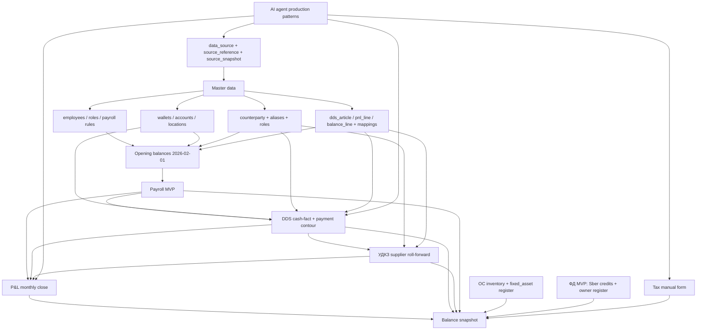

# Roadmap миграции управленческой отчетности в веб-приложение

Дата фиксации: 2026-05-24.  
Последнее обновление: 2026-05-25 (закрыты блокеры Mango, коммуналки, P&L tax classification, `ТК Черникова`, payroll opening, ОС inventory, УДКЗ manual opening, tax MVP, СБИС defer; `qty > 1` остаётся owner-review).  
Горизонт MVP: 3-6 месяцев от 2026-05-24.  
Дата X операционного старта данных: **2026-02-01**.  
Глубина исторической миграции: **гибрид** - master data + monthly totals + opening balances; raw history остается в Google Sheets/source snapshots.

## §1. Назначение и принципы roadmap

Этот документ превращает принятый контур единого управленческого приложения из [vision.md](/app-spec/architecture/vision.md), карту источников [28-data-inventory-for-migration.md](/app-spec/integrations/data-inventory.md), архитектуру БД [database.md](/app-spec/architecture/database.md) и модульные спецификации в практический план миграции.

Roadmap не выбирает стек, не проектирует UI и не расширяет архитектурные решения. Он отвечает на вопросы:

- в какой последовательности переносить управленческие Google Sheets и processed-источники в приложение;
- какие остатки нужны на дату X;
- какие справочники мигрировать первыми;
- где можно переключаться с Google Sheets на БД;
- где переход блокируется owner-review или физической инвентаризацией.

Принципы:

1. **Снизу вверх.** Очередность из [17]: сначала `Зарплата и кадры`, затем финансы (`DDS`, `Balance`, `УДКЗ`, `P&L`), затем операционные интеграции, потом производство, в конце маркетинг.
2. **Дата X = 2026-02-01.** Все доменные операции приложения стартуют с этой даты. Opening balances отражают состояние на начало дня 2026-02-01, то есть closing snapshot на 2026-01-31.
3. **История переносится гибридно.** В БД не переносим каждую операцию 2024-2025. Переносим справочники, monthly totals и стартовые остатки. Исторические Google Sheets остаются read-only source snapshots.
4. **DDS - единственный cash-fact.** Оплаты поставщикам, payroll cash, owner payments и налоговые платежи должны матчиться к DDS, а не дублироваться в модульных ledger'ах.
5. **Единый `counterparty`.** Поставщики, банки, сотрудники, собственники, налоговые органы и клиенты живут в одном master-справочнике с ролями; УДКЗ использует supplier-профиль поверх `counterparty`.
6. **Audit централизован.** Все импортированные, ручные и финансово значимые значения имеют `source_reference_id`; старые module-local source refs не плодим.
7. **`wallet` и `data_source` раздельны.** Sber/T-Bank/Сейф/ТК Черникова - бизнес-кошельки; API, iiko export, Google Sheets и manual form - источники доставки.
8. **Payment calendar считает cash gap по `total cash`.** Базовый разрыв = общий остаток меньше 0; wallet-разрез - drill-down, internal transfers скрыты из календаря как строки и неттируются в DDS.
9. **Три плана статей.** `dds_article`, `pnl_line`, `balance_line` остаются отдельными справочниками, связь идет через mapping tables.
10. **Payroll защищен.** `payroll_payment` хранит персональные обязательства в payroll-модуле; DDS получает только cash matching или batch без раскрытия лишних ПДн.
11. **Документы идут через pipeline.** `parsed_document` - техническое извлечение, `source_document` - подтвержденный бизнес-документ после promotion.
12. **ФД и налоги в MVP асимметричны.** Кредиты - Sber API, дивиденды и расчеты с собственниками - DDS/ручной owner register, налоги - ручной structured form до отдельной спеки.
13. **Нет нулей вместо дыр.** Если источник не найден, период не закрыт или методология не подтверждена, значение получает `requires_review` / `source_not_loaded`, а не `0`.

### Decision traceability from database architecture §12

Roadmap уже operationalizes принятые решения 12a/12b: дата X = **2026-02-01**, глубина миграции = **C гибрид**. Ниже сохранён traceability-блок из database architecture, чтобы варианты решения не потерялись после удаления исходного гибридного файла.

| Вариант | Что переносим | Плюсы | Минусы / риск | Когда подходит |
| --- | --- | --- | --- | --- |
| A. Полная историческая миграция 2024-2025 | Все доступные Google Sheets snapshots и processed CSV превращаются в доменные записи с source_reference | максимальная аналитика и тренды; можно сверять старые отчёты | дорого; много дыр, устаревших формул, ПДн и legacy-кошельков | если owner хочет приложение как полный архив управленческого учета |
| B. Cutover на дату X + read-only legacy archive | В БД заносится opening balance / opening ledgers на дату X, старые Sheets остаются read-only | быстрее MVP; меньше мусора; проще права | меньше drill-down по истории; нужны качественные opening balances | если приоритет - текущий управленческий контур |
| C. Гибрид: справочники + закрытые snapshots, без каждой операции | Перенести master data, статьи, контрагентов, сотрудников, monthly totals и opening balances; raw history оставить в source_snapshot | баланс скорости и проверяемости | нельзя расследовать каждую историческую операцию из UI | выбранный вариант первого запуска |
| D. Модульный cutover | Payroll стартует с одной даты, DDS с другой, balance с контрольного snapshot, УДКЗ с последнего закрытого месяца | учитывает разную зрелость модулей | сложная коммуникация и межмодульные сверки | если модули запускаются постепенно |

Минимальный безопасный набор при любом варианте:

1. Создать `data_source` для каждого S01-S49 из `/app-spec/integrations/data-inventory.md`.
2. Снять `source_snapshot` для всех исторических Google Sheets, которые используются как источник правил или opening balance.
3. Перенести master data: locations, wallets, employees, roles/categories, dds articles, P&L lines, balance lines, supplier counterparties, fixed asset categories.
4. Зафиксировать opening values на дату X: cash by wallet, supplier AP/advances, payroll liabilities/deposits/fund, fixed assets residual value, loans/owner balances, tax liabilities.
5. Всем историческим значениям дать `quality_status`: `final` только если источник и методология подтверждены; `partial` для устаревших/неполных; `requires_review` для дыр; `not_applicable` для закрытых контуров Гагарина/Alfa/РБП.

Дубликатами признаны и не перенесены отдельным текстом: сама дата X, выбранный гибрид, opening balance таблицы, master data plan и monthly totals, потому что они уже раскрыты в §1, §3, §4 и §5 roadmap.

### Dependency graph

Ключевой вывод: **Balance нельзя запускать как источник правды раньше Payroll, DDS и opening balances**. В MVP он может работать с ручными fallback'ами, но только если каждая строка имеет источник, статус качества и owner-review.

## §2. Фазы миграции

Фазы рассчитаны на частичное перекрытие работ. Если вести строго последовательно, горизонт расползется за 6 месяцев; прагматичный режим - параллельно готовить master data, opening balances, ОС-инвентаризацию и агентские источники, но cutover модулей делать по порядку.

| Фаза | Календарное окно | Длительность | Что входит | Выход | Ресурсы | Exit criteria | Owner-чекпоинт |
| --- | --- | ---: | --- | --- | --- | --- | --- |
| 0. Migration control plane | конец мая - начало июня 2026 | 1-2 недели | Заморозить список S01-S49, завести `data_source`, `source_snapshot`, migration register, правила статусов качества, список owner-review очередей | Единая карта источников и миграционный журнал | агент-архитектор, агент-мигратор, Григорий | S01-S49 заведены как источники; по каждому есть владелец, частота, privacy, primary pattern; Google Sheets не редактируются | Owner утверждает границы MVP и правило: gaps не превращаются в нули |
| 1. Master data foundation | июнь 2026 | 2-3 недели | Контрагенты с ролями и дедупликацией, сотрудники и роли, кошельки, локации, три плана статей, mapping tables, категории ОС | Справочники готовы для всех следующих модулей | агент master data, payroll agent, finance agent, владелец | Нет дублей high-confidence без решения; legacy wallets помечены; статьи имеют stable ids; mapping gaps вынесены в review | Owner утверждает dedup `counterparty` и спорные aliases |
| 2. Opening balances на дату X | июнь - июль 2026 | 3-5 недель | Стартовый снимок на 2026-02-01: cash, payroll, supplier AP/advances, owners, credits, taxes, запасы, ОС. Физическая инвентаризация ОС стартует параллельно | Opening register по 42 строкам баланса со статусами `full` / `partial` / `requires_review` / `not_applicable` | Олеся, Виктория, Григорий, управляющий, агент balance, агент payroll, агент DDS | По каждой строке есть сумма или явный blocker; ОС либо инвентаризованы, либо маркированы как blocker; расхождение баланса объяснено статусами | Owner-review всех opening balances перед cutover финансов |
| 3. Payroll MVP и первый cutover | июль - август 2026 | 4-6 недель | Карточки сотрудников, роли, категории, ставки, начисления, удержания, депозиты, накопительный фонд, payroll run, protected payments, P&L export | Payroll можно вести в БД с параллельной сверкой с Google Sheets | payroll agent, payroll responsible, владелец, Григорий | 2 расчетных периода сходятся с Sheets в согласованном tolerance; все активные сотрудники есть; депозиты и фонд согласованы; персональные данные закрыты ролями | Owner разрешает вести новый payroll run в БД, Sheets - только резерв на dual-run |
| 4. DDS + payment contour + cash cutover | август - сентябрь 2026 | 4-6 недель | Sber/T-Bank import, iiko `Главная касса`, `Сейф` manual form, cashflow transactions, classification rules, payment calendar, payroll batch bridge, supplier payment match | DDS становится cash-fact для банков, кассы и payment matching | DDS agent, finance agent, Олеся/Виктория, владелец | Closing cash сходится по кошелькам; internal transfers Sber -> T-Bank дают 0; unclassified закрытого месяца = 0 или owner-approved suspense; payroll payments не раскрывают ПДн | Owner утверждает rule engine, cash cutoff и лимит suspense |
| 5. Finance MVP: УДКЗ, P&L, Balance, ФД, Taxes | сентябрь - октябрь 2026 | 5-7 недель | УДКЗ через `supplier_payment_match`, P&L monthly totals/accrual, Balance snapshot, Sber credits, owner register, tax manual form, ОС manual/partial until inventory complete | Закрытие месяца в приложении по финмодулям, Google Sheets остаются сверкой | finance agent, balance agent, Олеся, Виктория, Григорий, налоговый агент | Один закрытый месяц собран в БД: Payroll + DDS + P&L + Balance; все 42 строки баланса имеют статус и source_reference; ФД/налоги заведены хотя бы manual | Owner принимает первый финансовый close и решает, какие Sheets переводить в read-only |
| 6. Dual-run stabilization и archive | октябрь - ноябрь 2026 | 2-4 недели | 1-2 месяца двойного ведения, сверка расхождений, закрытие owner-review очередей, архивирование legacy Sheets, регламент закрытия месяца | Официальный запуск MVP приложения | все владельцы модулей, Григорий | Два close подряд проходят без критических gaps; роли и доступы проверены; архивные Sheets заморожены; новые операции идут в приложение | Owner подписывает критерий «приложение запущено» |

Параллельные потоки:

- **ОС-инвентаризация** стартует в фазе 2 и может продолжаться до фазы 5. Если не завершена, Balance запускается с `requires_review` по 11 строкам ОС и без автоматической амортизации.
- **AI/document слой** стартует в фазе 0 и доводится до production в фазах 4-5, потому что без него P&L по документным статьям и налоги будут перегружать Викторию и владельца.
- **Monthly totals 2024-2025** можно грузить параллельно фазам 1-3, так как это агрегаты, а не доменные операции.

## §3. Стартовый снимок opening balances на 2026-02-01

Opening balance = состояние на начало дня **2026-02-01**. Для банков и кошельков это closing balance на **2026-01-31** или balance before first movement 2026-02-01, если API отдает только дневные выписки. Для месячных регистров это остаток на конец января 2026.

Статусы в этом разделе:

| Статус | Значение |
| --- | --- |
| `full` | источник и методология подтверждены, значение можно перенести после технической выгрузки |
| `partial` | источник есть, но нужен добор актуальности, маппинга или ручной сверки |
| `requires_review` | без owner-action значение нельзя финализировать |
| `not_applicable` | строка сохраняется в `balance_line`, но в MVP равна 0 по принятому решению |

### 3.1 Сущностный состав opening balance

| Сущность | Что собрать на 2026-02-01 | Источники | Методология | Owner-проверка |
| --- | --- | --- | --- | --- |
| Кошельки | Остатки Sber, T-Bank, `Сейф`, `ТК Черникова`; legacy Alfa/ТК Гагарина; `ГарантФонд` как депозиты курьеров в T-Bank | S01, S02, S16, S40, S43 | `wallet_balance_snapshot`; банк - API balance; `ТК Черникова` - iiko `Главная касса`; `Сейф` - ручная инвентаризация | Физические остатки подтверждены; нужно зафиксировать суммы на начало дня 2026-02-01 |
| Поставщики: КЗ | Closing AP по поставщикам и статьям | S21 + DDS S04/S02 + iiko контроль S16/S12 | УДКЗ roll-forward: opening + recognized expense - DDS cash match = closing; для 2026-02-01 - manual opening register | УДКЗ 2025/2026 не current truth, manual register разрешен |
| Поставщики: авансы | Отрицательные supplier balances + внешние prepayment components по `prepayment_kind` | S21, S31, S37, S38, S39, S32, S35 | Все префиксы агрегируются в `Выданные авансы поставщикам`; УДКЗ покрывает supplier-based авансы, остальные типы (`rental_prepayment`, `subscription_prepayment`, `ad_budget_balance`, `phone_balance`) приходят из своих источников; налоговых предоплат нет | Утвердить суммы по каждому типу и спорные external sources |
| Сотрудники | Задолженность перед сотрудниками, задолженность сотрудников, депозиты, накопительный фонд | S17/S18 + S16/S43 для депозитов курьеров как control | Payroll opening ledger: employee payable/receivable, `deposit_account`, `accumulation_fund_account`; долги сотрудников на 2026-02-01 есть | Выгрузить opening register из зарплатной ведомости |
| Кредиты | Остаток тела кредитов и овердрафта | S01/S24, S02, УФД S22 как структура | Sber API как primary для кредита; T-Bank/Sber API для овердрафта; проценты отдельно в P&L | Проверить Sber credit и возможный T-Bank overdraft по API/выпискам |
| Дивиденды и собственники | Дивиденды начисленные/выплаченные, задолженность перед собственниками, вложения собственников, займы собственников бизнесу/из бизнеса | S04, S44, memory по УФД и owner debt | Дивиденды и выплаты - DDS financial activity; owner loans - `owner_loan_register` manual | Утвердить owner loan register, график возврата и ставку, если есть |
| ОС | Категории ОС, статус каждой единицы, остаточная стоимость, локация; `Не работающее оборудование` - статус внутри исходной категории, не отдельная operational-категория | S19 + owner-provided реестр 2025 + физическая инвентаризация | Исторический реестр и реестр 2025 - seed; факт - инвентаризация Черникова и склада в окне 2026-06-01..2026-06-12. Групповые legacy-строки `qty > 1` остаются `requires_owner_review` до отдельного решения; статусы в UI на русском | Balance MVP может запускаться с `requires_review` по ОС; нулевые стоимости остаются owner-review |
| Запасы | Товар для перепродажи, сырье, готовая продукция, вспомогательные товары, упаковка | S13/S14 | iiko snapshot на дату + whitelist категорий | Утвердить whitelist и спорные группы товаров |
| Налоги | Задолженность по налогам, налоговые начисления/оплаты, налоги ниже EBITDA | S23/S48 + ручной ввод | Manual structured form по налогам до отдельной спеки; источник WorkMail налогового агента `askad02@mail.ru`; P&L/API 7% - accrual/model, cash `659 783` - только УСН 6%, tax payable отдельно; налоговых предоплат нет | Дозаполнить карту писем WorkMail налогового агента и payment match |
| Monthly equity | Накопленная прибыль, текущий результат, капитал | S06 + monthly totals | Накопленная прибыль = закрытые P&L totals до даты X; январь 2026 как opening adjustment, если нет доменных операций | Утвердить, как фиксировать январь 2026 при старте доменных операций с февраля |

### 3.2 Покрытие 42 строк баланса для opening balance

Таблица ниже использует 42 строки исходного балансового шаблона как migration checklist. Внутри приложения часть строк раскрывается в субрегистры: например, строка `Задолженность перед сотрудниками` раскрывается на payroll payable, депозиты и накопительный фонд; строка `Выданные авансы` раскрывается по `prepayment_kind`.

| # | Строка баланса | Opening source на 2026-02-01 | Методология | Статус |
| ---: | --- | --- | --- | --- |
| 1 | Тепловое оборудование | S19 + инвентаризация | Остаточная стоимость по подтвержденным единицам | `requires_review` |
| 2 | Холодильное/морозильное оборудование | S19 + инвентаризация | То же | `requires_review` |
| 3 | Кассовое оборудование | S19 + инвентаризация | То же | `requires_review` |
| 4 | Оборудование торговых залов | S19 + инвентаризация | То же | `requires_review` |
| 5 | Вспомогательное оборудование | S19 + инвентаризация | То же | `requires_review` |
| 6 | Электромеханическое оборудование | S19 + инвентаризация | То же | `requires_review` |
| 7 | Электроника и оргтехника | S19 + инвентаризация | То же | `requires_review` |
| 8 | Системы кондиционирования | S19 + инвентаризация | То же | `requires_review` |
| 9 | Прочий кухонный инвентарь | S19 + инвентаризация | Подтвердить 0 или наличие | `requires_review` |
| 10 | Не работающее оборудование | S19 + инвентаризация | Legacy/balance-control строка: в целевой модели не отдельная категория, а статус `not_working` внутри исходной категории ОС | `requires_review` |
| 11 | Мебель и предметы интерьера | S19 + инвентаризация | Остаточная стоимость по подтвержденным единицам | `requires_review` |
| 12 | Товар для перепродажи | S13/S14 | iiko stock snapshot + whitelist | `full` |
| 13 | Сырье и материалы | S13/S14 | iiko stock snapshot сырья на дату | `full` |
| 14 | Готовая продукция | S13/S14 | iiko whitelist, обычно 0 только если confirmed zero | `full` |
| 15 | Вспомогательные товары | S13/S14 | iiko stock + whitelist | `full` |
| 16 | Упаковка | S13/S14 | iiko stock + whitelist упаковки | `full` |
| 17 | Р/счета | S01/S02 | Sber + T-Bank balances; Alfa legacy inactive | `full` |
| 18 | Касса / Наличные | S16/S40 | iiko `Главная касса` + manual safe count; физические остатки есть, нужна сумма на дату X | `partial` |
| 19 | Задолженность партнеров / клиентов | S08 | iiko partner receivables, `Алиса` | `full` |
| 20 | Выданные авансы поставщикам | S21 + S31/S37/S38/S39/S32/S35 | Supplier-based manual opening/УДКЗ + external `prepayment_kind` components из договоров, рекламных кабинетов и Mango; налоговых предоплат нет | `partial` |
| 21 | Задолженность сотрудников | S17/S18 | Payroll receivable opening из зарплатной ведомости; долги сотрудников есть | `full` |
| 22 | Прочая задолженность в нашу пользу | S44 | `owner_loan_register`: займы бизнеса собственникам | `partial` |
| 23 | Расходы будущих периодов | Решение 11.5 | В балансе не используется, все префиксы в строке авансов поставщикам | `not_applicable` |
| 24 | Прочее / КФВ, депозиты, овернайт | S01/S02 или manual | Подтвердить наличие банковских депозитов/КФВ; иначе `confirmed_zero` | `requires_review` |
| 25 | Уставный капитал | Решение по ИП | Для ИП отсутствует | `not_applicable` |
| 26 | Накопленная прибыль/убыток | S06 monthly totals | Cumulative P&L до даты X | `partial` |
| 27 | Накопленная прибыль/убыток - прошлых периодов | S06 monthly totals | Закрытые годы до 2026 | `partial` |
| 28 | Накопленная прибыль/убыток - текущих периодов | S06 + opening adjustment | Январь 2026 или `source_not_loaded` до подтверждения | `requires_review` |
| 29 | Дивиденды | S04/S44 | Начисления и выплаты по статьям финансовой деятельности DDS | `full` |
| 30 | Добавочный капитал | Исторический шаблон | Пусто в 2024-2025 | `not_applicable` |
| 31 | Резервы переоценки | Исторический шаблон | Пусто в 2024-2025 | `not_applicable` |
| 32 | Долгосрочные кредиты банков | S01/S24 | Остаток тела кредита из Sber API/банковской справки; в феврале 2026 был кредит в Сбере | `full` |
| 33 | Долгосрочные займы | S22/S44 | В 2024-2025 0; подтвердить отсутствие | `not_applicable` |
| 34 | Задолженность по лизингу | S22 | В 2024-2025 0; подтвердить отсутствие | `not_applicable` |
| 35 | Краткосрочные кредиты банков | S01/S24 | Если есть часть <12 мес, выделить из Sber/API или manual | `partial` |
| 36 | Краткосрочные займы | S22/S44 | Подтвердить отсутствие краткосрочных займов | `requires_review` |
| 37 | Овердрафт | S01/S02 | Остаток использованного овердрафта, не комиссия DDS | `partial` |
| 38 | Задолженность перед поставщиками | S21 + S16/S12 | Manual opening register + iiko supplier AP control | `partial` |
| 39 | Задолженность перед сотрудниками | S17/S18 | Payroll payable + субрегистры депозитов и накопительного фонда | `full` |
| 40 | Задолженность по налогам и сборам | S23/S48 | Tax manual opening register из WorkMail налогового агента | `partial` |
| 41 | Прочие обязательства / авансы клиентов | manual + owner review | Подтвердить 0 или завести обязательство с source_reference | `requires_review` |
| 42 | Задолженность перед собственниками | S04/S44 | DDS financial activity + owner register | `full` |

Owner-action до финализации фазы 2:

- провести инвентаризацию ОС на Черникова и складе в окне 2026-06-01..2026-06-12; Гагарина больше не активная точка, legacy-строки Гагарина предварительно относятся к складскому контуру;
- собрать manual opening register поставщиков на 2026-02-01;
- составить карту писем WorkMail налогового агента и заполнить tax manual opening register;
- зафиксировать суммы `Сейф`, `ГарантФонд`, банковские депозиты/КФВ и краткосрочные займы на дату X;
- принять политику допуска к запуску: какие `partial` строки можно закрыть после owner-review, а какие блокируют cutover.

## §4. Master data migration plan

Порядок миграции справочников:

| Порядок | Справочник | Источники | Что переносим | Критерий готовности |
| ---: | --- | --- | --- | --- |
| 1 | `data_source` и `source_reference` seed | S01-S49 из [28] | Код источника, access pattern, coverage, владелец, частота, privacy, current status | Все sources заведены до доменных импортов |
| 2 | `location` | 17, 16, iiko | Черникова, Гагарина legacy, склад; active_from/active_to | Legacy-точки не смешиваются с активной Черниковой |
| 3 | `wallet` + `account` | S01/S02/S16/S40/S43 | Sber, T-Bank, `Сейф`, `ТК Черникова`, legacy Alfa/ТК Гагарина, `ГарантФонд` как депозиты курьеров в T-Bank | `wallet` не содержит credentials; связь с `data_source` через mapping |
| 4 | `counterparty` + roles + aliases | S04/S21/S25-S31/S44/S48 + [13-counterparties.md](/business-docs/counterparties/counterparties.md) | Поставщики, банки, сотрудники, собственники, налоговые органы, клиенты/партнеры | Owner-approved dedup для спорных дублей; `supplier` не отдельный master |
| 5 | Три плана статей | S04/S06/S20/S21 | `dds_article`, `pnl_line`, `balance_line` со stable ids | Нет текстовых ключей в расчетах; aliases заведены отдельно |
| 6 | Mapping tables | 21, 26, P&L methodology | `dds_article_pnl_mapping`, `pnl_balance_mapping`, supplier article mapping | Для ключевых строк P&L/Balance есть mapping или owner-review |
| 7 | Employees + payroll rules | S17/S18/S15 | Сотрудники, роли, категории, ставки, депозиты, фонд, статусы | Активный штат и opening subledger согласованы |
| 8 | Fixed asset categories | S19/S20 | Operational-категории ОС, статусы, локации; `not_working` как статус | Категории есть до инвентаризации; суммы не финализируются без факта |
| 9 | Contracts/prepayment families | S31/S37/S38/S39/S32/S35 | Аренда, склад, подписки, рекламные бюджеты, Mango; налоговые префиксы зарезервированы, но не используются в MVP | У каждого регулярного префикса есть `prepayment_kind`, source owner и `counterparty_id`/external account where applicable; УДКЗ не расширяется псевдо-поставщиками |

Дедупликация `counterparty`:

- `counterparty` создается один раз, роли добавляются отдельно: `supplier`, `bank`, `employee`, `owner`, `tax_authority`, `customer`.
- Сомнительные совпадения не merge'ятся автоматически; создается `counterparty_alias` с confidence и owner-review.
- Для платежей и документов храним private legal details только в private/source layer, в публичных docs остаются рабочие имена или hashes.
- До owner-approve дедупликации нельзя запускать УДКЗ и DDS cutover, потому что поставщик, документ и оплата должны ссылаться на один master.

## §5. Monthly totals переноса

Monthly totals нужны для тренда и сверки, но не для drill-down. Они попадают в БД как агрегаты по строкам и месяцам, а не как операции.

Период переноса:

- базовый диапазон: **2024-01 - 2025-12**;
- формат периода: `YYYY-MM`;
- гранулярность: строка отчета/статья/месяц/сумма/status/source_reference;
- raw operations остаются в historical Sheets и private/source snapshots.

| Отчет | Какие месяцы переносим | Источники | Формат в БД | Что делать с дырами |
| --- | --- | --- | --- | --- |
| Balance | 2024-01..2025-12 как target range; фактически подтверждено 2024-01..2025-04, после этого баланс не велся | S20, processed balance snapshots | `balance_monthly_total(period, balance_line_id, amount, quality_status, source_reference_id)` | 2025-05..2025-12 не заполнять нулями; ставить `source_not_loaded` / `requires_review` |
| DDS | 2024-01..2025-12 как агрегаты по статьям и кошелькам, где есть исторический ДДС | S04/historical DDS snapshots, S05 для план-факта | `dds_monthly_total(period, wallet_id, dds_article_id, inflow, outflow, net, quality_status)` | Если лист/месяц не найден, сохранять пустой period stub с owner-review |
| P&L | 2024-01..2025-12 по строкам P&L | S06/historical P&L, iiko/P&L methodology | `pnl_monthly_total(period, pnl_line_id, amount, direction, quality_status)` | Не реконструировать документы; gaps по источникам помечать `source_not_loaded` |
| Payroll aggregates | 2024-01..2025-12 только сводные суммы ФОТ/депозитов/фонда, без персональных строк | S17/S18 | `payroll_monthly_total(period, line_type, amount, privacy_scope)` | Персональные historic rows не переносить в общий слой |
| УДКЗ | 2024-03..2024-12 подтверждено как исторический seed; 2025/2026 не current truth, opening 2026-02-01 через manual register | S21 | `supplier_balance_article_summary(period, pnl_article_id, ap_balance, advance_balance, recognized_expense)` | Если продолженного файла нет, monthly totals 2025 пометить missing; не переносить старый файл как ноль/current |
| ОС | Исторические monthly totals только как legacy reference, не как актуальный факт | S19 | `fixed_asset_monthly_total(period, category_id, residual_value, quality_status)` | После 2024-06-11 все значения `partial` до инвентаризации |

Правило переноса:

- `final` получают только месяцы, где источник и методология подтверждены.
- `partial` получают месяцы, где источник есть, но есть риск устаревшего справочника, missing mapping или ручной формулы.
- `requires_review` получают месяцы с дырой источника, конфликтом методологии или отсутствием ответственного.
- Monthly totals не блокируют Payroll/DDS cutover, но блокируют публичный исторический тренд, если их показать без статусов.

## §6. Модульный roadmap

| Модуль | MVP-подмодули | Отложено | Источники MVP | Cutover criteria с Google Sheets на БД |
| --- | --- | --- | --- | --- |
| Payroll | Сотрудники, роли, категории, ставки, сменные начисления, ручные события, депозиты, накопительный фонд, protected payments, P&L export | HR analytics, сложный lifecycle с несколькими ролями, автоматический iiko attendance если данные нулевые/неполные | S17/S18, S15 как контроль, S16 только как reconciliation/control для депозитов курьеров | `unblocked` после интервью K: правила явок, периода, ролей, выплат, депозитов и edge cases закрыты; 2 периода parallel-run сходятся; все активные сотрудники есть; депозиты/фонд approved; персональные выплаты доступны только payroll-роли |
| DDS | Sber/T-Bank import, iiko `Главная касса`, `Сейф` manual, кошельки, cashflow transactions, classification rules, payment calendar, internal transfers, payroll batch bridge | Авто-submit платежей в банк, сложные mixed payments, полный ЭДО bridge | S01/S02/S03/S04/S05/S16/S40/S45/S47 | Closing cash сходится; internal transfers = 0; unclassified закрытого месяца = 0 или owner-approved suspense; payroll cash не раскрывает ПДн |
| Balance | 42 `balance_line`, monthly snapshot, auto-source для `full` строк, manual fallback для partial/pending, checks/metrics, opening balances | Автоматическая ОС-амортизация до инвентаризации, графики, расследование старых расхождений 2025 | S19-S24/S31/S44 + Payroll/DDS/P&L/УДКЗ | Все 42 строки имеют value/status/source; owner принял opening balance; расхождение А=П либо в tolerance, либо есть anomaly log |
| УДКЗ | Supplier profile над `counterparty`, opening AP/advances, supplier documents, `supplier_payment_match`, monthly roll-forward, `prepayment_kind` | СБИС full EDO matching, рекламные кабинеты, налоговые переплаты, Mango balance, owner loans | S21 + DDS S01/S02/S04/S16, S31/S37/S38/S39/S32/S35 | Активный 2025/2026 источник или manual opening approved; оплаты берутся только из DDS; AP/advances сходятся с balance lines |
| P&L | Monthly close по строкам: iiko revenue/food cost, payroll ФОТ по ролям, DDS classic lines, document/accrual lines, supplier recognized expenses, Mango manual, коммунальный OCR, taxes manual | CAC/ROMI, product analytics, full marketing funnel, автоматический СБИС без credentials | S06/S07-S14/S17/S25-S32/S37-S42/S48 | 2 месяца parallel close с Sheets; нет material строк без source/status; ДДС-строки не подменены банком |
| ОС | Категории, инвентаризационный реестр, русские статусы, owner-review для legacy `qty > 1`, остаточная стоимость, амортизация после owner approve | Авто-поиск ОС по всем документам, списания без физической проверки | S19 + инвентаризация 2026-06-01..2026-06-12 + S25/S26/S45 как документы | До инвентаризации только manual/partial; Balance MVP может идти с `requires_review`; cutover ОС после выезда и owner approve |
| ФД | Sber credit остатки, owner payments from DDS, `owner_loan_register`, owner contributions, dividends ledger | Полная спека УФД, лизинг, сложные графики займов, проценты по owner loans | S01/S24, S04, S22 как структура, S44 | Кредитные остатки подтверждены Sber/API; дивиденды и owner payable сходятся с DDS; owner loan register approved |
| Налоги | Manual structured form: tax charges, tax payments, tax liabilities; карта писем WorkMail налогового агента | Интеграция налогового кабинета, полная налоговая спека, авто-сверка с ФНС | S23/S48 + DDS tax payments | Налоговый агент/owner подтвердили opening tax balances; P&L taxes имеют 7% accrual source_reference, а balance tax payable/cash payments имеют отдельные source_reference; налоговых предоплат нет |

Статусы разблокировки после интервью K 2026-05-24/25:

- **Payroll**: готов к разработке MVP. Остались техническая реализация, dual-run и privacy/access checks; owner-методология по явкам, периоду вторник-понедельник, `Выплаты`, депозитам/фонду и edge cases закрыта.
- **ОС**: инвентаризация не блокирует весь финансовый MVP, но блокирует cutover ОС как source of truth. Field-work запланирован на 2026-06-01..2026-06-12; до owner-approved register Balance работает с `requires_review` по 11 строкам ОС.
- **УДКЗ / supplier forecast**: prototype-source и manual opening register разрешены; долгосрочный master поставщиков - `counterparty` с ролью `supplier`, supplier forecast получает known AP из УДКЗ/iiko и forecast signals из DDS cadence/rolling average.

Прагматичное правило cutover:

- Google Sheets сначала становятся **сверкой**, а не архивом.
- Архивировать Sheets можно только после двух закрытий месяца в приложении без критических расхождений.
- Для Payroll и DDS cutover допустим раньше, чем для Balance: Balance терминальный и зависит от остальных.
- Для ОС cutover не должен блокировать весь MVP, если owner явно принимает `requires_review` по 11 строкам ОС до физической инвентаризации.

## §7. AI-агентский слой запуска

Production-паттерны первой волны:

| Приоритет | Паттерн из [29] | Что подключает первым | Какие данные приносит | Почему сейчас |
| --- | --- | --- | --- | --- |
| 1 | `direct_api` | Sber, T-Bank, iiko | Банковский cash-fact, остатки кошельков, iiko продажи/food cost/запасы/Главная касса | Это позвоночник DDS, P&L и Balance |
| 2 | `google_sheets_csv_export` | Payroll, DDS Sheets, P&L, Balance, УДКЗ, ОС | Master data, monthly totals, source snapshots, legacy formulas | Нужен для миграции без редактирования Sheets |
| 3 | `manual_structured_form` | `Сейф`, Mango for MVP, taxes, owner loans, opening balance gaps, cash expenses | Ручные значения с author/date/evidence/status | Снижает хаос там, где API нет |
| 4 | `telegram_ocr_bot` | Коммунальные платежки, чеки администраторов, документы к оплате | `parsed_document`, `payment_order_candidate`, `expense_accrual_candidate` | Самые болезненные paper/cash потоки |
| 5 | `mail_with_ai_ocr` | Mail.ru/WorkMail, Билинский, Синапс, StarterApp, Лемма, налоговый агент | Счета, УПД, акты, периоды услуги, суммы accrual | Закрывает P&L-документы без ожидания СБИС |
| 6 | `lk_browser_cookie` | Mango финансы как post-MVP automation, часть рекламных кабинетов | Телефония, кабинеты, остатки бюджетов | Только после owner-login и правил credential handling; P&L Mango в MVP закрывается ручным вводом |
| 7 | `ai_agent_lk_authorized` | Biz Panel, VK/маркетинг, кабинеты с MFA | Бюджеты, клики, показы, остатки | Не блокирует финансовый MVP, но готовится к верхнему контуру |

Минимальные production-требования:

- каждый запуск пишет `agent_run` и `agent_action`;
- каждый документ проходит `parsed_document` -> `source_document` только после auto-rule или owner-review;
- private raw хранится вне публичных docs;
- у каждой интеграции есть `source_credential` с владельцем, сроком, scope и последним успешным запуском;
- failures не молчат: создается `credential_event` и owner-review task.

Как ловим протухание credentials:

| Механизм | Правило |
| --- | --- |
| `last_success_at` | Если источник должен обновляться ежедневно, отсутствие успеха >24-36 часов создает warning; для monthly источников - warning после ожидаемого окна закрытия |
| `expires_at` / `refresh_due_at` | За 7 дней до срока токена/сертификата создается task владельцу доступа |
| Smoke test | Для Sber/T-Bank/iiko/Mail/LK запускается дешевый read-only запрос без выгрузки полного raw |
| `credential_event` | Типы: `expiring`, `expired`, `auth_failed`, `mfa_required`, `captcha_blocked`, `scope_missing`, `revoked` |
| Fallback | Если API/LK упал, модуль не ставит 0; включается manual form или source snapshot с `source_not_loaded` |

## §8. Owner-чекпоинты

| Код | Когда | Решение владельца | Что блокируется без решения |
| --- | --- | --- | --- |
| OC-0 | Конец фазы 0 | Утвердить границы MVP, дату X, допустимые статусы gaps и правило no-zero | Любой cutover, потому что команды будут закрывать дырки по-разному |
| OC-1 | Конец фазы 1 | Утвердить dedup `counterparty`, роли, aliases и спорные контрагенты | DDS, УДКЗ, P&L document matching |
| OC-2 | Конец фазы 2 | Принять opening balances по 42 строкам, включая `partial`/`requires_review` | Payroll/DDS/Balance cutover и доверие к стартовым остаткам |
| OC-3 | Во время фазы 2, окно 2026-06-01..2026-06-12 | Проконтролировать инвентаризацию ОС, русские статусы, provisional-склад для legacy Гагарина и разбор нулевых стоимостей | Автоматизация ОС и P&L-строка `Амортизация`; Balance MVP может идти с `requires_review` до owner-approved register |
| OC-4 | Конец фазы 3 | Разрешить Payroll run в БД и подтвердить privacy модель payroll payments; методология Payroll уже `unblocked`, checkpoint проверяет dual-run/доступы | Payroll cutover, ФОТ P&L, employee balances |
| OC-5 | Конец фазы 4 | Утвердить DDS classification rules, лимит suspense, cash cutoff, суммы `Сейф`/`ГарантФонд` на дату X | УДКЗ, P&L cash-derived lines, payment calendar |
| OC-6 | Начало фазы 5 | Принять manual opening register УДКЗ 2026-02-01 | Supplier AP/advances и Balance |
| OC-7 | Фаза 5 | Утвердить tax manual structured form, карту писем WorkMail налогового агента и owner-loan review | Taxes, owner balances, credit lines in Balance |
| OC-8 | Конец фазы 6 | Подписать официальный запуск MVP и archive/read-only статус Sheets | Завершение dual-run |

Закрыто как owner-методология после интервью K: payroll rules/edge cases, supplier registry как `counterparty` role `supplier`, supplier forecast для календаря, ОС-порог/амортизация/ремонт-модернизация/продажа, перенос РБП в авансы поставщикам. Остались не методологические, а запусковые checkpoint'ы: суммы opening, dual-run, инвентаризация и owner-review спорных остатков.

Потенциальная корректировка после фазы 5: если объединение РБП и авансов поставщикам начнет мешать анализу, можно вынести классические РБП в отдельную балансовую строку. До такого owner-решения действует принятое правило 11.5: все префиксы идут в `Выданные авансы поставщикам`.

## §9. Риски и митигации

| Риск | Почему реален | Митигация |
| --- | --- | --- |
| Потеря доверия к цифрам | Баланс отстал на 13 месяцев; часть источников ручные; старые Sheets содержат формулы и исторические хвосты | Везде `source_reference`, quality status, anomaly log; не показывать gaps как 0; owner-review по opening balance |
| ОС блокируют весь запуск | Реестр ОС устарел с 2024-06-11, нужна физическая инвентаризация Черникова/склада | Запустить ОС как отдельный поток в окне 2026-06-01..2026-06-12; Balance MVP допускает `requires_review` по ОС до owner-approved inventory |
| Двойное ведение перегрузит Олесю/Викторию/Григория | Олеся уже не успевает вести баланс 13 месяцев; УФД у Виктории с задержками; двойной close съест время | Dual-run только 1-2 месяца; формы вместо свободного текста; materiality threshold; clear owner-review queues |
| УДКЗ 2025/2026 не найден | Найденный файл УДКЗ покрывает 2024 и не актуализировался с середины 2025 | Создать manual opening supplier register на 2026-02-01; не блокировать DDS |
| Налоги останутся черной коробкой | Учёт ведет налоговый агент, письма есть в WorkMail; карта сообщений начата, но период/основания и payment match еще не полные | MVP через manual structured form + source_reference; отдельный агент продолжает карту писем `askad02@mail.ru`; `pending_parse/source_not_loaded` вместо owner-question/0; opening tax balances owner-approved |
| Legacy ПДн и payroll privacy | Payroll содержит ФИО, персональные выплаты, депозиты, штрафы | История персональных строк не переносится в общий processed; role-based access; DDS видит batch/matching, не персональные суммы |
| Credentials протухнут незаметно | API, IMAP, LK cookies, CAPTCHA/MFA и банковские токены нестабильны | `source_credential`, smoke tests, `credential_event`, fallback manual/source_not_loaded |
| Cash/admin expenses продолжат теряться | Наличные траты администраторов и `Сейф` сейчас без нормального audit trail | Manual structured form + Telegram/OCR для чеков; monthly cash count; owner-review по material расходам |
| Автоклассификация даст мусор | Business-card, прочие расходы, owner/payroll/self-transfer похожи в банке | Rule engine с confidence; material unknown в owner-review; запрет финализировать месяц с unclassified сверх лимита |
| Исторические monthly totals будут дырявыми | 2025 balance не велся с мая; часть DDS/P&L файлов может не иметь всех месяцев | Переносить totals со статусами; historic trend не является cutover blocker; raw history остается source_snapshot |

## §10. Критерии «приложение запущено»

MVP можно официально считать запущенным и переводить Google Sheets в archive/read-only, когда выполнены все критерии:

1. В БД заведены `data_source` для S01-S49 и централизованный `source_reference` для импортов, ручных значений, документов и opening balances.
2. Master data готовы и owner-approved: `counterparty` с ролями, employees, wallets/accounts, locations, три плана статей и mapping tables.
3. Opening balances на 2026-02-01 заведены по всем 42 строкам баланса: `full`, `partial`, `requires_review` или `not_applicable`; owner подписал список blockers.
4. Payroll закрывает текущий период в БД, а Sheets используются только как сверка или аварийный fallback.
5. DDS является единственным cash-fact: Sber, T-Bank, `ТК Черникова`, `Сейф`; internal transfers не дублируют выручку; payroll payments идут через protected matching/batch.
6. УДКЗ получает оплаты только через `supplier_payment_match` из DDS и отдает AP/advances в Balance.
7. P&L закрывает месяц по ключевым источникам: iiko, payroll, DDS classic, supplier/document accrual, manual taxes where needed.
8. Balance собирает snapshot месяца по 42 строкам, считает check А=П и financial metrics; расхождения живут в anomaly log.
9. ФД MVP закрывает кредиты через Sber API и owner/dividend balances через DDS/manual owner register.
10. Tax MVP имеет ручной реестр начислений/платежей/задолженности с source_reference и ответственным.
11. AI-agent слой имеет production-minimum: `agent_run`, `agent_action`, `parsed_document`, `source_document`, `credential_event`, private raw handling.
12. Monthly totals 2024-2025 загружены как агрегаты или помечены `source_not_loaded` / `requires_review`; пользователь не видит пустые месяцы как подтвержденный 0.
13. Два последовательных monthly close прошли в приложении без критичных расхождений; оставшиеся `partial` строки имеют owner-approved план.
14. Google Sheets получили статус read-only archive: не удаляются, но перестают быть первичным местом ведения новых операций.

Минимальное определение запуска: **с февраля 2026 onward новые управленческие факты живут в приложении, старые Sheets остаются источником правил и сверки, а каждое число в отчетности имеет источник, статус и ответственного**.
