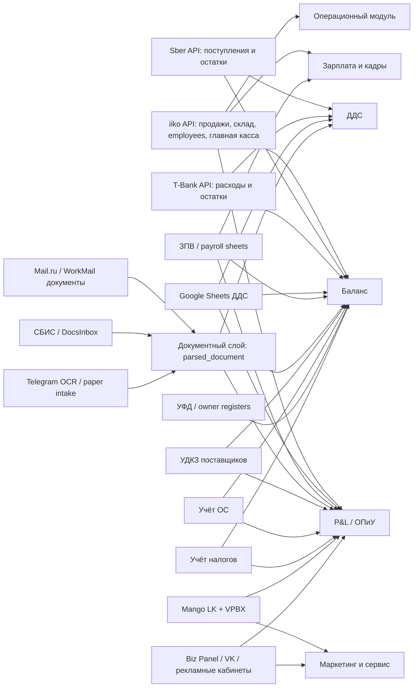

# Реестр источников данных для миграции

Дата сборки: 2026-05-24.  
Последнее обновление: 2026-05-25 (закрыты Mango/manual, коммунальный Telegram/OCR, `ГарантФонд`, УДКЗ manual opening, tax MVP, СБИС defer after MVP).

## §1. Назначение

Этот документ — единый high-level реестр источников, из которых сейчас собирается управленческая, операционная и маркетинговая отчётность проекта «Тепло». Он нужен перед миграцией в единое веб-приложение из [vision.md](/app-spec/architecture/vision.md): по каждой строке отчётов должно быть понятно, где живёт факт, как он доставляется, кто отвечает за источник и какой модуль приложения должен забрать этот процесс.

Реестр не повторяет методологии расчёта ОПиУ, ДДС, баланса и payroll. Подробные правила остаются в профильных документах: [pnl-build-methodology.md](/business-docs/finance/pnl-methodology.md), [21-dds-module-spec.md](/app-spec/modules/finance/dds/spec.md), [25-dds-filling-methodology.md](/business-docs/finance/dds-methodology.md), [26-balance-module-spec.md](/app-spec/modules/finance/balance/spec.md), [27-dz-kz-module-spec.md](/app-spec/modules/finance/dz-kz/spec.md), [payroll engine spec](/app-spec/modules/staff/payroll/00-engine.md).

Статусы покрытия берутся из memory `feedback_source_coverage_definition.md`:

| Статус | Значение |
| --- | --- |
| `full` | источник однозначно определён и методология подтверждена владельцем; способ доставки не важен |
| `partial` | источник есть, но методология, актуальность, маппинг или регулярный канал требуют доработки |
| `pending` | источник назван, но не подключён или не найден рабочий регулярный процесс |
| `not_applicable` | исторический или неиспользуемый контур |

Отдельная ось — способ доставки данных: `api`, `sheets_manual`, `paper_ocr`, `manual_form`, `ai_agent_email`, `browser_lk`. Наличие ручного ввода или OCR само по себе не понижает coverage class: если источник и методология определены, строка может быть `full`.

## §2. Карта источников

| ID | Источник | Категория | Что даёт бизнесу | Способ доступа | Coverage | Оцифрованность / ссылки | Кто ведёт | Частота | Целевой модуль приложения |
| --- | --- | --- | --- | --- | --- | --- | --- | --- | --- |
| S01 | Sber API / банк поступлений | финансовые: банки, ДДС, выручка, остатки | Основной cash-факт входящей выручки, остатки р/с, сверка iiko vs банк, кредитные остатки после отказа от УФД | `api` | `full` для выписок и остатков; `partial` для кредитного endpoint | Технически оцифровано: [research/scripts/sber/export_statement.py](/research/scripts/sber/export_statement.py), [research/scripts/sber/build_cashflow.py](/research/scripts/sber/build_cashflow.py), [research/scripts/sber/build_operations_table.py](/research/scripts/sber/build_operations_table.py), [research/scripts/sber/reconcile_iiko_revenue.py](/research/scripts/sber/reconcile_iiko_revenue.py) | банк + владелец доступа | ежедневно / ежемесячное закрытие | DDS, P&L bridge, Balance, Financial activity |
| S02 | T-Bank Business Open API / банк расходов | финансовые: банки, ДДС, поставщики, налоги, выплаты | Основной cash-факт исходящих платежей, 98% расчётов с поставщиками, выплаты, налоги, бизнес-карта, малая доля прямого эквайринга | `api` | `full` для выписки; `partial` для полной классификации | Технически оцифровано: [research/scripts/tbank/export_statement.py](/research/scripts/tbank/export_statement.py), [research/scripts/tbank/build_cashflow.py](/research/scripts/tbank/build_cashflow.py), [research/scripts/tbank/build_counterparty_dds_match.py](/research/scripts/tbank/build_counterparty_dds_match.py), [research/scripts/bank/classify_cashflow.py](/research/scripts/bank/classify_cashflow.py) | банк + владелец доступа | ежедневно / ежемесячное закрытие | DDS, Payment contour, Supplier AR/AP, P&L bridge |
| S03 | Приватный реестр банковских правил | финансовые: ДДС, банки | Разделяет `revenue_acquiring_sber`, `revenue_acquiring_tbank`, `internal_transfer_sber_to_tbank`, кредиты, возвраты, налоги, поставщиков | `manual_form` + `api` | `partial` | Полу-оцифровано: шаблон `research/processed/bank_operation_rules_template.csv`; классификатор [research/scripts/bank/classify_cashflow.py](/research/scripts/bank/classify_cashflow.py). Полные назначения только в `research/private/` | владелец + агент | по мере появления новых паттернов | DDS rule engine |
| S04 | Google Sheets `2026 ДДС — Классический • ИП Шокина` | финансовые: ДДС, P&L, баланс | Каноническая ручная/полу-ручная классификация ДДС-операций по кошелькам, статьям, контрагентам; первичный источник для P&L-строк `ДДС классический` | `sheets_manual` | `full` для подтверждённых статей; `partial` для алиасов и спорных контрагентов | Полу-оцифровано: читается через Google Drive/Sheets; методология в [25-dds-filling-methodology.md](/business-docs/finance/dds-methodology.md). Банки — сверка, не замена для P&L-строк ДДС | владелец / финансовый менеджер | ежедневно / ежемесячно | DDS, P&L, Balance |
| S05 | Google Sheets `Платежный календарь` | финансовые: платёжный календарь | План-факт платежей, недельный cash forecast, связь с ДДС-фактом | `sheets_manual` | `partial` | Полу-оцифровано: текущие формулы через `IMPORTRANGE`, целевой перенос описан в [21-dds-module-spec.md](/app-spec/modules/finance/dds/spec.md) | финансовый менеджер | еженедельно | Payment calendar |
| S06 | Google Sheets `2026 ОПиУ • [ИП Шокина]` | финансовые: ОПиУ/P&L | Управленческая структура P&L, ручной перенос и раскладка строк по блокам/направлениям | `sheets_manual` | `full` как структура и методология; `partial` по заполненности месяцев | Полу-оцифровано: read-only методология в [pnl-build-methodology.md](/business-docs/finance/pnl-methodology.md) | владелец / финансовый менеджер | ежемесячно | P&L |
| S07 | iiko OLAP `Отчёт о выручке по направлениям` | операционные: iiko продажи, P&L | Выручка до/после скидок, скидки, food cost по направлениям `Роллы`, `Пицца`, `ГЦ`, `Бар` | `api` | `full` | Технически оцифровано: [research/scripts/iiko/export_revenue_by_direction.py](/research/scripts/iiko/export_revenue_by_direction.py) | iiko + агент | ежедневно / ежемесячно | P&L, Operations, Marketing analytics |
| S08 | iiko OLAP `Отчёт о партнёрах` | операционные / коммерческие | Комиссия партнёра `В гостях у Алисы`: 20% от суммы со скидкой | `api` | `full` методологически; `partial` по автоматическому регулярному экспорту | Технически доступно через iiko OLAP; правило в [pnl-build-methodology.md](/business-docs/finance/pnl-methodology.md) | iiko + владелец | ежемесячно | P&L, Partner channel |
| S09 | iiko продажи, каналы, доставка, отмены, возвраты | операционные: iiko | Заказы, средний чек, каналы `OriginName`, `OrderType`, `Delivery.ServiceType`, доставка, опоздания, отмены, возвраты | `api` | `full` для продаж/доставки; `partial` для клиентов и атрибуции | Технически оцифровано: [research/scripts/iiko/export_sales_day_hour.py](/research/scripts/iiko/export_sales_day_hour.py), [research/scripts/iiko/export_orders_delivery.py](/research/scripts/iiko/export_orders_delivery.py), [research/scripts/iiko/export_ops.py](/research/scripts/iiko/export_ops.py), [research/scripts/iiko/build_economic_block.py](/research/scripts/iiko/build_economic_block.py) | iiko + управляющий | ежедневно | Operations dashboard, Marketing analytics |
| S10 | iiko P&L preset `P&L по складам`, строка `Зарплата курьеров` | операционные / кадровые: курьеры | Траты на курьерскую службу для P&L | `api` | `full` | Технически оцифровано: [research/scripts/iiko/export_pnl_by_preset.py](/research/scripts/iiko/export_pnl_by_preset.py) | iiko + руководитель доставки | ежемесячно | P&L, Delivery economics |
| S11 | iiko акты списания | операционные: склад, P&L | `Списание продукции и сырья`: проведённые writeoff-акты и суммы списаний | `api` | `full` | Технически оцифровано: [research/scripts/iiko/export_ops.py](/research/scripts/iiko/export_ops.py) | управляющий / iiko | еженедельно / ежемесячно | P&L, Inventory |
| S12 | iiko приходные накладные | операционные: накладные, закупки | Расходники ТТ и вспомогательные товары по whitelist для P&L | `api` | `full` для whitelist-строк; `partial` для новых товаров | Технически оцифровано: [research/scripts/iiko/build_pnl_from_invoices.py](/research/scripts/iiko/build_pnl_from_invoices.py) | управляющий / iiko | ежемесячно | P&L, Supplier AR/AP, Inventory |
| S13 | iiko инвентаризации | операционные: ревизии, упаковка, запасы | Результаты ревизии, инвентаризация упаковки, коробки для пиццы, остатки запасов для баланса | `api` | `full` для подтверждённых whitelist; `partial` для новых групп | Технически оцифровано: [research/scripts/iiko/build_inventory_results.py](/research/scripts/iiko/build_inventory_results.py) | управляющий | еженедельно / ежемесячно | P&L, Balance, Inventory |
| S14 | iiko справочник товаров и складские остатки | операционные: склад, баланс | Разделение запасов: сырьё, упаковка, готовая продукция, вспомогательные товары, товар для перепродажи | `api` | `full` по методологии; `partial` по whitelist остатков | Технически оцифровано через [research/scripts/iiko/export_ops.py](/research/scripts/iiko/export_ops.py), [research/scripts/iiko/build_inventory_results.py](/research/scripts/iiko/build_inventory_results.py) | управляющий / iiko | ежемесячный snapshot | Balance, Inventory |
| S15 | iiko employees attendance | кадровые / операционные | Факт явок, часы, роли iiko, типы явок; входы для будущего payroll-расчёта | `api` | `full` для факта явки; `partial` для планового графика и категорий 1-6 | Технически оцифровано: [research/scripts/iiko/export_employees.py](/research/scripts/iiko/export_employees.py) | iiko + HR/payroll | еженедельно | Payroll, HR |
| S16 | iiko `Финансы -> План счетов -> Главная касса` / `ТК Черникова` | операционные / финансовые: главная касса | Наличная выручка, partner receivable `Алиса наличные`, депозиты курьеров, оперативные расходы администраторов с бара | `api` | `full` для источника; `partial` для rule engine мелких расходов | Технически оцифровано: [research/scripts/iiko/export_finance_chart.py](/research/scripts/iiko/export_finance_chart.py). Owner decisions 2026-05-25: `Алиса наличные` = partner receivable, `Перемещения` = legacy, `Всякое Гагарина` = legacy reference, `Всякое Черникова` = review-слой | администраторы + управляющий | ежедневно / ежемесячно | DDS, Payroll deposits, Cash control |
| S17 | Google Sheets `Расчёт зарплат NEW` | кадровые: ЗПВ, ФОТ | Правила зарплаты, начисления, удержания, премии, НДФЛ, штрафы, депозиты, накопительный фонд | `sheets_manual` | `full` для текущей методологии; `partial` для отдельных рисков формул | Полу-оцифровано: [payroll engine spec](/app-spec/modules/staff/payroll/00-engine.md); локальная сборка агрегатов [research/scripts/business_control/build_labor_costs.py](/research/scripts/business_control/build_labor_costs.py) | payroll responsible / владелец | еженедельно / ежемесячно | Payroll, P&L |
| S18 | Payroll cash payments и депозитные движения курьеров | кадровые / финансовые | Факт выплат, депозит удержание/возврат/списание, накопительный фонд | `sheets_manual` + `api` + `manual_form` | `partial` | Полу-оцифровано в ЗПВ; связь с `ТК Черникова` требует bridge из S16 | администраторы, payroll | ежедневно / еженедельно | Payroll, DDS, Balance |
| S19 | Google Sheets `Учёт Основных Средств 2.0` | финансовые: ОС, баланс, амортизация | Исторический реестр ОС, категории, метод амортизации, остаточная стоимость | `sheets_manual` | `partial` | Полу-оцифровано: [old-os-and-balance-discovery.md](/research/archive/old-os-and-balance-discovery.md), [research/scripts/business_control/build_fixed_assets_balance.py](/research/scripts/business_control/build_fixed_assets_balance.py). Реестр устарел с 2024-06-11 | финансовый менеджер / владелец | ежегодно / после инвентаризации | Fixed assets, Balance, P&L amortization |
| S20 | Google Sheets `Баланс 2024/2025` | финансовые: баланс | Структура 42 статей баланса, исторические snapshot'ы, регламент | `sheets_manual` | `partial` | Полу-оцифровано: [26-balance-module-spec.md](/app-spec/modules/finance/balance/spec.md), [research/scripts/business_control/build_fixed_assets_balance.py](/research/scripts/business_control/build_fixed_assets_balance.py). Баланс отстаёт на 13 месяцев | Олеся / финансовый менеджер | ежемесячно по регламенту | Balance |
| S21 | Google Sheets `Учёт ДЗ/КЗ поставщиков` (`УДКЗ`) | финансовые: ДЗ/КЗ, поставщики, баланс | Supplier roll-forward: признанные расходы, оплаты, КЗ поставщиков, авансы поставщикам; manual opening register на 2026-02-01 | `sheets_manual` + `manual_form` | `full` для 2024-структуры; `closed_manual` для opening 2026-02-01; `partial` для текущего roll-forward | Полу-оцифровано: [27-dz-kz-module-spec.md](/app-spec/modules/finance/dz-kz/spec.md). Owner 2026-05-25: найденный файл не актуализировался с середины 2025, использовать как seed, не current truth | финансовый менеджер | еженедельно / ежемесячно | Supplier AR/AP, P&L, Balance |
| S22 | Google Sheets `Учёт финансовой деятельности` (`УФД`) | финансовые: кредиты, займы, дивиденды | Структура кредитов, займов, дивидендов, вкладов собственников, лизинга | `sheets_manual` | `partial` как структура; неактуален как факт | Полу-оцифровано исторически. Memory фиксирует: кредиты брать из Sber API, дивиденды из ДДС, УФД только как шаблон | владелец / финансовый менеджер | ежегодно по регламенту | Financial activity, Balance |
| S23 | Учёт налогов | финансовые: налоги | Все налоги P&L, задолженность по налогам, начисления и оплаты; налоговых предоплат нет | `manual_form` / `ai_agent_email` | `closed_manual` для MVP; `requires_document` для карты писем | Owner 2026-05-25: учет ведет налоговый агент; MVP-форма = налог, период, начисление, оплата, остаток/предоплата, источник; источник писем S48 | налоговый агент / владелец | ежемесячно / ежегодно | Tax, P&L, Balance |
| S24 | Sber credit / loan остатки | финансовые: кредиты | Остаток тела кредита для долгосрочных кредитов баланса; проценты отдельно в P&L | `api` | `partial` | Автоматизируемо через Sber API; конкретный endpoint остатка кредита требует проверки в [12-sber-api-endpoints.md](/app-spec/integrations/sber/api-endpoints.md) | банк + владелец | ежемесячный snapshot | Financial activity, Balance |
| S25 | Mail.ru / WorkMail документный контур | маркетинговые / финансовые: счета, УПД, акты | Счета и УПД по iiko, Лемме, StarterApp, Синапсу, Билинскому, Доксинбоксу, Микроэл, охране, налоговому агенту | `ai_agent_email` | `full` для найденных отправителей; `partial` для парсеров и новых семейств | Технически оцифровано IMAP: [research/scripts/mail/mailru_mailbox.py](/research/scripts/mail/mailru_mailbox.py); справочник отправителей в [23-mailru-personal-mailbox.md](/app-spec/integrations/mailru/personal-mailbox.md) | контрагенты + владелец ящиков | ежедневно / ежемесячно | EDO-lite, P&L accrual, Supplier documents |
| S26 | СБИС / DocsInbox ЭДО | маркетинговые / финансовые: ЭДО | Входящие счета, акты, УПД, документная сверка маркетинга, сайта, сервисов | `api` / `browser_lk` fallback | `defer_after_mvp` | Доступ есть, но владелец сможет предоставить после 2026-06-01. Не MVP-блокер: документы пока закрываются через WorkMail/OCR/manual. API-карта в [11-sbis-edo-api-endpoints.md](/app-spec/integrations/sbis-edo/api-endpoints.md) | владелец / СБИС | ежедневно / ежемесячно | EDO, P&L accrual, Supplier documents |
| S27 | Biz Panel Синапса / Яндекс.Директ | маркетинговые | Фактический `Бюджет`, показы, клики, CPC; счета по договору `CNTX-212566` | `browser_lk` / `ai_agent_email` | `full` для правила P&L; `partial` для устойчивой автоматизации | Не полностью оцифровано: доказан AI/LK-путь через письмо `hello@biz-panel.com`; методология в [pnl-build-methodology.md](/business-docs/finance/pnl-methodology.md) | Синапс + владелец доступа | ежемесячно / при закрытии маркетинга | Marketing analytics, P&L |
| S28 | WorkMail `smmbux@yandex.ru` / ИП Билинский | маркетинговые | УПД по таргетированной рекламе: обслуживание/продвижение и рекламный бюджет за период | `ai_agent_email` | `full` | Полу-оцифровано через IMAP S25; T-Bank/DDS только сверка оплаты. Канонический паттерн письма: отправитель `ИП Билинский А.Р.` / `ИП Билинский Андрей Романович`, тема `Документы для ИП Шокина Кристина Юрьевна...`, вложения УПД | Билинский + владелец ящика | ежемесячно | Marketing P&L |
| S29 | Mail.ru `webmaster@insaitov.ru` / Synapse SEO | маркетинговые | SEO-счета по периоду услуги, сверка T-Bank | `ai_agent_email` | `full` | Полу-оцифровано через IMAP S25; правило в [pnl-build-methodology.md](/business-docs/finance/pnl-methodology.md) | Synapse + владелец ящика | ежемесячно | Marketing P&L |
| S30 | StarterApp / сайт и приложение | маркетинговые / операционные | Документы по платформе сайта/приложения; отдельный контур онлайн-заказов и платежей | `ai_agent_email` + `api`/сайт позже | `full` для P&L-документов; `pending` для product analytics | Полу-оцифровано через Mail.ru `leshkina@starterapp.ru`; онлайн-аналитика сайта/приложения требует отдельного подключения | StarterApp + владелец | ежемесячно / ежедневно для product metrics | Site/app, P&L, Marketing |
| S31 | Подписки автоматизации: iiko, Лемма, Доксинбокс, Реви | финансовые / маркетинговые: сервисы | Accrual-расходы `Оплата систем автоматизации`, предоплаты в баланс, период услуги | `ai_agent_email` + `sheets_manual` + `api` сверка | `full` для текущих правил; `partial` по Доксинбокс-сумме и новым контрактам | Полу-оцифровано: Mail.ru S25 + T-Bank S02 + accrual schedules; писать `Реви`, не Greevy | контрагенты + владелец | ежемесячно / раз в 6 месяцев для Реви | P&L, Balance prepaid, Supplier documents |
| S32 | Mango Office LK / финансы | маркетинговые / административные: телефония | Переменная компонента строки `Телекоммуникации`; для MVP - ручной ввод владельца | `manual_form` сейчас; `browser_lk` post-MVP | `closed_manual` | Owner 2026-05-25: ручной ввод Mango. Подтверждено: 2026-02 `11 946,61`, 2026-03 `12 122,02`, 2026-04 `10 189,52`; 2026-05 = `source_not_loaded`, месяц не завершен. Скрипт/cookie остаются backlog: [research/scripts/mango/export_telecom.py](/research/scripts/mango/export_telecom.py) | владелец доступа Mango | ежемесячно | P&L telecom, Telephony billing |
| S33 | Mango VPBX API | маркетинговые / операционные: телефония | История звонков, пропущенные, записи, конверсия звонок -> заказ | `api` | `pending` | Автоматизируемо, но ключи не выпущены; карта в [15-telephony.md](/app-spec/integrations/mango/telephony.md) | владелец Mango | ежедневно | Telephony analytics, Marketing funnel |
| S34 | Mango Speech Analytics | маркетинговые / сервис | Транскрипты разговоров, тематика, эмоции, жалобы | `api` | `pending` | Не подключено; нужен отдельный token и подтверждение тарифа | владелец Mango | ежедневно / еженедельно | Service quality, Marketing retention |
| S35 | VK / таргет / рекламные кабинеты кроме Biz Panel | маркетинговые | Расходы, показы, клики, аудитории, остатки бюджетов | `browser_lk` / `api` при наличии | `partial` | Не оцифровано в проекте; часть расходов закрыта УПД Билинского S28, кабинетные метрики требуют AI-агента/LK | Билинский / владелец доступа | ежемесячно / еженедельно | Marketing analytics |
| S36 | Клиентская база, retention, LTV, RFM | маркетинговые / операционные | Новые/повторные клиенты, retention D30/60/90, LTV/CAC, сегменты | `api` + private mart | `pending` | Не оцифровано как готовый mart; поля есть в iiko, но требуют private-обработки без PII | iiko + маркетинг | ежемесячно / еженедельно | Marketing analytics, CRM |
| S37 | Коммунальные платежи Черникова: вода, газ, электричество от арендодателя | коммунальные / финансовые | Расход P&L `Коммунальные платежи Черникова`; начисление периода из распознанной платежки, не только оплата | `paper_ocr` / Telegram bot | `full` | Owner 2026-05-25: Telegram-бот уже распознает платежки, достает сумму, дату и тип платежа, кладет в спец-хранилище; оттуда данные идут в ОПиУ. DDS получает cash-fact из банка/налички | арендодатель приносит, бот/ФМ контролирует | ежемесячно | P&L, DDS, Supplier documents |
| S38 | Аренда ТТ Черникова | финансовые / коммунальные | Фиксированная аренда 100 000 ₽/мес; аванс за следующий месяц | `manual_form` / договор | `full` | Не требует API; контролируемый ручной/договорной источник | владелец / ФМ | ежемесячно | P&L, DDS, Balance prepaid |
| S39 | Аренда склада | финансовые | Фиксированная аренда склада 5 000 ₽/мес; аванс | `manual_form` / договор | `full` | Не требует API; контролируемый ручной/договорной источник | владелец / ФМ | ежемесячно | P&L, DDS, Balance prepaid |
| S40 | Кошелёк `Сейф` | финансовые: наличные | Наличный сейф, ручные движения и остаток cash | `manual_form` | `full` как допустимый источник; `partial` по регулярности | Не оцифровано: нужен structured manual input + инвентаризация остатка | владелец / ФМ | ежедневно / ежемесячно | DDS, Balance cash |
| S41 | Наличные траты администраторов с бара | операционные / финансовые | Мелкие закупки, ремонт, мойщица, частные подрядчики, business-card-like расходы вне банка | `manual_form` + `paper_ocr` для чеков | `pending` как регулярный процесс | Не оцифровано и сейчас теряется/размывается; кандидат на мобильную форму с фото подтверждения | администраторы смены | ежедневно / по факту | DDS, P&L, Cash control |
| S42 | Комиссия агрегатору `К порогу` | маркетинговые / коммерческие | Ручная сумма комиссии агрегатора за месяц | `manual_form` | `full` по owner-правилу; автоматизация `partial` | Не оцифровано как API: менеджеры агрегатора присылают сумму, затем ручной ввод | менеджеры `К порогу` + владелец | ежемесячно | P&L, Partner channel |
| S43 | `ГарантФонд` | финансовые: депозиты курьеров | Депозиты курьеров, физически хранящиеся в Т-Банке | `manual_form` + bank/control | `full` по смыслу; `requires_document` для opening amount | Owner 2026-05-25: это не резервный фонд, а депозиты курьеров. Связать с payroll deposit accounts и iiko корсчетом `Депозиты курьеров` | администраторы + владелец | ежемесячно / на дату X | DDS, Balance, Payroll |
| S44 | Owner loans / расчёты с собственниками | финансовые: УФД, баланс | Займы бизнеса собственникам, задолженность перед собственниками, дивиденды, возвраты | `manual_form` + `sheets_manual` | `partial` | Источник определён как будущий `owner_loan_register`, но реестр не найден; дивиденды брать из ДДС, УФД неактуален | владелец | ежемесячно / по операциям | Financial activity, Balance |
| S45 | T-Bank payment order intake / Telegram OCR | финансовые / коммунальные: документы к оплате | Приём фото/PDF/текста счёта, платежки, УПД, коммунального акта; structured candidate и owner review | `paper_ocr` | `full` как технический паттерн; бизнес-потоки по типам отдельно | Технически оцифровано: [research/scripts/tbank/payment_order_bot.py](/research/scripts/tbank/payment_order_bot.py), [research/scripts/tbank/payment_order.py](/research/scripts/tbank/payment_order.py), [research/scripts/tbank/payment_parsers.py](/research/scripts/tbank/payment_parsers.py), [research/scripts/tbank/ocr_image_macos.swift](/research/scripts/tbank/ocr_image_macos.swift) | владелец/сотрудник отправляет документ | по событию | Payment contour, OCR intake |
| S46 | Google Drive corpus / управленческие документы | финансовые / операционные | Поиск старых таблиц, регламентов, меню, графиков, документов автоматизации | `sheets_manual` / connector | `partial` | Полу-оцифровано: карта в [07-google-drive-discovery.md](/app-spec/integrations/google-drive-discovery.md); новые снимки делать только при отсутствии processed | владелец Google Drive | по задачам | Knowledge base, Migration registry |
| S47 | Business-card retail purchases and receipts | финансовые / операционные | Розничные покупки через бизнес-карту: продукты, питание персонала, содержание ТТ, офис | `api` + `paper_ocr` / чек | `partial` | Банк видит merchant, но без чека статья часто неочевидна; нужен чек/OCR или owner rule | администраторы / ФМ | по факту | DDS, P&L classification |
| S48 | Налоговый агент / WorkMail `askad02@mail.ru` | финансовые: налоги | Документы и сообщения налогового агента, источник `Учёт налогов`, tax payable и opening tax balances | `ai_agent_email` | `partial`: источник подтвержден, карта писем начата | Owner 2026-05-25: налоговый учет ведет налоговый агент. Последняя поправка: P&L/API начисляет 7% только как accrual-модель, cash-выплата `659 783` = только УСН 6%, tax payable ведется отдельно по письмам агента. Parsed seed: письмо `#837` от 2026-05-20, `ЕНП до 28.05.docx` 18 556,93 ₽ + `0,2 %.xls` 78,95 ₽, due 2026-05-28, owner close deadline 2026-06-30 | налоговый агент + владелец | ежемесячно / ежегодно | Tax, P&L, Balance |
| S49 | Реви / клиентские оценки и жалобы | маркетинговые / сервис | Оценки, жалобы, NPS-like показатели, связь качества с retention | `browser_lk` / `api` при наличии | `pending` | Не оцифровано как метрики; в документах пока есть только поставщик и подписка. В новых артефактах писать `Реви` | спец-администратор / владелец | ежедневно / еженедельно | Service quality, Marketing retention |

### Проверка покрытия строк ОПиУ и баланса

Для строк P&L:

| Группа строк P&L | Источник в реестре |
| --- | --- |
| Выручка без/с учетом скидок, скидки, food cost по направлениям | S07 |
| Исторические строки Гагарина | S07 + статус `not_applicable` после 2024 |
| Комиссия партнёрам | S08 |
| Возвраты клиентам, эквайринг, РКО, прочие банковские комиссии, транспортные услуги, питание персонала, расходы на персонал, поиск/найм, листовки, прочие маркетинговые, овердрафт, штрафы/пени | S04 как первичный P&L-источник, S01/S02 как cash-сверка |
| Зарплата поваров, администраторов, администрации, премии, накопительный фонд, списание депозитов, штрафы по ревизиям | S17/S18 |
| Налоги с ЗП | S04 + S17 как контроль |
| Курьерская служба | S10 |
| Списание продукции и сырья | S11 |
| Содержание торговых точек | S04 + S12 + S41/S47 как низовой факт |
| Инвентаризации упаковки, коробок, ревизии | S13 + S17 для штрафов по ревизиям |
| Аренда Черникова и склада | S38/S39 |
| Коммунальные Черникова | S37 |
| Телекоммуникации | S32 manual Mango + S25/S04 для фиксированных iHC/Микроэл по документам и ДДС |
| Таргетированная реклама | S28 |
| Наружная реклама | S26 |
| Контекстная реклама | S27 |
| SEO | S29 |
| Сайт и приложение | S30 |
| Оплата систем автоматизации | S31 |
| Комиссия агрегатору | S42 |
| Проценты по кредитам, кредиты/УФД | S22/S24 |
| Налоги ниже EBITDA | S23/S48; для P&L/API 7% от iiko OLAP выручки без скидок - только accrual/model начисление (`УСН 6% + страховые взносы 1%`); cash-выплата `659 783` = только УСН 6%; tax payable/остаток отдельно по WorkMail `askad02@mail.ru`; налоговых предоплат нет |
| Амортизация | S19 |

Для строк баланса:

| Группа строк баланса | Источник в реестре |
| --- | --- |
| 11 строк внеоборотных активов | S19 |
| Запасы: товар для перепродажи, сырьё, готовая продукция, вспомогательные товары, упаковка | S13/S14 |
| Р/счета | S01/S02 |
| Касса / наличные | S16 + S40 |
| Задолженность партнёра `Алиса` | S08 |
| Выданные авансы поставщикам | S21 + S31/S37/S38/S39/S32/S35 для префиксных остатков |
| Задолженность сотрудников | S17/S18 |
| Прочая задолженность в нашу пользу | S44 |
| КФВ / депозиты | S01/S02, методология pending; `ГарантФонд` отдельно = депозиты курьеров S43 |
| Накопленная прибыль | S06 |
| Дивиденды и расчёты с собственниками | S04 + S44 |
| Вложения собственников | S22/S44 |
| Кредиты банков | S24 |
| Овердрафт тело | S01/S02 + S22, не статья ДДС `Овердрафт` |
| КЗ поставщикам | S21 + iiko-контроль S16 |
| КЗ сотрудникам, депозиты, накопительный фонд | S17/S18 |
| Налоги к уплате | S23/S48; manual structured form до отдельного налогового модуля |

## §3. Связи между источниками



Ключевые связи:

| Кто читает | Кого читает | Зачем |
| --- | --- | --- |
| P&L | iiko S07-S13 | выручка, скидки, food cost, курьеры, списания, накладные, инвентаризации |
| P&L | S04 ДДС Sheets | все строки `ДДС классический`, где владелец уже ведёт классификацию |
| P&L | S25-S31 документные источники | accrual-расходы по периоду услуги, а не по дате оплаты |
| DDS | S01/S02/S16/S40 | cash-факт по банкам, главной кассе, сейфу |
| DDS | S45/S47 | документы и чеки как основание платежа и классификации |
| Payroll | S15/S17/S18 | явки, начисления, удержания, выплаты и депозиты |
| Balance | S19-S24/S31/S44 | остатки активов, обязательств, авансов, кредитов, собственников |
| Marketing | S09/S27-S36/S49 | заказы, расходы, CAC/ROMI, retention, звонки и отзывы |

## §4. Категории по способу подключения

Один источник может попадать в несколько групп, если доставка смешанная: например, документ приходит по email, оплата сверяется через банк, а остаток кабинета читается через LK.

### API

Источники: S01, S02, S03, S07, S08, S09, S10, S11, S12, S13, S14, S15, S16, S18, S24, S26, S30, S31, S33, S34, S35, S36, S47, S49.

Состояние: самый сильный слой уже работает для банков и iiko. Основной риск не в доступе, а в маппинге бизнес-смысла: банковская операция не равна строке P&L, а iiko raw-факт не заменяет управленческое правило.

### Sheets

Источники: S04, S05, S06, S17, S18, S19, S20, S21, S22, S31, S44, S46.

Состояние: это текущая управленческая система. На этапе миграции Sheets читаются read-only как источник правил, статей, формул и legacy-факта. После переноса они должны стать read-only архивом или экспортом.

### Paper OCR

Источники: S37, S41, S45, S47.

Состояние: технический прецедент уже есть через T-Bank payment order intake. Следующий шаг — расширить parser registry на коммунальные платежки Черникова и чеки/акты, которые сейчас приносят физически.

### Manual Form

Источники: S03, S18, S23, S37, S38, S39, S40, S41, S42, S43, S44.

Состояние: ручной ввод допустим, если он структурирован: дата, период, сумма, статья, кошелёк, контрагент, основание, вложение/комментарий и audit trail. Главная проблема — не ручной ввод сам по себе, а устные/свободнотекстовые факты без регулярного владельца.

### AI Agent Email

Источники: S23, S25, S27, S28, S29, S30, S31, S48.

Состояние: IMAP-подключение работает; raw письма и вложения должны жить в `research/private/`. Для P&L важнее период услуги в PDF/УПД, чем дата письма или оплаты.

### Browser LK

Источники: S26, S27, S32, S35, S49.

Состояние: подходит для источников с личным кабинетом, MFA или CAPTCHA. Агент не должен обходить CAPTCHA; владелец проходит вход, затем агент читает отчёт, скачивает CSV или использует cookie/session только для read-only.

## §5. Дырки и узкие места

1. **Противоречие по `ДДС классический`: T-Bank API-карта vs более поздняя P&L-методология.** В [14-tbank-api-endpoints.md](/app-spec/integrations/tbank/api-endpoints.md) местами сказано, что строки `ДДС классический` нужно строить из T-API. Более позднее решение в [04-strategy-worklog.md](/business-docs/portrait/strategy-worklog.md) и [pnl-build-methodology.md](/business-docs/finance/pnl-methodology.md) фиксирует обратное: для P&L первичный источник — Google Sheets ДДС, банки служат raw/cash-сверкой. Для миграции считать позднее решение каноническим.
2. **УФД неактуален как факт.** Документ полезен как структура кредитов, займов, дивидендов и лизинга, но не как актуальный источник остатков. Кредиты переключены на Sber API, дивиденды — на ДДС. Нужен отдельный `owner_loan_register`.
3. **Owner loans не закрыты реестром.** Баланс знает, что `Прочая задолженность в нашу пользу` — займы собственников бизнесу, но график возврата, ставка и место ведения реестра не определены.
4. **Учёт налогов для MVP закрыт ручной формой, но нужна полная карта писем.** Налоговый агент подтвержден, WorkMail `askad02@mail.ru` есть; parsed seed по tax payable: письмо `#837` от 2026-05-20 с `ЕНП до 28.05.docx` на 18 556,93 ₽ и `0,2 %.xls` на 78,95 ₽. Период и payment match остаются `pending_parse`; это tax payable/control, не дубль P&L. Налоговых предоплат нет.
5. **УДКЗ найден как structure seed, но не current truth.** Файл не актуализировался с середины 2025; для opening 2026-02-01 нужен manual supplier register. Регламент баланса старой версии говорил `Учёт ДЗ/КЗ = FALSE`, что уже устарело для 2024.
6. **ОС и баланс исторические.** Учёт ОС не обновлялся с 2024-06-11; баланс отстаёт на 13 месяцев. Инвентаризация Черникова/склада назначена на 2026-06-01..2026-06-12; до неё Balance MVP допускает `requires_review` по ОС.
7. **Задолженность сотрудников в балансе = 0, но payroll opening источник подтвержден.** Остатки на 2026-02-01 живут в зарплатной ведомости; долги сотрудников есть. Нужно выгрузить opening register, а не брать ноль из старого баланса.
8. **Mango финансы автоматизационно заблокирован CAPTCHA/MFA, но P&L MVP закрыт manual.** Endpoint отчёта найден; для MVP подтверждены ручные суммы за 2026-02..2026-04, май ждет закрытия месяца.
9. **Mango VPBX и Speech Analytics не подключены.** Это блокирует звонки, пропущенные и конверсию звонок -> заказ.
10. **СБИС/DocsInbox отложен после MVP.** Доступ есть, но владелец сможет предоставить после 2026-06-01; это не MVP-блокер, потому что документы закрываются через WorkMail/OCR/manual.
11. **Маркетинговые кабинеты не собраны централизованно.** Biz Panel покрывает Яндекс по Синапсу, WorkMail покрывает Билинского по УПД, но кабинетные остатки, VK-метрики и CAC/ROMI требуют отдельного источника.
12. **Клиентский mart не создан.** iiko содержит поля клиентов, но retention, LTV, новые/повторные и RFM требуют private-модели без PII.
13. **20,5% заказов с пустым `OriginName`.** До очистки атрибуции нельзя делать жёсткие выводы по каналам.
14. **`ТК Черникова` оцифрована, но не классифицирована.** По Главной кассе есть 13 корсчетов; только `Задолженность перед поставщиками` автоматически маппится в `Оплата поставщикам`.
15. **Наличные траты администраторов и `Сейф` не имеют нормального audit trail.** Это главный устный/бумажный поток, который может теряться.
16. **Opening amounts still need documents/snapshots.** `Сейф`, `ГарантФонд`, tax opening и supplier opening имеют подтвержденные источники/методологию, но суммы на 2026-02-01 нужно зафиксировать отдельными opening registers/snapshots.
17. **Реви в старых документах может встречаться как Greevy.** В новых артефактах использовать `Реви` / ООО «РЕВВИ», сохраняя старые IDs только для совместимости.

## §6. Прецеденты автоматизации

| Прецедент | Что уже сделано | Что переиспользовать |
| --- | --- | --- |
| Direct API banks | Sber и T-Bank читаются read-only, raw в `research/private/`, processed агрегаты без чувствительных назначений | Общий `bank_operation`, `source_snapshot`, rule engine, маскирование PII |
| Direct API iiko | Продажи, доставка, food cost, списания, инвентаризации, накладные, employees, Главная касса | Общий iiko client, месячные chunks, whitelist товаров, mapping активной Черниковой |
| Google Sheets snapshots | ДДС, ОПиУ, payroll, баланс, ОС, УДКЗ разобраны как структуры и правила | `source_sheet`, `source_cell`, `period`, `article`, `quality_status`, schema-change detection |
| Mail.ru / WorkMail | IMAP/SMTP connector, SQLite, attachments private, справочник отправителей | `mail_with_ai_ocr`: sender -> document family -> article -> parser -> bank cross-check |
| T-Bank payment order intake | Бот принимает фото/PDF/текст, OCR/парсеры создают private candidates, платеж не отправляется без явной команды | Паттерн уже используется для коммунальных платежек Черникова; расширять на чеки/акты/частных подрядчиков |
| Mango LK discovery | Карта endpoint'ов `product-expenses/report-*`, скрипт resume через session cookie, блокировка CAPTCHA описана | Для P&L MVP использовать manual input; `lk_browser_cookie` оставить для post-MVP автоматизации Mango и других LK |
| iiko Главная касса | Выгружены операции `Главная касса`, выделены 13 корсчетов | Rule engine для `ТК Черникова`, bridge депозитов курьеров, сверка наличной выручки |
| Payroll aggregation | Сборка ФОТ по sheets и формализация payroll-сущностей | Перенос в `payroll_run`, `payroll_ledger_line`, `deposit_account`, `payment` |

### Переиспользуемый паттерн `payment_order_bot`

Прецедент S45 важен как готовый способ превратить физический документ в структурированную запись:

```text
фото / PDF / текст в Telegram
-> private upload
-> OCR / deterministic parser
-> parsed_document / payment_order_candidate
-> owner_review или parsed_ready
-> связь с ДДС, P&L accrual, платежом и банком
```

Бот не должен сам списывать деньги. Для платежей он готовит кандидат и, при отдельной настройке, может отправить документ в `Платежи в работе -> На подпись`; подпись остаётся за владельцем. Для коммунальных и чековых потоков этот же паттерн можно использовать без банковского submit: достаточно создать `expense_accrual_candidate` и связать его с оплатой/ДДС.

## §7. Кандидаты на следующий шаг автоматизации

| Приоритет | Кандидат | Почему это важно | Рекомендуемый следующий шаг |
| --- | --- | --- | --- |
| high | Коммунальные платежки Черникова от арендодателя | Ежемесячная P&L-строка уже идет через Telegram/OCR, но нужен устойчивый storage -> P&L/DDS bridge | Документировать parser registry: `utility_water`, `utility_gas`, `utility_electricity`; проверять, что месяц начисления из бота не подменяется датой оплаты |
| high | Наличные траты администраторов с бара | Поток вообще не оцифрован, но влияет на `Содержание ТТ`, питание персонала, мелкий ремонт и cash control | Мобильная форма: дата, сумма, статья, кошелёк `ТК Черникова`/`Сейф`, фото чека, комментарий, автор; синхронизация с S16 |
| high | Tax WorkMail map | Налоги влияют на P&L ниже EBITDA и opening tax liabilities; источник подтвержден, карта начата по письмам `#761/#767/#818/#836/#837`, но период/основания и payment match еще не полные | Продолжить tax-mail pass по `askad02@mail.ru`: сгруппировать документы, заполнить `tax_charge`, `tax_payment`, `tax_payable`; для неполных данных ставить `pending_parse/source_not_loaded`, не owner-question и не 0 |
| medium | СБИС/DocsInbox сервисный read-only доступ | Закрывает наружную рекламу, документную сверку маркетинга/сервисов и supplier documents без ручных выгрузок | После 2026-06-01 получить доступ, сделать 7-дневный read-only test, затем маппинг контрагент -> P&L article |
| medium | Mango финансы и VPBX | P&L telecom закрыт manual, но автоматизация Mango и звонки/пропущенные нужны для операционной воронки | Для финансов оставить manual до post-MVP; отдельно выпустить VPBX `api_key`/`api_salt` для звонков |
| medium | Marketing LK / VK / остатки рекламных кабинетов | Без кабинетных метрик нельзя считать CAC, ROMI, остатки prepaid ad budgets и качество каналов | Запустить AI-agent LK flow: список кабинетов, owner login, read-only экспорт бюджета/кликов/остатков; где есть API — перейти на `api` |

## §8. Связь с целевой архитектурой

Этот реестр является входом в миграцию из Google Sheets и разрозненных кабинетов в единое приложение из [vision.md](/app-spec/architecture/vision.md).

Целевые правила переноса:

1. Каждый источник из §2 становится `data_source` с `coverage_class`, `primary_pattern`, владельцем, периодичностью и privacy level.
2. Каждый запуск API, OCR, IMAP, LK или ручной формы пишет `agent_run` и `agent_action`.
3. Raw с PII, назначениями платежей, cookie, OCR text, письмами и screenshots хранится только в `research/private/`.
4. `research/processed/` и публичные docs хранят агрегаты, хеши, статусы, ссылки на source ids и методологию.
5. Пустота, ноль, `source_silent`, `owner_review` и `not_applicable` — разные состояния.
6. Ручной ввод остаётся валидным способом доставки, но только через структурированную форму и audit trail.

Приоритет модулей совпадает с целевой архитектурой: сначала `Зарплата и кадры`, затем `ДДС/P&L/Баланс`, затем операционные интеграции iiko/банки/ЭДО/Mango, затем склад/производство и только после этого полный маркетинговый слой CAC/ROMI/LTV.
