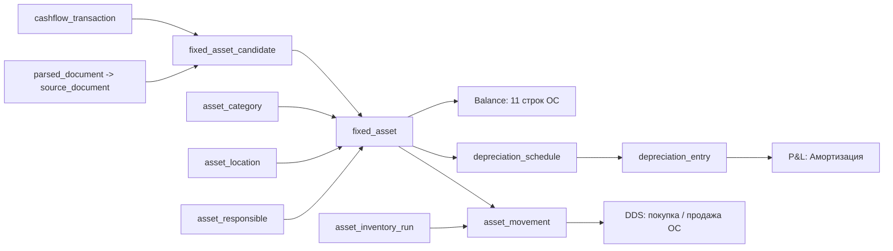

# Спецификация модуля `Учёт основных средств`

Дата фиксации: 2026-05-24.  
Последнее обновление: 2026-05-25 (закрыты правила инвентаризации, русских статусов и операционные решения по ОС).

## Назначение

Модуль `Учёт основных средств` должен заменить исторический Google Sheets `Учёт Основных Средств 2.0` на веб-процесс ведения реестра ОС: инвентаризация, ввод новых единиц, перемещения, амортизация, ремонты/модернизации, выбытия и передача остаточной стоимости в баланс.

Документ фиксирует целевую продуктовую и доменную модель. Он не пересчитывает старый реестр, не обновляет [old-os-and-balance-discovery.md](/research/archive/old-os-and-balance-discovery.md) и не считает амортизацию 2026 до подтверждения актуального состава ОС владельцем.

Ключевой принцип: старый реестр - это seed для категорий, локаций, сроков полезного использования и исторических карточек. Текущим фактом на дату запуска приложения становится только owner-approved инвентаризация с источниками и статусами качества.

## 1. Источники и статус

| Источник | Роль в модуле | Статус | Ограничение |
| --- | --- | --- | --- |
| [old-os-and-balance-discovery.md](/research/archive/old-os-and-balance-discovery.md) | Read-only срез старого Google Sheets, план восстановления ОС и баланса | `partial` | Исторический контур устарел с 2024-06-11 |
| [fixed_assets_inventory_historic.csv](/research/processed/fixed_assets/fixed_assets_inventory_historic.csv) | Исторический реестр 134 строк ОС | `partial` | Не подтверждает физическое наличие и локацию на 2026-05-24 |
| [balance_structure.csv](/research/processed/fixed_assets/balance_structure.csv) | 11 строк внеоборотных активов в балансе | `partial` | Значения последнего периода 2024-12-31 условные |
| [fixed_assets_bank_candidates.csv](/research/processed/fixed_assets/fixed_assets_bank_candidates.csv) | Скрининг банковских операций 2026-02-01..2026-05-19 | `empty_result` | По строгому правилу найдено 0 кандидатов; это не доказывает отсутствие покупок ОС |
| [2025 реестр ОС](https://docs.google.com/spreadsheets/d/1GK6Cl8U7MiMa_Z97Snz_tdCXej5lwi_Ji5si6qZZLKI/edit?gid=2021085115#gid=2021085115) | Owner-provided реестр 2025 года | `seed_not_current_truth` | Использовать как seed для инвентаризации, но не как current truth без физической проверки |
| [26-balance-module-spec.md](/app-spec/modules/finance/balance/spec.md) | Методология баланса и статусы 11 строк ОС | `partial` по ОС | Баланс ждёт подтверждённый реестр ОС |
| [database.md](/app-spec/architecture/database.md) | Общая архитектура БД и audit | `draft architecture` | В §6.6 зафиксированы только `fixed_asset` и `depreciation_schedule`; эта спека расширяет доменную модель ОС |
| [31-migration-roadmap.md](/app-spec/architecture/migration-roadmap.md) | Roadmap миграции и cutover ОС | `requires_review` до инвентаризации | ОС не должны блокировать весь MVP, если владелец принимает `requires_review` по 11 строкам |

По memory проекта применяются решения: единый `counterparty`, DDS как cash-fact, общий `source_reference`, префиксы через `prepayment_kind`, pipeline `parsed_document` -> `source_document`.

## 2. Текущее устройство исторического учёта

В старом Google Sheets `Учёт Основных Средств 2.0` были следующие вкладки:

| Вкладка | Назначение в старом файле | Что становится в приложении |
| --- | --- | --- |
| `Регламент` | Правила ведения файла, ответственные, источники и срок заполнения | Методология модуля, роли и регламент закрытия периода |
| `Учёт ОС` | Главная таблица ОС: наименование, количество, цена, помещение, тип, даты, срок полезного использования, амортизация, остаточная стоимость, продажа | Карточки `fixed_asset`, движения `asset_movement`, графики амортизации |
| `Свод` | Свод амортизации и стоимости ОС по типам и месяцам | Агрегаты по `asset_category` для P&L и баланса |
| `Свод по помещениям` | Свод по локациям; в XLSX-экспорте нет сохранённых значений | Отчёт по `asset_location` и инвентаризационным отклонениям |
| `Свод по ответственным` | Свод по ответственным; в XLSX-экспорте нет сохранённых значений | Отчёт по `asset_responsible` |
| `Справочник` | Типы ОС, описания, ответственные и помещения | Справочники `asset_category`, `asset_location`, `asset_responsible` |
| `НФ` | Служебная/шаблонная вкладка | Не переносится как бизнес-сущность; хранится только как source snapshot |

Исторический реестр содержит:

| Метрика | Значение |
| --- | ---: |
| Строк ОС | 134 |
| Первоначальная стоимость | 3 856 742.00 ₽ |
| Накопленная амортизация, расчётно | 353 050.05 ₽ |
| Остаточная стоимость по книге | 3 503 691.95 ₽ |
| Строк с нулевой первоначальной стоимостью | 4 |
| Метод в processed-реестре | `linear_monthly_formula` для 134 строк |

Исторические локации:

| Локация | Строк ОС | Первоначальная стоимость | Остаточная стоимость |
| --- | ---: | ---: | ---: |
| Ф-л Черникова | 76 | 2 470 742.00 ₽ | 2 182 906.61 ₽ |
| ТЗ Гагарина | 44 | 1 068 000.00 ₽ | 1 013 831.95 ₽ |
| Склад Гагарина | 11 | 250 000.00 ₽ | 240 422.62 ₽ |
| Склад (гараж) | 3 | 68 000.00 ₽ | 66 530.77 ₽ |

Owner decision 2026-05-24 по Гагарина: точки Гагарина больше нет. Все ОС физически должны быть либо на Черникова, либо на складе. До инвентаризации текущие ОС, которые числятся на `ТЗ Гагарина`, можно перенести в складской контур как provisional `in_storage` / `requires_review`; после инвентаризации локации, статусы и остаточные стоимости актуализируются.

Локальная проверка processed-реестра 2026-05-24 показала, что в историческом CSV есть строки с `qty > 1`. Примеры из `Учёт ОС`: `Стелаж 198х150х70` (`qty=3`, source row 2), `Холодильник Капри МХМ 700 л` (`qty=2`, source row 5), `Стол разделочный с бортом 150х60 см` на Черникова (`qty=6`, source row 81), `Ларь морозильный Aucma BD-560` (`qty=3`, source row 99). По memory 2026-05-24 решение по групповым legacy-строкам не закрыто: владелец запросил примеры и не нашёл сдвоенных строк в рабочей таблице. До отдельного owner decision такие строки получают `requires_owner_review`; автоматическое разделение не считается принятой методологией.

## 3. Категории, балансные строки и порог признания

Owner decision 2026-05-24: управленческий порог признания ОС в приложении - **5 000 ₽**, как в старом регламенте. Покупки ниже порога по умолчанию не капитализируются как ОС и должны попадать в расход/ремонт/инвентарь по назначению, если владелец отдельно не подтвердит исключение.

Для всех категорий используется единый метод амортизации: линейный помесячный. Срок полезного использования (`useful_life_months`, СПИ) остаётся разным по категориям и карточкам, как в историческом шаблоне; именно СПИ является настройкой под разный износ. Гибрид методов по категориям не вводится, чтобы будущий финансовый менеджер не выбирал метод вручную при добавлении новой категории.

Owner decision 2026-05-25: `Не работающее оборудование` не является отдельной operational-категорией ОС. Неработающее оборудование хранится как статус (`not_working`) внутри исходной категории: тепловое, холодильное, кассовое и т.д. Legacy-строка баланса `Не работающее оборудование` сохраняется как историческая/контрольная строка, но новые карточки ОС не должны получать её как `asset_category_id`.

Целевой справочник `asset_category` должен покрывать строки внеоборотных активов баланса, но `Не работающее оборудование` реализуется через статус, а не отдельную категорию:

| # | Категория ОС / строка баланса | Исторические строки ОС | Остаточная стоимость в историческом реестре | Значение баланса 2024-12-31 | Текущее покрытие | Методология |
| ---: | --- | ---: | ---: | ---: | --- | --- |
| 1 | Тепловое оборудование | 28 | 512 623.22 ₽ | 570 623.00 ₽ | `partial` | Линейная амортизация по подтверждённым единицам; нужна инвентаризация |
| 2 | Холодильное/морозильное оборудование | 18 | 1 488 827.40 ₽ | 1 332 077.00 ₽ | `partial` | То же |
| 3 | Кассовое оборудование | 8 | 106 729.16 ₽ | 106 729.00 ₽ | `partial` | То же |
| 4 | Оборудование торговых залов | 13 | 214 405.75 ₽ | 214 406.00 ₽ | `partial` | То же |
| 5 | Вспомогательное оборудование | 32 | 577 895.91 ₽ | 676 646.00 ₽ | `partial` | То же |
| 6 | Электромеханическое оборудование | 9 | 250 762.90 ₽ | 250 763.00 ₽ | `partial` | То же |
| 7 | Электроника и оргтехника | 2 | 16 833.33 ₽ | 16 833.00 ₽ | `partial` | То же |
| 8 | Системы кондиционирования | 2 | 70 047.62 ₽ | 70 048.00 ₽ | `partial` | То же |
| 9 | Прочий кухонный инвентарь | 0 | 0.00 ₽ | 0.00 ₽ | `partial` | Подтвердить 0 или наличие через инвентаризацию |
| 10 | Не работающее оборудование | 0 | 0.00 ₽ | 0.00 ₽ | `partial` | Не использовать как отдельную категорию новых ОС; отражать как статус `not_working` внутри исходной категории и контролировать через инвентаризационный/status view |
| 11 | Мебель и предметы интерьера | 22 | 265 566.66 ₽ | 239 917.00 ₽ | `partial` | Линейная амортизация по подтверждённым единицам; нужна инвентаризация |

Расхождения между остаточной стоимостью исторического CSV и значениями баланса 2024-12-31 не исправляются в этом документе. Они фиксируются как legacy-разрыв, который закрывается первичной инвентаризацией и owner-approved opening balance.

## 4. Целевая модель модуля

Целевой модуль состоит из реестра единиц ОС, справочников, графика амортизации, журнала движений и инвентаризационных запусков.



Главные сущности:

| Сущность | Назначение | Ключевые поля на логическом уровне |
| --- | --- | --- |
| `fixed_asset` | Карточка отдельной единицы ОС. Legacy-строки `qty > 1` до owner decision импортируются как `requires_owner_review`, без автоматического разворота | `inventory_name`, `asset_category_id`, `location_id`, `responsible_id`, `purchase_date`, `commissioning_date`, `initial_cost`, `residual_value`, `current_status`, `source_reference_id` |
| `asset_category` | operational-категории ОС с привязкой к строкам баланса; `not_working` не категория, а статус карточки | `name`, `balance_line_id`, `default_useful_life_months`, `recognition_threshold_policy`, `active_flag` |
| `asset_location` | Управленческие локации: Черникова, Гагарина legacy, склад, гараж, офис/админ | `location_id`, `asset_storage_type`, `active_from`, `active_to`, `legacy_flag` |
| `asset_responsible` | Ответственный за наличие/состояние ОС. Owner decision 2026-05-24: базовый ответственный - управляющий точки | `user_id` или `employee_id`, `location_id`, `effective_from`, `effective_to` |
| `depreciation_schedule` | План амортизации по единице ОС | `fixed_asset_id`, `method`, `useful_life_months`, `start_period_id`, `end_period_id`, `quality_status`, `source_reference_id` |
| `depreciation_entry` | Помесячная строка фактической амортизации для P&L и баланса | `fixed_asset_id`, `period_id`, `depreciation_amount`, `accumulated_depreciation_after`, `residual_value_after`, `quality_status` |
| `asset_movement` | Событие жизненного цикла ОС | `fixed_asset_id`, `movement_type`, `movement_date`, `from_location_id`, `to_location_id`, `amount_effect`, `counterparty_id`, `cashflow_transaction_id`, `source_document_id`, `source_reference_id` |
| `asset_inventory_run` | Физическая инвентаризация на дату | `inventory_date`, `scope`, `location_ids`, `responsible_user_id`, `status`, `source_reference_id` |

Типы `asset_movement`:

| Тип | Смысл |
| --- | --- |
| `purchase` | Поступление ОС от поставщика, лизингодателя или через иной документ |
| `commissioning` | Ввод в эксплуатацию и старт амортизации |
| `transfer` | Перемещение между локациями или ответственными |
| `repair` | Ремонт без увеличения балансовой стоимости |
| `modernization` | Улучшение, увеличивающее балансовую стоимость или срок полезного использования |
| `revaluation` | Управленческая переоценка по owner decision |
| `inventory_adjustment` | Корректировка по результатам инвентаризации |
| `sale` | Продажа ОС с cash inflow и выбытием |
| `writeoff` | Списание из-за износа, поломки, утраты или непригодности |
| `loss` | Недостача/потеря по инвентаризации |

`fixed_asset` и `depreciation_schedule` уже названы в [database.md §6.6](/app-spec/architecture/database.md). Дополнительные сущности этой спеки являются детализацией модуля ОС и должны быть синхронизированы с архитектурой 30 при следующем обновлении логической модели, без SQL и выбора стека.

## 5. Жизненный цикл единицы ОС

1. **Кандидат на ОС.** Платёж в DDS, счёт, УПД, акт, накладная, чек или ручная инвентаризационная строка создают `fixed_asset_candidate`. Owner decision 2026-05-25: после 2024-06-11 первичный контроль новых покупок ОС начинается с DDS; если покупка ОС прошла по банку или наличному счёту, но ОС не заведено в реестр, система должна подсветить вопрос "что это была за покупка ОС?" и позволить создать ОС прямо из DDS. На этом этапе покупка ещё не капитализирована.
2. **Решение о признании.** Финансовый ответственный проверяет порог, назначение, категорию, документ, локацию и ответственного. Если это расход или ремонт, кандидат отклоняется из ОС и уходит в P&L/УДКЗ как обычный расход.
3. **Поступление.** При подтверждении создаётся `fixed_asset` и `asset_movement(type=purchase)`. Поставщик, продавец или лизингодатель связан через единый `counterparty`.
4. **Ввод в эксплуатацию.** `asset_movement(type=commissioning)` фиксирует дату, с которой начинается полезное использование. Управляющий точки подтверждает ввод в эксплуатацию; если при покупке/приёмке он не отметил резерв, новое оборудование по умолчанию считается введённым с первого месяца. Если ОС куплено в резерв и ещё не используется, карточка остаётся `received_not_commissioned` и не амортизируется до ввода.
5. **Амортизация.** После подтверждённого реестра генерируется `depreciation_schedule`, а каждый закрываемый месяц получает `depreciation_entry`. Сумма entry попадает в P&L строку `Амортизация`; residual value попадает в баланс.
6. **Перемещение.** Любое изменение локации или ответственного фиксируется `asset_movement(type=transfer)`; старая локация не переписывается задним числом.
7. **Ремонт или модернизация.** Ремонт сохраняет работоспособность и признаётся расходом периода. Модернизация увеличивает стоимость или срок службы и меняет амортизационную базу с даты owner-approved события.
8. **Переоценка.** Управленческая переоценка допустима только как отдельное событие с `source_reference` и причиной. Она не должна тихо перезаписывать первоначальную стоимость.
9. **Выбытие.** Продажа, списание или потеря закрывают актив через `asset_movement(type=sale/writeoff/loss)`. После выбытия амортизация прекращается, residual value уходит из баланса, а денежный факт продажи отражается в DDS. Owner decision 2026-05-25: финансовый результат от продажи ОС в P&L не показывать; это перевод стоимости из внеоборотных активов в ликвидные деньги, а не управленческий доход.
10. **Архив.** Карточка ОС не удаляется. Она остаётся в истории с датой выбытия, источниками и связями с документами, cashflow и инвентаризациями.

## 6. Процессы

### 6.1 Первичная инвентаризация

Цель: закрыть гэп с 2024-06-11 до даты запуска приложения и получить owner-approved opening register.

Owner decision 2026-05-25: первичную физическую инвентаризацию Черникова и склада провести не раньше 2026-06-01 и не позднее 2026-06-12. Ответственный за факт наличия/состояния - управляющий.

Порядок:

1. Создать `asset_inventory_run` со scope: Черникова, склад, склад/гараж, офис/админ; Гагарина учитывается только как legacy-источник, не как активная точка.
2. Загрузить исторические 134 строки как seed со статусом `legacy_partial`, без признания текущим фактом; строки `ТЗ Гагарина` предварительно перевести в складской контур как provisional `in_storage` / `requires_review`.
3. По каждой единице подтвердить: физически найдено, локация, ответственный (управляющий точки), состояние, серийный/инвентарный номер при наличии, фото/акт при необходимости.
4. Групповые строки legacy (`qty > 1`) вынести в owner-review с примерами и не превращать автоматически в отдельные единицы до отдельного решения владельца.
5. Присвоить статус на русском языке в UI/формах: `в эксплуатации`, `на складе`, `не работает`, `продано`, `списано`, `утеряно`. Внутренние коды могут оставаться `in_use`, `in_storage`, `not_working`, `sold`, `written_off`, `lost`, но пользовательский слой должен быть русским. Неработающее оборудование не становится отдельной категорией баланса; это статус внутри исходной категории ОС.
6. Подтвердить остаточную стоимость и полезный срок: взять legacy-значение, пересчитать по новой политике или зафиксировать owner adjustment.
7. Все расхождения сохранить как `asset_movement(type=inventory_adjustment)` или owner-review задачу.

Результат первичной инвентаризации: список ОС с `quality_status=final/partial/requires_review`, который можно использовать для opening balance и запуска амортизации.

### 6.2 Регулярная инвентаризация

Рекомендуемый ритм:

| Частота | Scope | Цель |
| --- | --- | --- |
| Квартал | Дорогое оборудование, кассы, электроника, неработающее/ремонтное | Быстро ловить потери, перемещения и поломки |
| Полугодие | Все ОС Черникова и склады | Подтверждать баланс и ответственных |
| Год | Полная инвентаризация активных локаций и разбор legacy-строк Гагарина как source history | Закрывать годовой реестр и полезные сроки |

Закрытие инвентаризации должно создавать список расхождений: не найдено, найдено не там, найдено без карточки, состояние изменилось, требуется списание, требуется ремонт, требуется модернизация.

### 6.3 Ввод нового ОС из DDS, счёта/УПД

Целевой pipeline:

1. Покупка ОС первично контролируется через DDS: банковская или наличная операция с признаками ОС создаёт задачу review / `fixed_asset_candidate`, если карточка ОС ещё не заведена.
2. Документ поступления попадает в интеграционный слой как `parsed_document`.
3. После проверки он повышается до `source_document` по решению 11.8.
4. Если документ похож на ОС, создаётся `fixed_asset_candidate` с ссылкой на `source_document`, `counterparty_id`, сумму, категорию-кандидат и локацию.
5. Платёж за ОС живёт в DDS как `cashflow_transaction`, потому что DDS является cash-fact. Покупка ОС в DDS - cash outflow инвестиционного/балансового характера, а не P&L-расход.
6. Если была предоплата за ОС, она должна проходить через поставочный контур с `prepayment_kind` по решению 11.5 до получения документа/актива; после поступления предоплата закрывается на актив.
7. После owner/finance review кандидат становится `fixed_asset`; создаётся `asset_movement(type=purchase)`.
8. После фактического ввода создаётся `asset_movement(type=commissioning)` и график амортизации.

Документы для сверки после 2024-06-11: первичный контроль - DDS; дополнительные документы могут поступать из СБИС/DocsInbox, счетов, УПД, актов, чеков, наличных покупок и личных карт, но они служат подтверждением/расшифровкой к DDS и `source_document`, а не заменой cash-fact.

Связь с УДКЗ: если поставщик ОС ведётся как supplier, документ может жить как `supplier_document` или связанный `source_document`, но оплата не дублируется в УДКЗ. УДКЗ/DDS хранят matching, а ОС хранит капитализированный актив.

### 6.4 Выбытие: продажа, списание, потеря

| Сценарий | Что фиксирует ОС | Что фиксирует DDS | Что фиксирует баланс/P&L |
| --- | --- | --- | --- |
| Продажа | `asset_movement(type=sale)`, дата выбытия, покупатель, продажная цена, residual на дату | Cash inflow от покупателя | Актив уходит из 11 строк ОС, деньги увеличивают ликвидные активы; финансовый результат от продажи не попадает в P&L |
| Списание | `asset_movement(type=writeoff)`, причина, акт/решение, residual | Обычно cashflow нет | Актив уходит из баланса; списание residual требует методологии P&L |
| Потеря/недостача | `asset_movement(type=loss)`, inventory discrepancy, ответственный | Cashflow нет до компенсации | Актив уходит из баланса; компенсация сотрудника, если есть, идёт отдельным процессом |

Списание и продажа не должны выполняться только изменением статуса в карточке. Нужен отдельный movement с датой, источником и причиной.

Owner decision 2026-05-25: продажа ОС отражается только в DDS и балансе. В P&L результат от продажи ОС не показывается: это не доход и не прибыль, а перевод из внеоборотных активов в ликвидные деньги.

### 6.5 Ремонт vs модернизация

Ремонт признаётся расходом периода, если он:

- восстанавливает работоспособность или поддерживает исходное состояние;
- не увеличивает срок полезного использования;
- не повышает производительность/мощность/экономическую выгоду;
- не создаёт отдельный объект ОС.

Модернизация капитализируется, если она:

- существенно улучшает характеристику ОС;
- продлевает срок полезного использования;
- увеличивает производительность, мощность или функциональность;
- является заменой ключевого узла, после которой актив фактически стал лучше исходного состояния.

В приложении спорные случаи получают `requires_review`. До owner decision они не должны автоматически попадать ни в амортизацию, ни в P&L как подтверждённый расход.

Owner decision 2026-05-24:

- в DDS уже есть статья `Ремонт ОС`; дополнительно нужна статья `Модернизация ОС`;
- для обеих статей обязательна привязка к ремонтируемому или модернизируемому `fixed_asset`;
- если сумма работ меньше 15% от изначальной стоимости ОС, это управленчески классифицируется как `Ремонт ОС` и признаётся расходом периода;
- если сумма работ больше 15% от изначальной стоимости ОС, это управленчески классифицируется как `Модернизация ОС`, капитализируется и амортизируется;
- сумма ровно 15% получает `requires_owner_review`, пока не будет отдельного решения.

Оценка корректности: для управленческого корпоративного учёта такой порог удобен как контрольное правило и защищает от хаотичной классификации. Для регламентированного бухгалтерского/налогового учёта порог не должен быть единственным критерием: там обычно важны признаки улучшения, продления срока службы или роста полезности. Поэтому в приложении qualitative-признаки выше сохраняются как пояснение и контроль, а правило 15% фиксируется именно как owner-approved управленческая политика проекта.

## 7. Связь с другими модулями

| Модуль | Связь |
| --- | --- |
| Balance | 11 строк внеоборотных активов = сумма residual value подтверждённых `fixed_asset` по `asset_category.balance_line_id` на дату snapshot. До инвентаризации строки ОС остаются `partial` / `requires_review`. |
| P&L / ОПиУ | Строка `Амортизация` в блоке `Расходы ниже EBITDA` = сумма `depreciation_entry.depreciation_amount` за период по подтверждённым активам. Продажа ОС не создаёт доход/расход или финансовый результат в P&L; отражение только в DDS и Balance. |
| DDS | Покупка ОС = cash outflow + создание/пополнение актива; продажа ОС = cash inflow + выбытие актива. DDS остаётся единственным cash-fact. |
| УДКЗ | Поставщик ОС является `counterparty` с ролью `supplier`; supplier document/prepayment может участвовать в документном контуре, но оплата матчится через DDS. |
| Документы и AI/integration | `parsed_document` хранит OCR/extract; `source_document` хранит подтверждённый бизнес-документ. ОС ссылается только на подтверждённый документ или manual action. |
| Counterparty | Поставщик ОС, продавец при продаже, лизингодатель, сервисный подрядчик ремонта - роли единого `counterparty`, без отдельного справочника ОС-контрагентов. |
| Payroll/Core | `asset_responsible` может ссылаться на пользователя или сотрудника; базовая роль ответственного - управляющий точки; доступ к персональным данным ответственных должен соблюдать общую privacy-модель. |
| Reconciliation | Недостачи, расхождения баланса, неподтверждённые ремонты и legacy-строки создают `reconciliation_case` или owner-review задачу. |

## 8. Методология амортизации

Исторический файл использовал линейную помесячную амортизацию (`linear_monthly_formula`) и сроки полезного использования от 12 до 156 месяцев, часть строк без срока. Owner decision 2026-05-24: целевой метод приложения - линейная помесячная амортизация для всех категорий; СПИ остаются разными по категориям/карточкам.

```text
monthly_depreciation = depreciable_base / useful_life_months
residual_value_after_period =
  initial_cost
  + capitalized_modernizations
  - accumulated_depreciation
  - disposal_amount
```

Правила:

1. Амортизация генерируется только для активов с подтверждённой карточкой, датой ввода в эксплуатацию, категорией, стоимостью и сроком полезного использования.
2. До первичной инвентаризации historical depreciation не переносится в P&L 2026.
3. Если useful life пустой, актив получает `requires_review`, а не нулевую амортизацию.
4. Если initial cost равен 0, актив получает `requires_owner_review` до решения по конкретной карточке.
5. При модернизации меняется амортизационная база или срок с даты события, но старые `depreciation_entry` закрытого периода не переписываются.
6. При продаже/списании амортизация прекращается с периода выбытия по owner-approved правилу месяца выбытия.
7. Остаточная стоимость не должна уходить ниже 0 без явного owner adjustment.
8. Старт амортизации - месяц ввода в эксплуатацию. По умолчанию это первый месяц эксплуатации/покупки, если управляющий не отметил, что ОС куплено в резерв и ещё не введено.

Для ОС в резерве амортизация не создаётся до явного `commissioning`-события.

## 9. MVP модуля

### Что входит в первую итерацию

1. Страница `Учёт ОС` с реестром активов: категория, локация, ответственный, статус, стоимость, накопленная амортизация, остаточная стоимость, источник.
2. Справочник operational-категорий ОС с привязкой к строкам баланса; `Не работающее оборудование` реализовано статусом внутри исходной категории, а не отдельной категорией карточки.
3. Справочник локаций: Черникова, склад, склад/гараж, офис/админ; Гагарина сохраняется только как legacy/source location.
4. Импорт historical seed из `fixed_assets_inventory_historic.csv` со статусом `legacy_partial`.
5. Инвентаризационный workflow: создать `asset_inventory_run`, отметить наличие/состояние/локацию, собрать расхождения.
6. Ручной ввод нового ОС из подтверждённого документа или manual action.
7. Базовые движения: поступление, ввод, перемещение, ремонт, модернизация, продажа, списание, потеря.
8. Линейный график амортизации с порогом ОС 5 000 ₽, единым методом для всех категорий и категорийными СПИ.
9. Агрегат для баланса по строкам ОС/исходным категориям и агрегат для P&L `Амортизация`.
10. Общий `source_reference` для каждой финансово значимой суммы и manual decision.

### Что отложено

- Автоматический поиск ОС по всем документам и банковским операциям без owner review.
- Автоматическое списание или продажа без физической проверки.
- Полная лизинговая модель и разделение финансового/операционного лизинга.
- Автоматическое распознавание серийных номеров, фото и QR-наклеек.
- Расследование всех legacy-расхождений 2024-2025 до первичной инвентаризации.
- Отражение прибыли/убытка от продажи ОС в P&L не планируется для управленческого контура: по решению владельца продажа ОС не влияет на P&L.

Cutover-критерий: модуль можно считать первичным источником ОС только после физической инвентаризации и owner-approved opening register. Порог признания и метод амортизации уже закрыты решением 2026-05-24: 5 000 ₽ и единый линейный помесячный метод. До инвентаризации баланс может запускаться с `requires_review` по 11 строкам ОС.

## 10. Миграция и контроль качества

Порядок миграции:

1. Создать source snapshot для старого Google Sheets, processed CSV и owner-provided реестра 2025 года.
2. Загрузить `asset_category`, `asset_location`, legacy `fixed_asset` seed и актуальный реестр 2025 после отдельного ingestion.
3. Пометить все legacy-карточки как `legacy_partial`, не как текущий факт; Гагарина переносится в складской provisional-контур до инвентаризации.
4. Провести первичную инвентаризацию в окне 2026-06-01..2026-06-12 и owner review расхождений, включая строки с нулевой стоимостью и групповые legacy-строки `qty > 1`.
5. Создать opening register на дату запуска или дату X, если owner решит восстанавливать 2026-02-01.
6. Сгенерировать амортизацию только по финализированным карточкам.
7. Передать агрегаты в Balance и P&L.

Контроли:

| Контроль | Правило |
| --- | --- |
| Источник | Каждая стоимость, ввод, выбытие, модернизация и owner adjustment имеют `source_reference_id` |
| Категория | У каждой активной карточки есть `asset_category_id`, связанный с исходной категорией ОС; `not_working` хранится как статус, а не как отдельная категория |
| Локация | У каждой активной карточки есть текущая локация; Гагарина не является активной точкой, legacy-строки Гагарина до инвентаризации переносятся в складской provisional-контур |
| Ответственный | Для активов в эксплуатации назначен ответственный управляющий точки |
| Ремонт/модернизация | DDS-статьи `Ремонт ОС` и `Модернизация ОС` требуют привязки к `fixed_asset`; порог 15% от изначальной стоимости определяет базовую управленческую классификацию |
| Амортизация | Нет `depreciation_entry` без подтверждённого `depreciation_schedule` и события ввода в эксплуатацию |
| Баланс | Сумма residual value по категориям раскрывается до карточек ОС |
| P&L | Строка `Амортизация` раскрывается до `depreciation_entry`, а не до банковских оплат; продажа ОС не создаёт P&L-доход или расход |
| DDS | Cash outflow покупки ОС не признаётся P&L-расходом напрямую |

## 11. Согласование с архитектурными решениями 2026-05-24/25

| Решение | Как применяется в ОС |
| --- | --- |
| 11.1 `counterparty` | Поставщик ОС, продавец, покупатель при продаже, лизингодатель и сервисный подрядчик ремонта - роли единого `counterparty`; отдельный master-справочник ОС-контрагентов не создаётся |
| 11.2 DDS как cash-fact | Покупка и продажа ОС ссылаются на `cashflow_transaction`; модуль ОС не ведёт собственный payment ledger |
| 11.3 общий `source_reference` | `fixed_asset`, `asset_movement`, `depreciation_schedule`, `depreciation_entry`, `asset_inventory_run` и ручные корректировки имеют общий audit trail |
| 11.5 `prepayment_kind` | Если есть аванс за ОС, он проходит через поставочный/prepayment-контур до закрытия на актив; тип аванса фиксируется явно |
| 11.8 documents pipeline | `parsed_document` - технический extract; `source_document` - подтверждённый документ, на который можно опираться при создании ОС |
| 12a дата X | Если ОС не инвентаризованы к старту, opening balance получает `requires_review`; historical seed и owner-provided реестр 2025 не превращаются в current truth без инвентаризации |
| 12b гибридная миграция | Raw history старых Sheets остаётся source snapshot; в БД переносим master data, monthly totals и opening balances, а не каждую legacy-формулу |

## 12. Открытые вопросы владельцу

1. ✅ закрыто 2026-05-24: управленческий порог признания ОС - 5 000 ₽ из старого регламента.
2. ✅ закрыто 2026-05-24: метод амортизации единый - линейный помесячный для всех категорий; СПИ разные по категориям/карточкам, как в шаблоне.
3. ✅ закрыто 2026-05-24: амортизация стартует с месяца ввода в эксплуатацию; по умолчанию ОС считается введённым с первого месяца, если управляющий не отметил резерв/не введено.
4. ✅ закрыто 2026-05-24: точки Гагарина больше нет; все ОС должны быть либо на Черникова, либо на складе. До инвентаризации ОС, числящиеся на `ТЗ Гагарина`, переносятся в складской provisional-контур; после инвентаризации локации и статусы актуализируются.
5. ✅ закрыто 2026-05-24: ответственным за ОС в новом приложении является управляющий точки.
6. ✅ закрыто 2026-05-24: `Ремонт ОС` и новая DDS-статья `Модернизация ОС` требуют привязки к ОС; меньше 15% от изначальной стоимости - ремонт/расход периода, больше 15% - модернизация/капитализация/амортизация; ровно 15% - `requires_owner_review`.
7. ✅ закрыто 2026-05-25: legacy-строки `qty > 1` разделяются на отдельные единицы ОС; разные локации или состояния всегда означают отдельные карточки.
8. ✅ закрыто 2026-05-24: ОС с нулевой первоначальной стоимостью помечаются `requires_owner_review`.
9. ✅ закрыто 2026-05-25: первичный контроль покупок ОС после 2024-06-11 - DDS; если покупка ОС прошла по банку или наличному счёту и не заведена в ОС, система подсвечивает review "что это была за покупка ОС?" и может создавать ОС прямо из DDS. СБИС/DocsInbox, счета, УПД, акты, чеки, наличные покупки и личные карты используются как подтверждающие документы/source_document.
10. ✅ закрыто 2026-05-25: неработающее оборудование учитывать как статус внутри исходной категории ОС, а не как отдельную категорию баланса.
11. ✅ закрыто 2026-05-25: финансовый результат от продажи ОС в P&L не отображать; продажа ОС отражается только в DDS и балансе как перевод стоимости из внеоборотных активов в ликвидные деньги.
12. ✅ закрыто 2026-05-24: владелец дал ссылку на актуальный реестр 2025 года: https://docs.google.com/spreadsheets/d/1GK6Cl8U7MiMa_Z97Snz_tdCXej5lwi_Ji5si6qZZLKI/edit?gid=2021085115#gid=2021085115. Источник не скачивался в рамках интервью.
13. ✅ закрыто 2026-05-25: инвентаризация Черникова и склада проводится в окне 2026-06-01..2026-06-12; реестр 2025 используется как seed, но не как current truth.
14. ✅ закрыто 2026-05-25: статусы инвентаризации в пользовательском интерфейсе должны быть на русском: `в эксплуатации`, `на складе`, `не работает`, `продано`, `списано`, `утеряно`.
15. ✅ закрыто 2026-05-25: Balance MVP можно запускать с `requires_review` по ОС, если инвентаризация не завершена.

## 13. Артефакты

| Файл | Назначение |
| --- | --- |
| [old-os-and-balance-discovery.md](/research/archive/old-os-and-balance-discovery.md) | Read-only срез старого ОС и баланса, план восстановления |
| [fixed_assets_inventory_historic.csv](/research/processed/fixed_assets/fixed_assets_inventory_historic.csv) | Исторический реестр 134 строк ОС |
| [balance_structure.csv](/research/processed/fixed_assets/balance_structure.csv) | Структура баланса и 11 строк ОС |
| [fixed_assets_bank_candidates.csv](/research/processed/fixed_assets/fixed_assets_bank_candidates.csv) | Пустой результат скрининга банковских кандидатов в ОС |
| [report.md](/research/processed/fixed_assets/report.md) | Технический отчёт по сборке processed-артефактов |
| [26-balance-module-spec.md](/app-spec/modules/finance/balance/spec.md) | Баланс, где ОС закрывают 11 строк внеоборотных активов |
| [database.md](/app-spec/architecture/database.md) | Общая архитектура сущностей и audit |
| [31-migration-roadmap.md](/app-spec/architecture/migration-roadmap.md) | Roadmap миграции, где ОС-инвентаризация идёт отдельным потоком |

## 14. Предложение для индекса

Строка для [00-index.md](/docs/business-control/00-index.md), если владелец решит обновлять индекс:

```markdown
| [34](/app-spec/modules/finance/fixed-assets/spec.md) | Спецификация модуля `Учёт основных средств`: реестр ОС, инвентаризация, амортизация, движения, связь с Balance/P&L/DDS |
```
