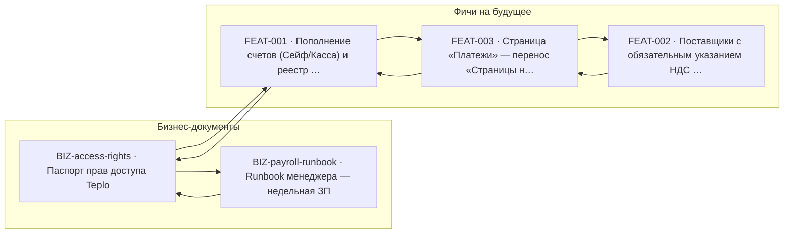

<!-- Сгенерировано scripts/build_index.py из скилла project-scribe.
     Не редактируй вручную — файл перезаписывается при каждой фиксации. -->

# Индекс документации

Обновлён: 2026-07-09. Документов: 5.

## Бизнес-документы

| ID | Название | Статус | Файл | Обновлён |
|---|---|---|---|---|
| BIZ-access-rights | Паспорт прав доступа Teplo | actual | [access-rights-matrix.md](access-rights-matrix.md) | 2026-06-16 |
| BIZ-payroll-runbook | Runbook менеджера — недельная ЗП | actual | [runbook-payroll-manager.md](runbook-payroll-manager.md) | 2026-06-08 |

## Фичи на будущее

| ID | Название | Статус | Файл | Обновлён |
|---|---|---|---|---|
| FEAT-001 | Пополнение счетов (Сейф/Касса) и реестр партнёров с выплатой изъятий | draft | [features/feat-001-account-replenishment-partners.md](features/feat-001-account-replenishment-partners.md) | 2026-07-09 |
| FEAT-002 | Поставщики с обязательным указанием НДС по товарам в накладных | draft | [features/feat-002-supplier-vat-invoices.md](features/feat-002-supplier-vat-invoices.md) | 2026-07-09 |
| FEAT-003 | Страница «Платежи» — перенос «Страницы на оплату» в Финансы и агрегатор платежей | draft | [features/feat-003-payments-page.md](features/feat-003-payments-page.md) | 2026-07-09 |

## Граф связей

