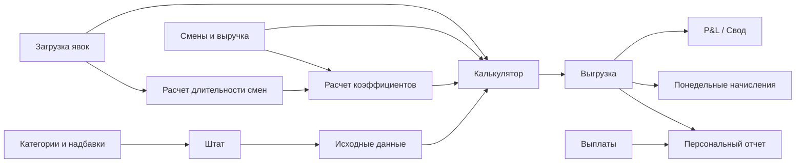

# Спецификация payroll-модуля `Зарплата и кадры`

Дата фиксации: 2026-05-20.  
Назначение: зафиксировать фактическую логику расчета зарплаты из Google Sheets `Расчет зарплат NEW` и первый контур будущего веб-модуля `Зарплата и кадры`.

Документ не содержит персональных данных, ФИО, телефонов и индивидуальных сумм сотрудников. Персональные значения должны оставаться в защищенных регистрах приложения и показываться только пользователям с правами payroll/HR.

## Источники и статусы правил

Основные источники:

- `research/processed/payroll_discovery/agent_a_handoff.md`;
- `research/processed/payroll_discovery/agent_b_handoff.md`;
- `research/processed/payroll_discovery/agent_c_handoff.md`;
- `research/processed/payroll_discovery/workbook_architecture.md`;
- `research/processed/payroll_discovery/payroll_calculation_flow.md`;
- `research/processed/payroll_discovery/staff_structure.md`;
- `research/processed/payroll_discovery/personal_report_structure.md`;
- `research/processed/payroll_discovery/payments_vs_accruals.md`;
- `research/processed/payroll_discovery/accumulation_and_deposit_rules.md`;
- `docs/business-control/17-unified-management-app.md`;
- `business-docs/finance/pnl-methodology.md`;
- `research/processed/economic_block/labor_report.md`.

Статусы правил:

| Статус | Значение |
| --- | --- |
| `подтверждено формулами` | правило найдено в формулах, справочниках или расчетных листах Google Sheets |
| `подтверждено владельцем` | правило зафиксировано как ответ/контекст владельца в смежных документах |
| `наблюдается в реестре` | тип строк или процесс виден в `Выгрузка`/`Выплаты`, но не раскрыт полноценной формулой |
| `гипотеза` | логика выведена из структуры таблицы и требует подтверждения владельца |
| `требует проверки` | есть риск ошибки формулы, источника, статуса или неполной трактовки |

## Решения Владельца 2026-05-20

1. Строки из `Калькулятор` попадают в `Выгрузка` через **Apps Script**. Для веб-приложения это не нужно копировать буквально: целевая логика должна создавать immutable `payroll_ledger_lines` внутри `payroll_run`.
2. Категория `Внештат` / категория 6 нужна для внештатных подмен: бывший сотрудник, сотрудник другого заведения или другой временный человек, который выходит на один-два дня при ЧП. Он не числится в штате, не участвует в проценте от выручки и по нему не удерживаются депозиты.
3. `Пиццерист / 4` и `Сушист / 4` — стажеры. Для целевого приложения правило: они получают только оклад, без процента от выручки. Логику приложения можно сделать чище, чем текущие Google Sheets-формулы.
4. Накопительный фонд выплачивается строго **15 января**.
5. `Депозит списание` не показывается в персональном отчете сотрудника. Персональный отчет предназначен для передачи сотруднику; если депозит списан, сотрудник, как правило, уже уволился. Списание должно жить во внутреннем audit trail / депозитном счете.
6. `Депозит возврат` отображается в фактических выплатах.
7. `Выплата накоплений` отображается как обычная выплата. В персональном отчете есть ячейка накоплений, которая после выплаты обнуляется.

## Решения Владельца 2026-05-24

**Решение владельца 2026-05-24 (11.7):** `payroll_payment` в целевом приложении является обязательством/ведомостью payroll-модуля, а не первичным cash-fact. Денежный факт хранится в DDS: индивидуальная банковская выплата матчится 1:1 с `cashflow_transaction`, кассовая ведомость закрывается через `payroll_payment_batch`. Доступ к индивидуальным суммам и drill-down до сотрудника есть только у payroll-роли; DDS видит агрегаты и приватные ссылки.

## 1. Текущее устройство расчета зарплаты в Google Sheets

Текущий payroll-контур устроен как связка справочников, ручных журналов, технических расчетов и итоговых регистров.

Справочники и ручные события живут в `Исходные данные`, `Штат`, `Категории и надбавки`, `Смены и выручка`, `Загрузка явок`. Скрытые/технические листы `Расчет длительности смен` и `Расчет коэффициентов` превращают явки, расписание и категории в нормированные коэффициенты смены. `Калькулятор` считает одного выбранного сотрудника за неделю. `Выгрузка` хранит накопленные расчетные строки начислений и удержаний. Owner decision 2026-05-25: `Выплаты` - это ведомость/обязательство к выплате, а не первичный денежный факт; факт выдачи денег закрывается через DDS. `Персональный отчет` сводит payroll ledger и payment obligations в персональный баланс.

Ключевой вывод для веб-приложения: таблицу нельзя переносить как один большой экран-калькулятор. Нужны отдельные сущности `payroll_run`, `payroll_ledger_line`, `payroll_payment`, `deposit_account`, `accumulation_fund_account`, `employee_event` и audit trail до исходных событий. `payroll_payment` фиксирует обязательство/ведомость; cash-fact закрывается через DDS.



## 2. Карта листов и назначение

| Лист | Назначение сейчас | Что становится в веб-приложении | Статус |
| --- | --- | --- | --- |
| `Исходные данные` | справочники ставок, коэффициентов, депозитов, порогов процента, фонда и надбавок | справочники payroll-правил с versioning | подтверждено формулами |
| `Штат` | текущие сотрудники, роли, дата приема, расчет стажа, депозитные показатели | `employees`, `employee_role_assignments`, `deposit_accounts` | подтверждено формулами |
| `Категории и надбавки` | ручной журнал категорий, депозитных условий, надбавок, премий, штрафов, НДФЛ, пособий | кадровые и payroll-события с датой действия | подтверждено формулами |
| `Смены и выручка` | расписание через `IMPORTRANGE`, дневная выручка | `shift_schedule`, `daily_revenue` | подтверждено формулами |
| `Загрузка явок` | фактические интервалы работы по сотрудникам и дням | `attendance_entries` | подтверждено формулами |
| `Расчет длительности смен` | парсинг интервалов, расчет часов и округление | расчетный сервис длительности | подтверждено формулами |
| `Расчет коэффициентов` | расчет плановых и фактических коэффициентов смены | сервис распределения revenue-share | подтверждено формулами |
| `Калькулятор` | недельный расчет выбранного сотрудника | payroll run preview / расчетный движок | подтверждено формулами |
| `Выгрузка` | накопительный расчетный ledger начислений и удержаний | `payroll_ledger_lines` | подтверждено формулами / наблюдается в реестре |
| `Выплаты` | legacy-реестр выплат; по решению владельца 2026-05-25 это ведомость/обязательство, а не первичный cash-fact | `payroll_payments` + 1:1 `cashflow_transaction` или `payroll_payment_batch` | подтверждено формулами; решение владельца 2026-05-25 |
| `Персональный отчет` | баланс сотрудника, детализация начислений и выплат | экран персонального payroll-отчета | подтверждено формулами |
| `Понедельные начисления` | недельная сводка по производству Черникова | ведомость/агрегация по периоду и подразделению | подтверждено формулами, требует параметризации |
| `Зарплата Администрации` | отдельный контур фиксированной административной зарплаты | admin payroll profile/events | подтверждено формулами |
| `Технический лист` | календарь и списки для отчетов | системные справочники/временные измерения | подтверждено формулами |

## 3. Роли, должности, категории и коэффициенты

В таблице есть две payroll-модели.

Первая модель: сменные сотрудники производства. Роли: `Сушист`, `Пиццерист`, `Шаурмист`, `Администратор`, `Заготовщик`. У них есть категория, ставка смены, коэффициент участия в проценте от выручки, депозит и накопительный фонд.

Вторая модель: администрация. Роли: `Директор по развитию`, `Управляющий`, `Руководитель службы доставки`, `Менеджер`, `Помощник менеджера`. Они живут на отдельном листе `Зарплата Администрации`, работают через фиксированные начисления/выплаты и не связаны напрямую с категорийной логикой смен.

Owner decision 2026-05-25: payroll-роль/станция смены берётся только из `Смены и выручка` / `Учет смен`. iiko-должности вроде `Кассир` и `Повар` не маппятся автоматически в payroll-роли; они могут быть только контрольным сигналом для рассинхрона.

### Сменные роли и категории

| Роль | Текущие категории | Исторические категории | Комментарий |
| --- | --- | --- | --- |
| `Администратор` | 2, 3, 4 | 2, 3, 4 | сменный production-администратор, не офисная администрация |
| `Заготовщик` | 5 | 5 | категория 5 без процента от выручки |
| `Пиццерист` | 1, 2 | 1, 2, 3, 4, 5 | для категории 4 ставка не найдена |
| `Сушист` | 1, 2, 3, 5, 6 | 1, 2, 3, 4, 5, 6 | категория 4 = стажер; категория 6 = внештатная подмена |
| `Шаурмист` | 3, 4 | 3, 4, 5 | категория 5 историческая |

### Категория и коэффициент процента

| Категория | Коэффициент участия в проценте | Депозит по умолчанию | Удержание депозита по умолчанию | Статус |
| ---: | ---: | ---: | ---: | --- |
| 1 | 10 | 20000 | 1000 | подтверждено формулами |
| 2 | 7.5 | 15000 | 1000 | подтверждено формулами |
| 3 | 5 | 10000 | 1000 | подтверждено формулами |
| 4 | 2.5 в текущей Google Sheets; целевое правило для стажеров — без процента | 7000 | 1000 | формула подтверждена; бизнес-правило приложения уточнено владельцем |
| 5 | 0 | 7000 | 1000 | подтверждено формулами |
| 6 | 0 | 0 | 0 | внештатная подмена, подтверждено владельцем |

Категория влияет на:

- коэффициент участия в распределении процента от выручки;
- дефолтный требуемый депозит;
- дефолтное удержание депозита;
- ставку смены через пару `роль + категория`;
- накопительный фонд косвенно, потому что фонд считается процентом от оклада.

Категория не задает напрямую премии, штрафы, НДФЛ, больничные/отпуска/пособия, статус сотрудника и административный оклад.

### Ставки смены по роли и категории

| Роль / категория | Ставка полной 12-часовой смены | Статус |
| --- | ---: | --- |
| `Администратор / 2` | 2200 | подтверждено формулами |
| `Администратор / 3` | 2000 | подтверждено формулами |
| `Администратор / 4` | 1800 | подтверждено формулами |
| `Заготовщик / 5` | 2200 | подтверждено формулами |
| `Пиццерист / 1` | 2600 | подтверждено формулами |
| `Пиццерист / 2` | 2200 | подтверждено формулами |
| `Пиццерист / 3` | 2000 | подтверждено формулами, историческая категория |
| `Пиццерист / 4` | стажерская ставка; в Google Sheets не найдена | целевое правило: только оклад, без процента; сумму ставки нужно задать в приложении |
| `Пиццерист / 5` | 2000 | подтверждено формулами, историческая категория |
| `Сушист / 1` | 2800 | подтверждено формулами |
| `Сушист / 2` | 2400 | подтверждено формулами |
| `Сушист / 3` | 2200 | подтверждено формулами |
| `Сушист / 4` | стажерская ставка; в Google Sheets не найдена | целевое правило: только оклад, без процента; сумму ставки нужно задать в приложении |
| `Сушист / 5` | 2000 | подтверждено формулами |
| `Сушист / 6` | 0 | внештатная подмена; без процента и без депозита |
| `Шаурмист / 3` | 2000 | подтверждено формулами |
| `Шаурмист / 4` | 1800 | подтверждено формулами |
| `Шаурмист / 5` | 1800 | подтверждено формулами, историческая категория |

### Надбавки

| Надбавка | Правило | Статус |
| --- | --- | --- |
| `Старший` | +500 к сменной ставке при активном событии | подтверждено формулами |
| `Зам` | +300 к сменной ставке при активном событии | подтверждено формулами |
| Дополнительный час | +200 в выбранных дневных колонках калькулятора | подтверждено формулами, требует уточнения сценария |
| Внеурочный коэффициент | x1.5 при отмеченном признаке | требует проверки: в `Калькулятор!C15:I15` ссылка на `C25:I25` конфликтует с депозитным блоком |

## 4. Полная логика начислений и удержаний

### 4.1 Оклад

Статус: подтверждено формулами.

База оклада берется из справочника `роль + категория`. Для полной смены используется полная ставка. Для неполной смены ставка пропорционально режется по часам:

```text
base_shift_rate = ставка(роль, категория)
allowances = надбавка Старший/Зам + доп. час, если применимо

если длительность >= 12 часов:
    salary_base = base_shift_rate + allowances
иначе:
    salary_base = (base_shift_rate + allowances) / 12 * hours

salary = salary_base
```

Возможное применение внеурочного коэффициента x1.5 требует проверки из-за неоднозначной ссылки в калькуляторе.

### 4.2 Процент от выручки

Статус: подтверждено формулами.

Процент считается не индивидуально от всей выручки сотруднику, а через общий дневной пул:

```text
rate = процент по tier-таблице дневной выручки
shift_pool = daily_revenue * rate
employee_share = employee_adjusted_coeff / total_adjusted_coeff
employee_percent = floor(shift_pool * employee_share)
```

Пороговая таблица процента:

| Минимальная дневная выручка | Процент |
| ---: | ---: |
| 50000 | 3.5% |
| 140000 | 4.5% |
| 190000 | 5.5% |
| 550000 | 6.5% |

Если порог не достигнут или формула возвращает ошибку, в текущей таблице часто стоит пустота, а не ноль. В приложении это нужно хранить как `not_applicable` или `no_rate`, а не как подтвержденный `0`.

### 4.3 Премия

Статус: подтверждено формулами.

Премии вводятся ручными событиями в `Категории и надбавки!R:V` по ключу `дата + сотрудник + тип + сумма + комментарий`. `Калькулятор` подтягивает сумму на соответствующий день, `Выгрузка` хранит итоговую строку типа `Премия`. В веб-приложении премия должна быть отдельным `manual_payroll_event` с автором, причиной, датой действия и ссылкой на расчетную строку.

### 4.4 Накопительный фонд

Статус: начисление подтверждено формулами; правило выплаты/потери подтверждено контекстом владельца, но требует детализации.

Фонд считается процентом от `Оклад`, а не от `Оклад + Процент + Премия`:

```text
если стаж < 0.5 года:
    фонд не начисляется
если стаж >= 0.5 года:
    floor(Оклад * 5%)
если стаж >= 1.0 года:
    floor(Оклад * 10%)
если стаж >= 1.5 года:
    floor(Оклад * 15%)
```

Контекст владельца: фонд копится в течение календарного года и выплачивается строго 15 января за предыдущий год; если сотрудник уходит раньше 15 января, он его не получает. Даже увольнение 14 января не даёт права на выплату. В формулах `Персональный отчет!I7:J7` есть окно подсказки с 1 по 15 января, но целевое бизнес-правило для приложения — именно 15 января.

В приложении фонд должен быть отдельным счетом:

- начисление фонда увеличивает обязательство фонда, но не обычную сумму к выплате;
- `Списание накоплений` уменьшает фонд с причиной;
- `Выплата накоплений` происходит строго 15 января и обнуляет накопительный счёт сотрудника за предыдущий календарный год;
- начисления нового года, начавшиеся с 1 января, не участвуют в выплате 15 января за прошлый год;
- с 1 января в персональном отчёте появляется отдельный информационный блок с суммой выплаты 15 января за прошлый год.

### 4.5 Больничные, отпуска и пособия

Статус: подтверждено формулами.

Сейчас это один общий тип `Больничные и отпуска и пособия`, который вводится ручным событием и увеличивает payroll-баланс сотрудника. Для веб-приложения лучше оставить общий line type для миграции, но добавить подтип `sick_leave`, `vacation`, `benefit`, чтобы P&L и HR-аналитика не смешивали разные основания.

### 4.6 Штрафы и удержания

Статус: подтверждено формулами, есть риск качества данных.

Штрафы и удержания вводятся ручными событиями и в `Выгрузка` хранятся положительными суммами. Знак задается не знаком числа, а типом строки: `Штрафы и удержания` уменьшают сумму к выплате.

В данных найден дубликат типа `Штрафы и удержания` с неразрывным пробелом. В персональном отчете ищется вариант с обычным пробелом, поэтому строки с NBSP могут выпадать из итогов. В веб-приложении нужен нормализованный справочник типов и миграционная проверка.

### 4.7 Штрафы по ревизиям

Статус: подтверждено формулами; P&L-строка подтверждена смежной методологией как будущая отдельная строка.

В `Калькулятор` есть отдельный блок штрафов по ревизиям. Найденные ставки: для производственных ролей кроме сменного администратора - 929; для `Администратор` - 25. Есть флаг исключения из ревизии. Логику исключения и периодичность применения нужно подтвердить.

В P&L штрафы по ревизиям планируется отделить от строки результата продуктовых инвентаризаций.

### 4.8 НДФЛ

Статус: удержание в payroll подтверждено формулами; источник полной P&L-строки налогов с зарплаты подтвержден владельцем как ДДС, а не только payroll.

В `Выгрузка` тип называется `НДФЛ Начислено`, а в `Персональный отчет` колонка подписана как `Удержание НДФЛ`. Это удержание уменьшает баланс сотрудника и не является денежной выплатой сотруднику.

В управленческом P&L строку `Налоги с ЗП` нельзя автоматически считать только из зарплатной ведомости, потому что социальные выплаты работодателя в ней не учитываются. Основной источник полной строки - ДДС, статья `Налоги с З/п`; payroll может быть контрольным источником.

### 4.9 Депозиты

Статус: удержание/возврат/списание подтверждены формулами; назначение `Депозит списание` подтверждено владельцем.

Депозит в текущей таблице смешан между `Штат`, `Исходные данные`, `Категории и надбавки`, `Калькулятор` и `Выгрузка`. Для приложения это должен быть отдельный счет сотрудника.

Базовая логика:

- требуемый депозит берется по категории или из персонального override;
- стандартное удержание берется по категории или из персонального override;
- собранный депозит = исходный депозит + `Депозит удержание` - `Депозит возврат`;
- если депозит не собран, калькулятор может создать `Депозит удержание`;
- при увольнении статус `Выдать` создает `Депозит возврат` с коэффициентом выдачи;
- статус `Не выдавать` создает `Депозит списание`.

`Депозит списание` не должно попадать в персональный отчет сотрудника: отчет предназначен для передачи сотруднику, а списание депозита обычно происходит после увольнения и невыполнения обязательств. В приложении списание должно быть видно во внутреннем audit trail депозитного счета и в управленческих отчетах. Owner decision 2026-05-24: для P&L/управленческого отчёта нужна отдельная статья `Списание депозитов`; основной источник - зарплатная ведомость / payroll ledger.

### 4.10 Ручные корректировки

Статус: гипотеза на основе ручных событий и структуры `Выгрузка`.

Сейчас ручные корректировки фактически растворены в типах `Премия`, `Штрафы и удержания`, `Больничные и отпуска и пособия`, `НДФЛ Начислено`, депозитных и фондовых строках. В приложении нужна отдельная операция `manual_adjustment`, которая требует:

- тип влияния: начисление, удержание, фонд, депозит, налог, техническая корректировка;
- дату действия и расчетный период;
- комментарий и основание;
- автора;
- связь с исходной строкой импорта, если это миграция из Google Sheets.

## 5. Правила распределения процента от выручки между сменой

Статус: подтверждено формулами.

Распределение процента состоит из пяти шагов.

1. По расписанию определяется состав смены и роль каждого сотрудника.
2. По роли и категории берется плановый коэффициент сотрудника.
3. По явке рассчитывается фактическая длительность. Если смена меньше 12 часов, коэффициент режется пропорционально `hours / 12`; если 12 часов и больше, берется полный коэффициент.
4. За день суммируются фактические коэффициенты всех участников смены.
5. Дневной процентный пул от выручки делится пропорционально фактическим коэффициентам.

Формула:

```text
adjusted_coeff =
    full_coeff, если final_hours >= 12
    full_coeff * final_hours / 12, если final_hours < 12

employee_percent =
    floor(daily_revenue * revenue_rate / total_adjusted_coeff * employee_adjusted_coeff)
```

Особенность явок: интервалы парсятся из текстовых значений. Минуты `>= 40` округляют длительность на 1 час вверх. Это целочисленное округление, а не точные дробные часы.

Риски переноса:

- интервалы через полночь и нестандартный формат времени могут считаться неверно;
- пустая длительность не равна нулевой смене;
- категория 5/6 имеет нулевой коэффициент процента, но может иметь оклад;
- ошибка в общем знаменателе дня меняет процент всех участников смены.

## 6. Персональный отчет сотрудника

Статус: подтверждено формулами, с несколькими gap.

`Персональный отчет` строится по входам:

- начало периода;
- конец периода;
- выбранный сотрудник.

Отчет сводит два регистра:

- `Выгрузка` - расчетные начисления/удержания;
- `Выплаты` - ведомость/обязательства к выплате; денежный факт закрывается через DDS.

Дневные колонки отчета:

| Группа | Типы |
| --- | --- |
| Начисления | `Оклад`, `Процент`, `Премия`, `Больничные и отпуска и пособия` |
| Отдельные обязательства | `Накопительный фонд`, `Депозит возврат`, `Депозит удержание` |
| Удержания | `Штрафы и удержания`, `Штрафы по ревизиям`, `НДФЛ Начислено` |
| Денежные выплаты | `Выплата ЗП`, `Выплата аванса` |

Текущая формула агрегирует строки по ключу:

```text
дата + сотрудник + тип строки
```

Для приложения этого недостаточно. Экран должен показывать:

- opening balance;
- начислено за период;
- удержано за период;
- выплачено деньгами;
- closing balance;
- отдельный блок накопительного фонда: начислено, списано, выплачено, остаток, право на выплату;
- отдельный блок депозита: требуется, собрано, удержано, возвращено, списано, решение при увольнении;
- раскрытие каждой суммы до исходных `ledger_line_id` и `payment_id`.

Особые правила и gap:

- комментарии к премиям/штрафам сейчас подтягиваются через lookup и могут терять вторую строку за тот же день;
- `Выплата накоплений` показывается как обычная выплата;
- накопления после выплаты обнуляются в отдельной ячейке фонда;
- `Депозит списание` сознательно не показывается в персональном отчете сотрудника, но должно быть во внутреннем audit trail;
- фонд частично участвует в стартовом балансе, но это нужно заменить на отдельный счет накопительного фонда.

## 7. Разделение P&L-начислений и cash-flow выплат

Статус: подтверждено формулами, смежной P&L-методологией, архитектурным решением 11.7 и решением владельца 2026-05-25 по вкладке `Выплаты`.

`Выгрузка` - accrual ledger. Он отвечает на вопрос, что начислено, удержано или перенесено в фонд/депозит. Это не обязательно деньги.

`Выплаты` в Google Sheets исторически выглядит как cash ledger, но в целевом приложении `payroll_payment` является обязательством payroll-модуля: кому, за что и сколько нужно выплатить или уже заявлено к выплате. Первичный cash-fact хранится в DDS как `cashflow_transaction`.

Owner decision 2026-05-25: счёт/кошелёк, с которого фактически произведена выплата, не хранится в зарплатной ведомости. Это информация только для DDS. Payroll payment хранит обязательство "кому и сколько", а wallet определяется по DDS cash-fact.

Для P&L использовать начисления, а не выплаты:

- `Оклад`;
- `Процент`;
- `Премия`;
- `Больничные и отпуска и пособия`;
- `Накопительный фонд` - трактовку как части ФОТ нужно финально подтвердить, но в текущей экономической сводке он учитывался как начисление ФОТ.

Для payroll payment obligations использовать `Выплаты`; для cash-flow использовать DDS:

- `Выплата ЗП`;
- `Выплата аванса`;
- `Выплата накоплений`.

Правило matching с DDS:

- индивидуальная банковская выплата: `payroll_payment` матчится 1:1 с `cashflow_transaction`;
- кассовая ведомость или агрегированная выдача: несколько `payroll_payment` закрываются через `payroll_payment_batch`, который виден в DDS как агрегат;
- индивидуальные суммы, ФИО и drill-down до сотрудника доступны только payroll-роли.
- wallet/source account выплаты берётся только из DDS; payroll-ведомость не содержит поле выбора счёта выплаты.

Удержания, депозиты и НДФЛ нельзя просто суммировать в ФОТ по знаку:

- штрафы и НДФЛ уменьшают баланс сотрудника;
- депозитное удержание уменьшает обычную выплату, но увеличивает депозитный счет;
- депозитный возврат увеличивает сумму к выплате, но по сути закрывает депозитное обязательство;
- депозитное списание не показывается сотруднику в персональном отчете и должно жить во внутреннем депозитном audit trail; в управленческом P&L для него нужна отдельная статья `Списание депозитов`;
- налоги с зарплаты для P&L должны сверяться с ДДС, потому что payroll-ведомость не содержит весь контур налогов работодателя.

Связь с ОПиУ: P&L получает блок зарплаты из Google Sheets `2026 Зарплатная ведомость` через `IMPORTRANGE` на лист `Из Отчетов`. В будущем веб-приложение должно отдавать этот блок как контролируемый отчет/API, а не через ручной импорт.

## 8. Жизненный цикл сотрудника

Статус: часть событий подтверждена формулами, полноценный lifecycle является целевой моделью.

В текущей таблице нет единого надежного статуса сотрудника. Наличие строки в `Штат` означает активную роль, но не покрывает испытательный срок, внештат, увольнение и архив.

Решение 2026-05-27: в целевом приложении `Штат` вынесен на отдельную страницу/master-реестр `employee`, а не ведется как вложенная вкладка зарплатной ведомости. Имя сотрудника read-only синхронизируется из iiko; должность, категория и надбавки ведутся в приложении. См. memory `project_staff_list_page`.

Целевые статусы:

- `active` - работает;
- `trial` - испытательный срок;
- `temporary` / `contractor` - временный или внештатный сотрудник;
- `terminated` - уволен;
- `archived` - скрыт из оперативного интерфейса, но сохранен для истории.

Внештатная подмена — отдельный сценарий: человек выходит на короткий срок, не числится в основном штате, не участвует в проценте от выручки и по нему не удерживается депозит.

### Найм

Одна операция должна:

1. создать сотрудника;
2. завести роль;
3. назначить категорию с effective date;
4. задать дату приема;
5. рассчитать депозит по категории или принять override;
6. установить статус `active` или `trial`;
7. записать audit trail.

Если сотрудник уже появился в iiko-явке, но ещё не заведён в приложении, payroll-run блокируется до внесения обязательных HR/payroll-данных. Без карточки сотрудника, роли, категории и необходимых расчётных параметров зарплата не рассчитывается.

### Изменение категории

Категория должна быть событием с датой действия, а не редактированием текущей строки. Текущая категория на дату расчета = последняя запись по сотруднику и роли с `effective_date <= calculation_date`.

При изменении категории приложение обязано проверить:

- есть ли ставка для пары `роль + категория`;
- какой депозит должен применяться после изменения;
- меняется ли коэффициент процента;
- не затрагивает ли изменение уже закрытые payroll runs.

### Смена роли

Смена роли должна закрывать старое назначение и открывать новое. Если у сотрудника несколько ролей, нужно явно хранить `is_primary` и правило депозита. Сейчас есть риск, что депозитная категория выбирается как минимальная категория среди ролей; это нужно подтвердить.

### Назначение и снятие `Старший`/`Зам`

Сейчас надбавки подтягиваются по сотруднику. Для приложения нужно решить, применяется ли надбавка ко всем ролям сотрудника или только к конкретной роли/смене. Целевая модель должна позволять роль-специфичную надбавку.

### Увольнение

Операция увольнения должна:

1. установить `termination_date`;
2. закрыть активные роли и надбавки;
3. заблокировать новые сменные начисления после даты увольнения;
4. рассчитать финальный payroll balance;
5. принять решение по депозиту: `return`, `forfeit`, `partial_return`;
6. принять решение по накопительному фонду: выплатить в разрешенный период или списать;
7. создать связанные ledger-строки и cash-задачи;
8. синхронно деактивировать/удалить сотрудника в iiko, сохранив локальную архивную карточку и audit;
9. сохранить основание решения.

Если увольнение внесено во время активной смены, приложение закрывает смену временем увольнения и считает оплату до этого момента. Явки после даты/времени увольнения считаются рассинхроном и отправляются в quality review.

### Потеря накопительного фонда

Контекст владельца: если сотрудник уходит раньше выплаты фонда 15 января, фонд не выплачивается и списывается в пользу прибыли; даже увольнение 14 января лишает права на выплату. В таблице это отражается строкой `Списание накоплений`, но не связано автоматически с увольнением. В приложении `fund_forfeit` должен быть отдельным внутренним событием с причиной и связью с увольнением. В 99% случаев причина - увольнение до даты права на выплату; редкая дисциплинарная причина допустима только как ручное решение. Плановая выплата фонда происходит строго 15 января.

### Удержание, возврат и списание депозита

Депозит должен жить как отдельный счет:

- `deposit_withholding` увеличивает собранный депозит и уменьшает payroll payable;
- `deposit_return` закрывает обязательство к возврату;
- `deposit_writeoff` списывает депозит с причиной;
- cash-выплата депозита должна проходить отдельным платежным событием, если деньги реально выдаются.

## 9. Предлагаемая модель данных веб-приложения

Минимальные сущности:

| Сущность | Назначение |
| --- | --- |
| `employees` | карточка сотрудника без расчета зарплаты внутри карточки |
| `employee_status_events` | история статусов: найм, trial, увольнение, архив |
| `roles` | справочник ролей |
| `employee_role_assignments` | история назначений сотрудника на роли |
| `employee_category_events` | история категорий с датой действия |
| `role_category_rates` | ставка смены по роли и категории |
| `category_rules` | коэффициент процента, депозит, удержание |
| `allowance_events` | назначение/снятие Старший/Зам, доплаты |
| `revenue_percent_tiers` | пороги выручки и процент |
| `shift_schedules` | плановые смены |
| `attendance_entries` | фактические интервалы явки |
| `shift_duration_results` | рассчитанная длительность и статус качества |
| `daily_revenue` | выручка по дню и подразделению |
| `shift_coefficients` | фактические коэффициенты распределения процента |
| `payroll_runs` | расчет за период/подразделение/версию правил |
| `payroll_ledger_lines` | все начисления, удержания, фонд, депозит, налоговые строки |
| `manual_payroll_events` | ручные премии, штрафы, пособия, НДФЛ, корректировки |
| `deposit_accounts` | депозитный счет сотрудника |
| `deposit_transactions` | удержание, возврат, списание депозита |
| `accumulation_fund_accounts` | счет накопительного фонда по сотруднику/году |
| `accumulation_fund_transactions` | начисление, списание, право на выплату, выплата фонда |
| `payroll_payments` | обязательства/ведомости выплат; cash-fact закрывается через 1:1 `cashflow_transaction` или `payroll_payment_batch` в DDS |
| `admin_payroll_profiles` | фиксированные административные оклады и должности |
| `pnl_mapping_rules` | связь payroll-типов со строками P&L |
| `audit_log` | кто, когда и почему изменил правило, событие или расчет |
| `import_batches` | пачки миграции/импорта из Google Sheets |

См. также `research/processed/payroll_discovery/payroll_module_entities.csv`.

## 10. Вопросы владельцу

Критичные открытые вопросы перед реализацией:

1. Что будет источником истины для расписания: внешний `IMPORTRANGE`, отдельная таблица смен или база веб-приложения?
2. Какие поля нужны для сценария внештатной подмены: заведение-источник, срок, ставка, ответственный за допуск, комментарий?
3. Какие окладные ставки задать для стажеров `Пиццерист / 4` и `Сушист / 4` в целевом приложении?
4. Надбавки `Старший` и `Зам` применяются по сотруднику целиком или по конкретной роли/смене?
5. При нескольких ролях какую категорию использовать для депозита: минимальную, основную роль или отдельную по каждой роли?
6. ~~Как технически оформлять выплату накопительного фонда 15 января: отдельным payroll run, отдельным payment batch или обычной выплатой с типом?~~ ✅ Закрыто решением владельца 2026-05-24: `payroll_payment` фиксирует обязательство payroll-модуля, а cash-fact закрывается через 1:1 `cashflow_transaction` или `payroll_payment_batch`.
7. ~~Как показывать сотруднику обнуление накоплений после выплаты, чтобы это было понятно и не выглядело как потеря денег?~~ ✅ Закрыто решением владельца 2026-05-24: с 1 января показывать отдельный информационный блок с суммой выплаты 15 января за прошлый год; выплата 15 января обнуляет фонд прошлого года и не затрагивает начисления нового года.
8. ~~В какой управленческий отчет попадет `Депозит списание`, если оно скрыто из персонального отчета сотрудника?~~ ✅ Закрыто решением владельца 2026-05-24: нужна отдельная управленческая статья `Списание депозитов`, источник - зарплатная ведомость / payroll ledger.
9. ~~Значение `Не выдавать` полностью покрывает кейс "уволился и не выполнил обязательства" или нужны причины/сценарии?~~ ✅ Закрыто решением владельца 2026-05-24: `Списание накоплений` в 99% случаев связано с увольнением до 15 января; редкая дисциплинарная причина возможна только как ручное решение с причиной.
10. Нужно ли включать накопительный фонд, депозиты, больничные/отпуска/пособия и списание накоплений в недельные итоги?
11. Фиксированная дата старта недель `2026-03-03` и фильтр `Производство Черникова` - временное ограничение или бизнес-правило?
12. Как обрабатывать явки через полночь и нестандартные форматы времени?
13. Где хранится источник правил и факта курьерских выплат?

Полный список вынесен в `research/processed/payroll_discovery/payroll_owner_questions.md`.

На 2026-05-20 закрыты прежние вопросы о процессе `Калькулятор -> Выгрузка`, категории 6, стажерах 4 категории, дате выплаты фонда, выплате накоплений и показе списанного депозита. Ответы зафиксированы в разделе «Решения Владельца 2026-05-20».

## 11. Риски переноса

| Риск | Последствие | Что сделать |
| --- | --- | --- |
| Нет явного статуса сотрудника | неверные начисления после увольнения или во время trial | завести status events и валидировать payroll run |
| `Выгрузка` заполняется через Apps Script без полноценного audit trail приложения | невозможно воспроизвести расчет внутри будущей системы без миграции процесса | заменить Apps Script на payroll runs и immutable ledger lines |
| Пустота в формулах принимается за ноль | занижение/искажение начислений | хранить статусы `not_applicable`, `missing_source`, `formula_error` |
| Нестандартные явки | неверные часы, коэффициенты и процент | сделать валидатор интервалов и ручное подтверждение |
| NBSP-дубликат типа штрафов | часть удержаний может выпасть из отчетов | нормализовать line types при миграции |
| Фонд и депозит частично смешаны с обычным балансом | неверный долг к выплате | вести отдельные счета фонда и депозита; в персональном отчете показывать только сотруднику релевантные движения |
| Налоги с ЗП неполны в payroll | неверный P&L | использовать ДДС как основной источник налогов с зарплаты |
| Администрация живет отдельным контуром | риск двойного учета или пропуска | завести отдельный admin payroll profile |
| Нет audit trail по ручным корректировкам | спорные начисления нельзя объяснить | требовать автора, основание и комментарий |
| Исторические role/category без ставок | расчет может падать или считать ноль | для стажеров `Пиццерист / 4` и `Сушист / 4` задать целевую окладную ставку без процента |

## 12. Минимальный MVP payroll-модуля

MVP должен закрыть не все HR-процессы, а стабильное воспроизведение текущего расчета и персонального отчета.

### Экраны

1. `Сотрудники`: карточка, статус, дата приема/увольнения, активные роли, категории, депозит, фонд.
2. `Справочники зарплаты`: ставки `роль + категория`, коэффициенты категорий, пороги процента, надбавки, правила фонда и депозита.
3. `Смены и явки`: расписание, фактические интервалы, рассчитанные часы, ошибки формата.
4. `Выручка по дням`: дата, подразделение, сумма, источник, статус.
5. `Расчет зарплаты`: payroll run за неделю/период, предпросмотр строк, контроль дублей и ошибок.
6. `Ручные события`: премии, штрафы, пособия, НДФЛ, депозитные решения, списание фонда.
7. `Ведомость`: итог по сотрудникам и неделям с разделением начислений/удержаний/к выплате.
8. `Персональный отчет`: баланс, фонд, депозит, выплаты и раскрытие до строк ledger.
9. `Выплаты`: ведомости `payroll_payment`, matching с DDS cash-flow 1:1 или через `payroll_payment_batch`, контроль приватности индивидуальных сумм.
10. `P&L экспорт`: управленческий отчет по ФОТ с маппингом на строки ОПиУ.

### Сущности первого релиза

- сотрудники и статусы;
- роли, категории, ставки и коэффициенты;
- смены, явки, выручка;
- payroll runs;
- payroll ledger lines;
- payroll payments;
- manual payroll events;
- deposit accounts/transactions;
- accumulation fund accounts/transactions;
- audit log.

### Операции первого релиза

- импорт текущих справочников из Google Sheets;
- создание/изменение сотрудника без потери истории;
- назначение роли и категории с effective date;
- загрузка смен, явок и выручки;
- расчет оклада, процента, премий, удержаний, НДФЛ, фонда и депозитов;
- закрытие payroll run с неизменяемыми строками ledger;
- фиксация выплат;
- формирование персонального отчета;
- экспорт P&L-агрегатов;
- журналирование ручных корректировок и ответственных.

Такой MVP переносит главный учетный контур из Google Sheets в приложение, но оставляет спорные бизнес-решения явными настройками, а не скрытыми формулами.
