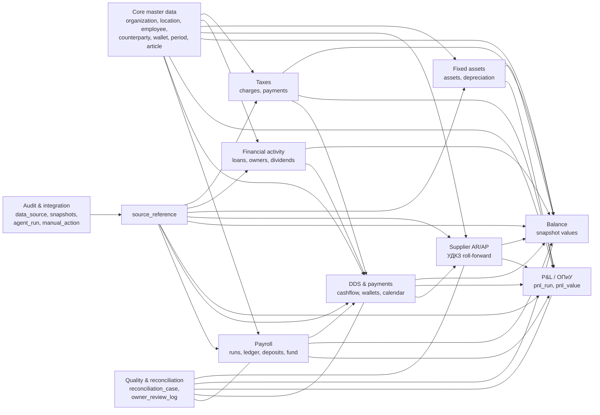

# Архитектура БД единого управленческого приложения

Дата фиксации: 2026-05-24.  
Статус: первый архитектурный каркас core domain, без SQL DDL, ORM-кода и выбора конкретной СУБД.

## 1. Назначение

Этот документ сводит независимые модульные спецификации в первый каркас единой БД управленческого веб-приложения «Тепло». Он фиксирует:

- какие сущности уже описаны в модулях;
- какие сущности пересекаются между модулями;
- какие поля нужны в первом каркасе и откуда взято каждое поле;
- кто является владельцем сущности;
- кто читает сущность;
- как централизовать audit trail и статусы качества;
- какие архитектурные решения нельзя закрывать без владельца.

Документ намеренно не содержит SQL DDL. Таблицы ниже описывают доменную модель: сущность, поля, связи, опциональность и инварианты.

## 2. Источники и обозначения

| Обозначение | Источник |
| --- | --- |
| `[17]` | [17-unified-management-app.md](17-unified-management-app.md) |
| `[19]` | [19-payroll-module-spec.md](19-payroll-module-spec.md) |
| `[21]` | [21-dds-module-spec.md](/app-spec/modules/finance/dds/spec.md) |
| `[26]` | [26-balance-module-spec.md](/app-spec/modules/finance/balance/spec.md) |
| `[27]` | [27-dz-kz-module-spec.md](/app-spec/modules/finance/dz-kz/spec.md) |
| `[28]` | [28-data-inventory-for-migration.md](/app-spec/integrations/data-inventory.md) |
| `[29]` | [29-ai-agent-integration-patterns.md](/app-spec/ai-agents/integration-patterns.md) |
| `[16]` | [16-fixed-assets-and-balance.md](16-fixed-assets-and-balance.md) |
| `[P&L]` | [pnl-build-methodology.md](/business-docs/finance/pnl-methodology.md) |
| `[memory:*]` | Memory-файлы проекта в `.claude/.../memory/` |
| `[new:*]` | Новое системное поле, добавленное только для единой БД; причина указана рядом |

Общее правило: каждое поле в таблицах ниже имеет источник в квадратных скобках. Если поле новое, оно не является новой бизнес-сущностью, а служит стабильному ключу, связи, audit trail, lifecycle или защите от потери истории.

## 3. Полная карта сущностей из модульных спецификаций

| Источник | Сущности |
| --- | --- |
| Payroll `[19]` | `employee`, `employee_status_event`, `role`, `employee_role_assignment`, `employee_category_event`, `role_category_rate`, `category_rule`, `allowance_event`, `revenue_percent_tier`, `shift_schedule`, `attendance_entry`, `shift_duration_result`, `daily_revenue`, `shift_coefficient`, `payroll_period`, `payroll_run`, `payroll_ledger_line`, `manual_payroll_event`, `deposit_account`, `deposit_transaction`, `accumulation_fund_account`, `accumulation_fund_transaction`, `payroll_payment`, `admin_payroll_profile`, `pnl_mapping_rule`, `import_batch` |
| DDS и платежный контур `[21]` | `account`, `wallet`, `wallet_balance_snapshot`, `bank_operation`, `payment_upload`, `payment_order_candidate`, `expense_accrual_candidate`, `cashflow_transaction`, `dds_article`, `counterparty`, `counterparty_alias`, `payment_role`, `classification_rule`, `classification_event`, `payment_calendar_item`, `payment_approval`, `source_document`, `document_match`, `pnl_balance_posting`, `reconciliation_case`, `calendar_week`, `own_account_registry`, `bank_import_run`, `payroll_payment_batch`, `edo_document`, `fixed_asset_candidate`, `loan_schedule` |
| Balance `[26]` | `balance_period`, `balance_line`, `balance_value`, `balance_check`, `balance_financial_metric`, `balance_anomaly_log` (`balance_source_reference` упразднён решением 11.3) |
| УДКЗ поставщиков `[27]` | `supplier_counterparty`, `supplier_opening_balance`, `supplier_document`, `supplier_payment_match`, `supplier_monthly_rollforward`, `supplier_balance_summary`, `prepayment_type` |
| AI/integration patterns `[29]` | `data_source`, `source_credential`, `agent_run`, `agent_action`, `parsed_document`, `source_snapshot`, `credential_event` |
| Учёт ОС `[16]` | `fixed_asset`, `depreciation_schedule` |
| P&L / ОПиУ `[P&L]`, `[26]`, `[28]` | `pnl_line`, `pnl_run`, `pnl_value`, `expense_accrual`, `prepaid_expense` |
| Учёт ФД `[26]`, `[memory:project_financial_activity_doc]`, `[memory:project_owner_debt_to_business]` | `financial_obligation`, `loan_schedule`, `dividend_ledger`, `owner_payment`, `owner_loan_register`, `owner_contribution`, `leasing_contract` |
| Учёт налогов `[26]`, `[28]` | `tax_charge`, `tax_payment`, `tax_prepayment` |
| Общий audit layer `[29]` + правило этой задачи | `source_reference`, `manual_action` |
| Quality/reconciliation `[21]`, `[26]`, `[29]` + правило этой задачи | `quality_status`, `reconciliation_case`, `owner_review_log` |

## 4. Принципы модели

1. Один первичный владелец у сущности. Другие модули читают через FK/reference, API или view, но не дублируют запись как свою.
2. Статус качества для доменных значений единый: `draft`, `partial`, `final`, `requires_review`, `not_applicable`.
3. Операционные статусы интеграций (`auth_failed`, `schema_changed`, `blocked_by_captcha`) живут в `agent_run` / `credential_event`, но не заменяют `quality_status` финансового значения.
4. Audit trail централизован: `<module>_value -> source_reference -> source_snapshot -> agent_run` или `<module>_value -> source_reference -> manual_action`.
5. Закрытые периоды и подтверждённые ledger/value строки не удаляются физически. Исправления идут корректировкой, новой версией или reversal-записью.
6. Текстовые названия статей, контрагентов и кошельков не являются ключами. Для них нужны immutable id и aliases.
7. Банк, ДДС, P&L и баланс не подменяют друг друга: банк показывает cash fact, P&L - accrual/result за период, баланс - остатки на дату.
8. Raw payload с ПДн, назначениями платежей, реквизитами, OCR text, cookies, письмами и screenshot хранится только в private-хранилище; доменные таблицы получают ссылки, hash и нормализованные поля.

### 4.1 Ключи и опциональность

| Правило | Значение |
| --- | --- |
| `id` | Первичный ключ сущности; обязателен всегда. Если `id` не был явно в исходной таблице Google Sheets, это `[new: stable_key]` для единой БД. |
| `*_id` | Ссылка на другую сущность. Обязательна, если связь уже подтверждена источником; опциональна, если в поле/связи указано `optional`, `pending` или `owner-question`. |
| `source_reference_id` | Обязателен для импортированных, ручных и финансово значимых значений, кроме `quality_status = not_applicable` или чисто вычисляемых агрегатов, которые раскрываются до дочерних значений с источниками. |
| `*_private`, `private_*`, `*_ref_private` | Может быть пустым в публичной/processed-витрине, но если факт существует, raw/evidence хранится в private-хранилище. |
| `effective_to`, `active_to`, `finalized_at`, `closed_at` | Опциональны до закрытия периода, роли, договора, кошелька или lifecycle-события. После закрытия становятся неизменяемой частью истории. |
| `quality_status` | Обязателен для всех `<module>_value`, snapshot, candidate, accrual, payment match и reconciliation сущностей. |

## 5. Core domain и master data

Эти сущности являются общими справочниками. Часть из них уже явно описана в модулях, часть является минимальной оболочкой для связей между модулями. Новые оболочки не добавляют бизнес-логики; они нужны, чтобы payroll, DDS, баланс, P&L и интеграции ссылались на один и тот же объект.

| Сущность | Поля с источником | Связи | Владелец | Читатели | Жизненный цикл | PII |
| --- | --- | --- | --- | --- | --- | --- |
| `organization` | `id` `[new: stable_key]`; `legal_name` `[17: ИП Шокина / юр.владелец контуров]`; `tax_profile` `[17: налоговый учёт]`; `status` `[new:lifecycle]` | 1:N `account`, `location`, `contract`, `data_source` | core_admin | все финансовые модули | создаётся при настройке; не удаляется после появления операций | medium |
| `owner` | `id` `[new: stable_key]`; `person_ref_private` `[memory:owner_debt_to_business]`; `role` `[17: собственник/директор]`; `status` `[new:lifecycle]` | 1:N `owner_loan_register`, `dividend_ledger`, `owner_payment`, `owner_contribution` | financial_activity | balance, DDS, P&L | создаётся при первом owner-движении; архив вместо удаления | high |
| `location` | `id` `[new: stable_key]`; `name` `[16: Черникова/Гагарина/склад]`; `location_type` `[16]`; `active_from` `[21: legacy ТК Гагарина]`; `active_to` `[21: Гагарина закрыта с 2024]` | 1:N `wallet`, `fixed_asset`, `shift_schedule`, `daily_revenue` | core_admin | payroll, DDS, balance, fixed_assets, P&L | создаётся при заведении точки/склада; закрывается датой | low |
| `user` | `id` `[new: app user]`; `display_name` `[26: ответственные Олеся/ФМ]`; `role_ids` `[17: роли и права]`; `status` `[new:lifecycle]` | N:M `app_role`; 1:N `manual_action`, `owner_review_log` | core_admin | все модули | создаётся при выдаче доступа; деактивация вместо удаления | high |
| `app_role` | `id` `[new: stable_key]`; `code` `[17: роли payroll/HR/finance]`; `permissions` `[17: доступ к ПДн/финансам]` | N:M `user` | core_admin | все модули | versioned при изменении прав | medium |
| `employee` | `id` `[19: employees]`; `private_person_ref` `[19: ПДн не в публичных docs]`; `hire_date` `[19: Штат]`; `termination_date` `[19: lifecycle]`; `current_status` `[19: active/trial/temporary/terminated/archived]` | 1:N payroll events/accounts; N:1 `location` optional | payroll | balance, P&L, DDS aggregated only | создаётся при найме/миграции; архивируется, не удаляется | high |
| `customer` | `id` `[new: stable_key]`; `external_customer_ref` `[28:S09 iiko clients/marketing]`; `customer_type` `[28:S08 partner Алиса]`; `pii_ref_private` `[28:private-модель клиентов]`; `status` `[new:lifecycle]` | 1:N orders/partner receivables; N:1 `counterparty` optional | operations/marketing future | P&L, balance, marketing | создаётся при подключении клиентского mart; пока owner-question | high |
| `counterparty` | `id` `[21:counterparties]`; `working_name` `[21]`; `legal_name_private` `[21]`; `payment_roles` `[21]`; `owner_status` `[21]`; `source_status` `[21]` | 1:N aliases, bank ops, supplier docs, contracts | DDS or core, pending owner decision | DDS, УДКЗ, P&L, balance, taxes, fixed_assets | создаётся rule/owner/import; merge только через alias/history | medium/high |
| `counterparty_alias` | `id` `[21]`; `counterparty_id` `[21]`; `alias_text_or_hash` `[21]`; `source_system` `[21]`; `confidence` `[21]`; `private_flag` `[21]` | N:1 `counterparty` | DDS/core | DDS, УДКЗ, integrations | добавляется при новом источнике; не удаляется из истории | medium/high |
| `product` | `id` `[new: stable_key]`; `external_iiko_product_id` `[28:S12-S14]`; `name` `[28:S14]`; `product_group` `[26:запасы/whitelist]`; `active_flag` `[new:lifecycle]` | inventory/P&L/balance lines | inventory future | P&L, balance | создаётся из iiko; деактивация при снятии с учета | low |
| `wallet` | `id` `[21:wallets]`; `account_id` `[21]`; `name` `[21]`; `wallet_type` `[21:bank/cash/store_cash/reserve]`; `location_id` `[21:ТК Черникова/Гагарина]`; `active_flag` `[21]` | 1:N `cashflow_transaction`, `wallet_balance_snapshot`; N:M `data_source` через `wallet_data_source` | DDS | balance, payment_calendar, payroll deposits | бизнес-кошелёк создаётся отдельно от способа доставки данных; legacy wallets закрываются датой | financial_sensitive |
| `fixed_asset` | `id` `[16:fixed_asset]`; `inventory_name` `[16:Учёт ОС]`; `asset_category` `[16]`; `location_id` `[16]`; `purchase_date` `[16]`; `commissioning_date` `[16]`; `initial_cost` `[16]`; `current_status` `[16:в работе/склад/списано/продано]`; `source_reference_id` `[new:audit]` | 1:N `depreciation_schedule`; N:1 `balance_line` category | fixed_assets | balance, P&L, DDS | создаётся после инвентаризации/документа; списание через событие, не delete | financial_sensitive |
| `contract` | `id` `[new:stable_key]`; `counterparty_id` `[P&L:подписки/договоры]`; `service_type` `[P&L]`; `billing_period_months` `[P&L:vendor_billing_schedules]`; `effective_from` `[P&L]`; `effective_to` `[new:lifecycle]`; `source_reference_id` `[new:audit]` | 1:N `expense_accrual`, `prepaid_expense`, supplier docs | DDS/P&L, pending | P&L, DDS, balance, УДКЗ | создаётся при регулярной услуге/договоре; закрывается датой | private |
| `period` | `id` `[new:shared dimension]`; `period_type` `[19:weekly, 26:monthly snapshot, 21:weekly calendar]`; `date_start` `[19/21/26]`; `date_end` `[19/21/26]`; `close_status` `[new:lifecycle]` | parent for payroll/P&L/DDS/balance periods | core_admin | все модули | генерируется календарём; закрытие versioned | low |
| `management_article` | `id` `[new:umbrella]`; `article_type` `[21:dds, P&L, balance]`; `code` `[26:balance_line code / 21 dds id]`; `name` `[21/26/P&L]`; `parent_id` `[26:иерархия]`; `active_flag` `[21/26]` | optional UI/search umbrella; canonical plans remain `dds_article`, `pnl_line`, `balance_line` with mapping tables | finance_admin | DDS, P&L, balance, УДКЗ | не заменяет модульные справочники; aliases вместо переименования | internal |

Инварианты master data:

- `counterparty` и `supplier_counterparty` не должны независимо накапливать разные aliases без выбранной стратегии унификации.
- Решение владельца 2026-05-24: `counterparty` является единым master-справочником с ролями `supplier`, `customer`, `bank`, `employee`, `owner`, `tax_authority`; `supplier_counterparty` - профильное view/extension для роли `supplier`.
- Решение владельца 2026-05-24: `wallet` не является секретом интеграции. Даже если связан с API, это бизнес-сущность ДДС; `data_source` описывает способ доставки, связь N:M идёт через `wallet_data_source`.
- Решение владельца 2026-05-24: `dds_article`, `pnl_line` и `balance_line` остаются тремя отдельными справочниками для cash/accrual/snapshot плоскостей; связи между ними ведутся через mapping tables (`dds_article_pnl_mapping`, `pnl_balance_mapping` и т.п.).
- `period` не заменяет модульные периоды: `payroll_period`, `balance_period`, `pnl_run` могут иметь свои правила закрытия, но должны ссылаться на общий календарный период или дату.

Дополнение 2026-05-27 к core/master data:

| Сущность | Поля с источником | Связи | Владелец | Читатели | Жизненный цикл | PII |
| --- | --- | --- | --- | --- | --- | --- |
| `employee` / страница `Штат` | `iiko_managed.display_name` `[memory:project_staff_list_page; read-only from iiko]`; `app_managed.position` `[memory]`; `app_managed.category` `[memory]`; `app_managed.allowances` `[memory:Старший/Заместитель старшего]` | master `employee` для Payroll, Shift schedule, DDS, Balance, УДКЗ; payroll-события и счета остаются в payroll-таблицах | core/master staff | Payroll, Shift schedule, DDS, Balance, УДКЗ | имя автоматически синхронизируется из iiko; app-managed поля меняются в приложении с audit trail; архив вместо удаления | high |
| `app_setting` | `key` `[memory:project_app_settings_page]`; `value`; `value_type`; `category`; `last_changed_at`; `last_changed_by`; `history` | настройки читают модули через сервисный слой; бизнес-справочники и секреты интеграций не хранятся в settings | core_admin | все модули | изменение только через UI/сервис настроек; каждое изменение попадает в history | medium |

## 6. Financial modules

### 6.1 Payroll

| Сущность | Поля с источником | Связи | Владелец | Читатели | Жизненный цикл | PII |
| --- | --- | --- | --- | --- | --- | --- |
| `employee_status_event` | `id` `[new:stable_key]`; `employee_id` `[19]`; `status` `[19]`; `effective_date` `[19]`; `reason_private` `[19]`; `source_reference_id` `[new:audit]` | N:1 `employee` | payroll | balance/P&L aggregated | создаётся при найме/увольнении/архиве; immutable | high |
| `role` | `id` `[19:roles]`; `name` `[19]`; `role_group` `[19:production/admin]`; `active_flag` `[new:lifecycle]` | 1:N assignments/rates | payroll | payroll, P&L | справочник; versioning при переименовании | low |
| `employee_role_assignment` | `id` `[19]`; `employee_id` `[19]`; `role_id` `[19]`; `effective_from` `[19]`; `effective_to` `[19]`; `is_primary` `[19:owner question]`; `source_reference_id` `[new:audit]` | N:1 employee/role | payroll | P&L | создаётся/закрывается событием; не удаляется | high |
| `employee_category_event` | `id` `[19]`; `employee_id` `[19]`; `role_id` `[19]`; `category` `[19]`; `effective_date` `[19]`; `source_reference_id` `[new:audit]` | N:1 employee/role | payroll | payroll | immutable; закрытые runs не пересчитывать без версии | high |
| `role_category_rate` | `id` `[19]`; `role_id` `[19]`; `category` `[19]`; `shift_rate` `[19]`; `effective_from` `[new:versioning]`; `quality_status` `[new:unified enum]` | referenced by payroll run | payroll | payroll, P&L | versioned; нельзя менять задним числом без новой версии | internal |
| `category_rule` | `id` `[19]`; `category` `[19]`; `revenue_coeff` `[19]`; `default_deposit_amount` `[19]`; `default_deposit_withholding` `[19]`; `effective_from` `[new:versioning]` | referenced by category events | payroll | payroll | versioned | internal |
| `allowance_event` | `id` `[19]`; `employee_id` `[19]`; `allowance_type` `[19:Старший/Зам/доп.час]`; `amount_or_factor` `[19]`; `effective_from` `[19]`; `effective_to` `[19]`; `source_reference_id` `[new:audit]` | employee/role optional | payroll | payroll | event-sourced | high |
| `revenue_percent_tier` | `id` `[19]`; `min_daily_revenue` `[19]`; `percent_rate` `[19]`; `effective_from` `[new:versioning]` | payroll calculation | payroll | payroll | versioned справочник | low |
| `shift_schedule` | `id` `[19]`; `employee_id` `[19]`; `location_id` `[19]`; `scheduled_date` `[19]`; `role_id` `[19]`; `source_reference_id` `[new:audit]` | employee/location | payroll | DDS/P&L aggregate | импорт/ручной ввод; закрытый период read-only | high |
| `attendance_entry` | `id` `[19]`; `employee_id` `[19]`; `work_date` `[19]`; `raw_interval_private` `[19]`; `source_reference_id` `[new:audit]`; `quality_status` `[new:unified enum]` | employee; 1:1 duration result optional | payroll | payroll | raw сохраняется; исправления новой версией | high |
| `shift_duration_result` | `id` `[19]`; `attendance_entry_id` `[19]`; `hours_final` `[19]`; `rounding_rule` `[19]`; `quality_status` `[new:unified enum]` | derived from attendance | payroll | payroll | пересчитывается до финализации run | medium |
| `daily_revenue` | `id` `[19]`; `business_date` `[19]`; `location_id` `[19]`; `amount` `[19]`; `source_reference_id` `[new:audit]`; `quality_status` `[new:unified enum]` | used by payroll and P&L | payroll or P&L, pending | payroll, P&L | импортируется; закрывается вместе с payroll/P&L | financial_sensitive |
| `shift_coefficient` | `id` `[19]`; `payroll_run_id` `[19]`; `employee_id` `[19]`; `work_date` `[19]`; `adjusted_coeff` `[19]`; `source_reference_id` `[new:audit]` | derived from attendance/category/tier | payroll | payroll | immutable after run final | high |
| `payroll_period` | `id` `[user prompt/26]`; `period_id` `[new:shared period link]`; `date_start` `[19]`; `date_end` `[19]`; `location_id` `[19]`; `quality_status` `[new:unified enum]` | 1:N payroll runs | payroll | P&L, balance | draft during calculation; final after payroll close | medium |
| `payroll_run` | `id` `[19]`; `payroll_period_id` `[new:period wrapper]`; `rule_version` `[19]`; `created_at` `[19]`; `finalized_at` `[19]`; `quality_status` `[new:unified enum]`; `source_reference_id` `[new:audit]` | 1:N ledger lines | payroll | P&L, balance, DDS batches | preview -> final; no mutation after final | high |
| `payroll_ledger_line` | `id` `[19]`; `payroll_run_id` `[19]`; `employee_id` `[19]`; `line_type` `[19]`; `amount` `[19]`; `business_date` `[19]`; `pnl_mapping_rule_id` `[19]`; `quality_status` `[new:unified enum]`; `source_reference_id` `[new:audit]` | run/employee/P&L mapping | payroll | P&L, balance aggregated | immutable after run final; corrections as lines | high |
| `manual_payroll_event` | `id` `[19]`; `employee_id` `[19]`; `event_type` `[19]`; `amount` `[19]`; `effective_date` `[19]`; `author_user_id` `[19/new:user]`; `source_reference_id` `[new:audit]` | creates ledger lines | payroll | payroll/P&L | draft -> final via payroll run | high |
| `deposit_account` | `id` `[19]`; `employee_id` `[19]`; `required_amount` `[19]`; `current_balance` `[19]`; `status` `[19]`; `source_reference_id` `[new:audit]` | 1:N deposit transactions; balance liability | payroll | balance, DDS | opened on hire/category; closed on return/writeoff | high |
| `deposit_transaction` | `id` `[19]`; `deposit_account_id` `[19]`; `transaction_type` `[19:withhold/return/writeoff]`; `amount` `[19]`; `payroll_ledger_line_id` `[19]`; `cashflow_transaction_id` `[21 bridge optional]`; `payroll_payment_batch_id` `[21 bridge optional]`; `source_reference_id` `[new:audit]` | deposit/payroll/DDS | payroll | DDS aggregated, balance | immutable; cash fact is matched through DDS, writeoff hidden from employee report but visible internally | high |
| `accumulation_fund_account` | `id` `[19]`; `employee_id` `[19]`; `fund_year` `[19]`; `current_balance` `[19]`; `eligibility_date` `[19:15 января]`; `status` `[19]` | 1:N fund transactions | payroll | balance, P&L | opened yearly; paid/forfeited by event | high |
| `accumulation_fund_transaction` | `id` `[19]`; `fund_account_id` `[19]`; `transaction_type` `[19]`; `amount` `[19]`; `business_date` `[19]`; `payroll_ledger_line_id` `[19]`; `cashflow_transaction_id` `[21 bridge optional]`; `payroll_payment_batch_id` `[21 bridge optional]`; `source_reference_id` `[new:audit]` | fund/payroll/DDS | payroll | P&L, balance, DDS aggregated | immutable; cash fact is matched through DDS | high |
| `payroll_payment` | `id` `[19:payments]`; `employee_id` `[19]`; `payment_type` `[19]`; `amount` `[19]`; `payment_date` `[19]`; `cashflow_transaction_id` `[21 bridge optional]`; `payroll_payment_batch_id` `[21 bridge optional]`; `quality_status` `[new:unified enum]` | payroll obligation -> DDS cash fact/batch | payroll | DDS aggregated, balance | obligation/statement -> matched 1:1 or batched -> final; individual sums visible only to payroll role | high |
| `admin_payroll_profile` | `id` `[19]`; `employee_id` `[19]`; `position` `[19]`; `fixed_amount` `[19]`; `effective_from` `[new:versioning]`; `source_reference_id` `[new:audit]` | employee/payroll run | payroll | P&L | versioned | high |
| `pnl_mapping_rule` | `id` `[19]`; `payroll_line_type` `[19]`; `pnl_line_id` `[P&L/new link]`; `effective_from` `[new:versioning]` | payroll -> P&L | payroll/P&L | P&L | versioned | internal |
| `import_batch` | `id` `[19]`; `source_id` `[29]`; `period_id` `[new]`; `row_count` `[29 source_snapshot analogue]`; `quality_status` `[new:unified enum]`; `source_snapshot_id` `[29]` | source snapshot | payroll | audit | created per migration/import | medium |

### 6.2 DDS and payment contour

| Сущность | Поля с источником | Связи | Владелец | Читатели | Жизненный цикл | PII |
| --- | --- | --- | --- | --- | --- | --- |
| `account` | `id` `[21]`; `account_type` `[21]`; `bank` `[21]`; `organization_id` `[21/new]`; `currency` `[21]`; `active_from` `[21]`; `active_to` `[21]`; `private_account_ref` `[21]` | 1:N wallets/bank ops | DDS | balance, payment calendar | created from bank/wallet; closed by date | financial_sensitive |
| `wallet_balance_snapshot` | `id` `[21]`; `wallet_id` `[21]`; `snapshot_date` `[21]`; `amount` `[21]`; `snapshot_kind` `[21:opening/closing]`; `quality_status` `[new:unified enum]`; `source_reference_id` `[new:audit]` | wallet, balance | DDS | balance | created by API/manual close; final after reconciliation | financial_sensitive |
| `bank_import_run` | `id` `[21/dds_module_entities]`; `bank` `[21]`; `period_start` `[21]`; `period_end` `[21]`; `operation_count` `[21]`; `agent_run_id` `[29]`; `quality_status` `[new:unified enum]` | agent_run, bank_operations | DDS/integration | audit, DDS | per import; immutable | internal |
| `bank_operation` | `id` `[21]`; `bank` `[21]`; `operation_date` `[21]`; `direction` `[21]`; `amount_abs` `[21]`; `native_category` `[21]`; `counterparty_hash` `[21]`; `account_id` `[21]`; `raw_ref_private` `[21]`; `source_reference_id` `[new:audit]` | account, classification events | DDS | DDS, audit | raw import immutable; classification separate | high |
| `own_account_registry` | `id` `[21]`; `bank` `[21]`; `account_hash` `[21]`; `masked_account` `[21]`; `organization_id` `[21/new]`; `active_flag` `[21]` | internal transfer detection | DDS | DDS rule engine | private maintained; no public export | high |
| `cashflow_transaction` | `id` `[21]`; `operation_date` `[21]`; `amount_signed` `[21]`; `currency` `[21]`; `wallet_id` `[21]`; `counterparty_id` `[21]`; `dds_article_id` `[21]`; `movement_type` `[21]`; `activity_type` `[21]`; `payment_calendar_item_id` `[21]`; `transfer_group_id` `[21]`; `quality_status` `[new:unified enum]`; `source_reference_id` `[new:audit]` | wallet, counterparty, article, docs, balance/P&L postings; supplier/payroll matches | DDS | P&L, balance, УДКЗ, payroll | единственный cash-fact; draft/classified/final; corrections as reversal/adjustment | financial_sensitive |
| `dds_article` | `id` `[21]`; `name` `[21]`; `movement_type` `[21]`; `activity_type` `[21]`; `balance_relation` `[21]`; `active_flag` `[21]` | aliases, transactions, `dds_article_pnl_mapping`, balance mappings | DDS | P&L, balance | separate cash-flow plan; versioned/aliased; not text-keyed | internal |
| `payment_role` | `id` `[21]`; `code` `[21]`; `default_article_ids` `[21]`; `document_requirement` `[21]`; `pnl_balance_policy` `[21]` | counterparty, payment calendar | DDS | P&L, УДКЗ | справочник; versioned | internal |
| `classification_rule` | `id` `[21]`; `priority` `[21]`; `source_system` `[21]`; `match_signature_private` `[21]`; `flow_type` `[21]`; `article_candidate_id` `[21]`; `confidence` `[21]`; `requires_review` `[21]` | bank ops -> classification events | DDS | audit | created/updated through owner review; versioned | private |
| `classification_event` | `id` `[21]`; `bank_operation_id` `[21]`; `rule_id` `[21]`; `flow_type` `[21]`; `confidence` `[21]`; `applied_at` `[21]`; `changed_by_user_id` `[21/new]` | bank op/rule | DDS | audit | immutable event | internal |
| `payment_calendar_item` | `id` `[21]`; `direction` `[21]`; `due_date` `[21]`; `amount` `[21]`; `counterparty_id` `[21]`; `article_id` `[21]`; `wallet_id` `[21]`; `quality_status` `[new:unified enum]`; `source_reference_id` `[new:audit]` | planned payment -> actual cashflow | DDS/payment calendar | DDS, balance forecast | draft -> approved -> matched/final | private |
| `payment_approval` | `id` `[21]`; `calendar_item_id` `[21]`; `approver_user_id` `[21/new]`; `decision` `[21]`; `decided_at` `[21]`; `limit_check` `[21]`; `balance_check` `[21]` | payment calendar | DDS | audit | immutable | private |
| `payment_upload` | `id` `[21]`; `source_id` `[29]`; `upload_channel` `[21:Telegram/private upload]`; `file_hash` `[21]`; `private_file_ref` `[21]`; `received_at` `[21]`; `agent_run_id` `[29]` | parsed_document/payment candidates | integration/DDS | DDS, audit | raw private; no delete while linked | high |
| `payment_order_candidate` | `id` `[21]`; `parsed_document_id` `[21/29]`; `counterparty_id` `[21]`; `amount` `[21]`; `due_date` `[21]`; `suggested_purpose_private` `[21]`; `quality_status` `[new:unified enum]`; `owner_review_reason` `[21]` | parsed doc -> payment item | DDS/payment contour | DDS | draft/review/approved; never signs money itself | high |
| `expense_accrual_candidate` | `id` `[21]`; `parsed_document_id` `[21]`; `period_id` `[P&L/new]`; `counterparty_id` `[21]`; `pnl_line_id` `[P&L]`; `amount` `[21/P&L]`; `quality_status` `[new:unified enum]` | parsed doc -> P&L accrual | P&L/DDS pending | P&L, balance | candidate -> expense_accrual or rejected | private |
| `source_document` | `id` `[21]`; `document_type` `[21]`; `counterparty_id` `[21]`; `document_date` `[21]`; `service_period_start` `[21/P&L]`; `service_period_end` `[21/P&L]`; `amount` `[21]`; `source_system` `[21]`; `private_link` `[21]`; `source_reference_id` `[new:audit]` | matches/postings/supplier/fixed asset/tax | integration/DDS, pending | DDS, P&L, balance | created from ЭДО/OCR/manual; final after verification | high |
| `document_match` | `id` `[21]`; `source_document_id` `[21]`; `payment_calendar_item_id` `[21]`; `cashflow_transaction_id` `[21]`; `match_type` `[21]`; `amount_matched` `[21]`; `quality_status` `[new:unified enum]` | doc/payment/bank | DDS | P&L, balance | can be partial; final after reconciliation | private |
| `pnl_balance_posting` | `id` `[21]`; `cashflow_transaction_id` `[21]`; `source_document_id` `[21]`; `posting_type` `[21]`; `period_id` `[21/P&L]`; `pnl_line_id` `[21/P&L]`; `balance_line_id` `[21/26]`; `amount` `[21]`; `quality_status` `[new:unified enum]` | bridge from cash/doc to reports | finance_core, pending | P&L, balance | created by posting rule; final with period close | financial_sensitive |
| `calendar_week` | `id` `[21]`; `year` `[21]`; `week_number` `[21]`; `date_start` `[21]`; `date_end` `[21]`; `calendar_standard` `[21]` | payment calendar | DDS | DDS, payroll | generated; immutable | low |
| `payroll_payment_batch` | `id` `[21]`; `payroll_period_id` `[19/21]`; `payment_type` `[21]`; `amount_total` `[21]`; `cashflow_transaction_ids` `[21]`; `payroll_run_id_private` `[21]`; `quality_status` `[new:unified enum]` | payroll obligations -> DDS cash facts | payroll | DDS aggregated, balance | aggregate bridge for cash ведомость; individual drill-down only for payroll role | high |
| `edo_document` | `id` `[21]`; `counterparty_id` `[21]`; `document_date` `[21]`; `service_period` `[21/P&L]`; `amount` `[21]`; `document_status` `[21]`; `linked_payment_id` `[21]`; `source_reference_id` `[new:audit]` | source_document specialization | integration | P&L, DDS, УДКЗ | from ЭДО; versioned by provider status | private |
| `fixed_asset_candidate` | `id` `[21]`; `cashflow_transaction_id` `[21]`; `source_document_id` `[21]`; `asset_type` `[21/16]`; `amount` `[21]`; `location_id` `[21/16]`; `quality_status` `[new:unified enum]` | candidate -> fixed_asset | DDS/fixed_assets | fixed_assets, balance | requires review before capitalization | private |

### 6.3 P&L / ОПиУ

| Сущность | Поля с источником | Связи | Владелец | Читатели | Жизненный цикл | PII |
| --- | --- | --- | --- | --- | --- | --- |
| `pnl_line` | `id` `[P&L]`; `name` `[P&L]`; `block` `[P&L]`; `direction` `[P&L]`; `source_policy` `[P&L]`; `active_flag` `[P&L]`; `legacy_flag` `[P&L:Гагарина]` | 1:N pnl values; links to DDS/balance through mapping tables | P&L | balance, DDS, payroll | separate accrual/result plan imported from P&L sheets; versioned/aliased | internal |
| `pnl_run` | `id` `[26:balance reads pnl_run]`; `period_id` `[new]`; `run_type` `[new:monthly/MTD]`; `created_at` `[new:lifecycle]`; `finalized_at` `[new:lifecycle]`; `quality_status` `[new:unified enum]`; `source_reference_id` `[new:audit]` | 1:N pnl values | P&L | balance, owner reports | draft -> final; new run for restatement | financial_sensitive |
| `pnl_value` | `id` `[26:balance reads pnl_value]`; `pnl_run_id` `[26]`; `pnl_line_id` `[P&L]`; `direction_id` `[P&L]`; `amount` `[P&L]`; `sign_policy` `[P&L]`; `quality_status` `[new:unified enum]`; `source_reference_id` `[new:audit]` | P&L line -> source_reference | P&L | balance | immutable after run final; correction by new run | financial_sensitive |
| `expense_accrual` | `id` `[P&L:document accrual]`; `source_document_id` `[21/P&L]`; `counterparty_id` `[P&L/21]`; `period_id` `[P&L]`; `pnl_line_id` `[P&L]`; `amount` `[P&L]`; `quality_status` `[new:unified enum]`; `source_reference_id` `[new:audit]` | docs/contracts -> P&L value | P&L | DDS, balance, УДКЗ | candidate -> final accrual; not tied to payment date | private |
| `prepaid_expense` | `id` `[P&L/memory:prepaid logic]`; `supplier_document_id` `[27 supplier advance optional]`; `counterparty_id` `[memory]`; `prepayment_kind` `[memory enum]`; `payment_transaction_id` `[21]`; `service_period_start` `[P&L]`; `service_period_end` `[P&L]`; `remaining_balance` `[memory]`; `balance_line_id` `[26:Выданные авансы поставщикам]`; `quality_status` `[new:unified enum]` | supplier-based УДКЗ advances or external prepayment source -> balance advance -> P&L accrual | P&L/УДКЗ/Balance sources | P&L, balance, УДКЗ | linked from `supplier_document` only for supplier-based advances; аренда, подписки, рекламные кабинеты и Mango приходят из contract/ad/LK/manual sources | financial_sensitive |

### 6.4 Balance

| Сущность | Поля с источником | Связи | Владелец | Читатели | Жизненный цикл | PII |
| --- | --- | --- | --- | --- | --- | --- |
| `balance_period` | `id` `[26]`; `snapshot_date` `[26]`; `quality_status` `[new:unified enum replacing local status]`; `responsible_user_id` `[26]`; `created_at` `[26]`; `finalized_at` `[26]` | 1:N balance values/checks/metrics | balance | owner/P&L/finance | draft/partial/final; final after checks | financial_sensitive |
| `balance_line` | `id` `[26]`; `block` `[26]`; `parent_id` `[26]`; `code` `[26]`; `name` `[26]`; `sign` `[26]`; `display_order` `[26]`; `source_module` `[26]`; `methodology_status` `[26]` | 1:N balance values; links to P&L through mapping tables | balance | P&L/DDS/owner reports | separate snapshot plan imported from 42-line template; versioned | internal |
| `balance_value` | `id` `[26]`; `period_id` `[26]`; `line_id` `[26]`; `value` `[26]`; `quality_status` `[26/new enum]`; `calculation_method` `[26]`; `source_reference_id` `[new:audit, common source_reference only]` | line/period/common source_reference | balance | reports | final after snapshot close; correction via new snapshot/version | financial_sensitive |
| `balance_check` | `id` `[26]`; `period_id` `[26]`; `assets_total` `[26]`; `liabilities_total` `[26]`; `delta` `[26]`; `delta_pct` `[26]`; `quality_status` `[new:unified enum]` | period | balance | owner | recalculated until final | financial_sensitive |
| `balance_financial_metric` | `id` `[26]`; `period_id` `[26]`; `metric_code` `[26]`; `value` `[26]`; `target` `[26]`; `quality_status` `[new:unified enum replacing above/below local status]` | period | balance | owner/strategy | recalculated from final values | financial_sensitive |
| `balance_anomaly_log` | `id` `[26]`; `period_id` `[26]`; `line_id` `[26]`; `description` `[26]`; `owner_review_log_id` `[new:central review]`; `resolved` `[26]`; `resolution_note` `[26]` | balance value -> owner review | balance | quality | opened on anomaly; closed with owner decision | private |

### 6.5 Supplier AR/AP / УДКЗ

| Сущность | Поля с источником | Связи | Владелец | Читатели | Жизненный цикл | PII |
| --- | --- | --- | --- | --- | --- | --- |
| `supplier_counterparty` | `id` `[27]`; `counterparty_id` `[21/new:unified master]`; `private_name_or_hash` `[27]`; `default_pnl_article_id` `[27]`; `status` `[27]`; `opening_balance` `[27]`; `source_reference_id` `[new:audit]` | profile view/extension over `counterparty` with role `supplier` | УДКЗ view, core master | DDS, P&L, balance | imported from УДКЗ and linked to master `counterparty`; merge through aliases/history | private |
| `supplier_opening_balance` | `id` `[27]`; `counterparty_id` с ролью `supplier` `[27/11.1]`; `period_start` `[27]`; `amount_signed` `[27]`; `source_reference_id` `[27/new]`; `quality_status` `[new:unified enum]` | supplier -> rollforward | УДКЗ | balance | created at migration/start period; immutable | financial_sensitive |
| `supplier_document` | `id` `[27]`; `period_id` `[27]`; `document_date` `[27]`; `document_ref_private` `[27]`; `amount` `[27]`; `counterparty_id` с ролью `supplier` `[27/11.1]`; `pnl_article_id` `[27]`; `prepayment_kind` `[27: supplier-based advance only]`; `comment_private` `[27]`; `source_reference_id` `[new:audit]`; `quality_status` `[new:unified enum]` | source_document optional; P&L accrual / supplier-based prepayment register | УДКЗ | P&L, DDS, balance | draft -> final after doc/prepayment verification; не хранит рекламные кабинеты, Mango или налоговые переплаты как псевдо-поставщиков | private |
| `supplier_payment_match` | `id` `[27]`; `supplier_document_id` `[27]`; `cashflow_transaction_id` `[21]`; `matched_amount` `[27]`; `match_rule_id` `[27/21]`; `quality_status` `[new:unified enum]` | DDS cash fact -> supplier document/prepayment | УДКЗ | balance, P&L, DDS | match can be partial; final after reconciliation; no own payment ledger | financial_sensitive |
| `supplier_monthly_rollforward` | `id` `[27]`; `period_id` `[27]`; `counterparty_id` с ролью `supplier` `[27/11.1]`; `opening_balance` `[27]`; `recognized_expense` `[27]`; `paid_amount` `[27]`; `closing_balance` `[27]`; `quality_status` `[new:unified enum]`; `source_reference_id` `[new:audit]` | docs/payments/opening -> balance summary | УДКЗ | balance, P&L | recalculated until month close; then immutable | financial_sensitive |
| `supplier_balance_summary` | `id` `[27]`; `period_id` `[27]`; `pnl_article_id` `[27]`; `recognized_expense` `[27]`; `ap_balance` `[27]`; `advance_balance` `[27]`; `quality_status` `[new:unified enum]` | rollforwards -> P&L/balance | УДКЗ | P&L, balance | generated from final rollforward | financial_sensitive |
| `prepayment_type` | enum/reference values for `prepayment_kind` `[27/memory]`; `name` `[new:display]`; `balance_policy` `[memory:advances_to_suppliers]`; `active_flag` `[new:lifecycle]` | supplier documents or external prepayment components -> P&L/balance | Balance/P&L with УДКЗ supplier subset | balance/P&L/УДКЗ/payment calendar | controlled list for filters and mappings; все типы агрегируются в balance line `Выданные авансы поставщикам`, но УДКЗ владеет только supplier-based subset | internal |

### 6.6 Fixed assets

| Сущность | Поля с источником | Связи | Владелец | Читатели | Жизненный цикл | PII |
| --- | --- | --- | --- | --- | --- | --- |
| `depreciation_schedule` | `id` `[16/26]`; `fixed_asset_id` `[16]`; `period_id` `[16]`; `depreciation_amount` `[16]`; `residual_value_after` `[16]`; `method` `[16:linear monthly pending confirmation]`; `quality_status` `[new:unified enum]`; `source_reference_id` `[new:audit]` | fixed_asset -> P&L/balance | fixed_assets | P&L, balance | generated only after confirmed asset register | financial_sensitive |

`fixed_asset` itself is listed in Core domain because it is also master data for location, balance and P&L.

### 6.7 Financial activity

Решение владельца 2026-05-24/25: для MVP используется асимметричный контур ФД. Кредиты берутся из Sber API по остатку основного долга, овердрафт - из банковских API/выписок по телу, дивиденды и выплаты собственникам - из ДДС-листа по статьям финансовой деятельности, займы бизнеса собственникам - из `owner_loan_register`, налоги - ручной structured form + WorkMail налогового агента. Полные модули `financial_activity` и `taxes` со своими спеками отложены; УФД остаётся структурным шаблоном, а не current source.

| Сущность | Поля с источником | Связи | Владелец | Читатели | Жизненный цикл | PII |
| --- | --- | --- | --- | --- | --- | --- |
| `financial_obligation` | `id` `[26]`; `obligation_type` `[26:кредит/займ/лизинг/овердрафт]`; `counterparty_id` `[21/26]`; `organization_id` `[new]`; `principal_initial` `[26/memory:УФД structure]`; `principal_balance` `[26:Sber API for credits]`; `start_date` `[memory:УФД]`; `maturity_date` `[memory:УФД]`; `quality_status` `[new:unified enum]`; `source_reference_id` `[new:audit]` | loan schedules/balance/P&L | financial_activity | balance, DDS, P&L | created per obligation; balance from source snapshots; close on payoff | financial_sensitive |
| `loan_schedule` | `id` `[21/26/memory]`; `financial_obligation_id` `[new link]`; `due_date` `[21]`; `principal` `[21]`; `interest` `[21]`; `fee` `[21]`; `balance_after` `[21]`; `quality_status` `[new:unified enum]` | obligation -> DDS/P&L/balance | financial_activity | DDS, P&L, balance | schedule planned; actual matched to bank | financial_sensitive |
| `dividend_ledger` | `id` `[26/memory]`; `owner_id` `[new]`; `period_id` `[memory]`; `accrued_amount` `[memory:ОПиУ]`; `paid_amount` `[memory:ДДС]`; `balance_amount` `[26]`; `quality_status` `[new:unified enum]`; `source_reference_id` `[new:audit]` | owner/P&L/DDS/balance | financial_activity | balance, DDS | accrual after P&L close; payment matched from DDS | high |
| `owner_payment` | `id` `[26]`; `owner_id` `[new]`; `cashflow_transaction_id` `[21]`; `payment_type` `[26/memory:дивиденды/займ/возврат]`; `amount` `[21]`; `quality_status` `[new:unified enum]` | DDS -> owner ledgers | financial_activity/DDS pending | balance | created from DDS financial articles; reviewed | high |
| `owner_loan_register` | `id` `[memory:owner_debt_to_business]`; `owner_id` `[new]`; `direction` `[memory:business_to_owner/owner_to_business]`; `issue_date` `[new:needed for register]`; `amount_principal` `[memory]`; `repayment_schedule_ref_private` `[memory:open question]`; `interest_rate` `[memory:open question]`; `balance_amount` `[26]`; `quality_status` `[new:unified enum]`; `source_reference_id` `[new:audit]` | balance line `Прочая задолженность...` / `Задолженность перед собственниками`; DDS financial articles | financial_activity later, DDS in MVP | balance, DDS | source is DDS-list in MVP; no delete after payments | high |
| `owner_contribution` | `id` `[memory:УФД structure]`; `owner_id` `[new]`; `period_id` `[memory]`; `amount` `[26:5 215 000 static line]`; `source_reference_id` `[new:audit]`; `quality_status` `[new:unified enum]` | equity balance | financial_activity | balance | create on contribution; static historical values imported | high |
| `leasing_contract` | `id` `[memory:УФД structure]`; `counterparty_id` `[21]`; `asset_ref` `[16/26]`; `start_date` `[memory]`; `end_date` `[memory]`; `monthly_payment` `[memory]`; `quality_status` `[new:unified enum]` | fixed asset/financial obligation | financial_activity | balance, P&L | currently not_applicable historically; keep structure pending | private |

### 6.8 Taxes

| Сущность | Поля с источником | Связи | Владелец | Читатели | Жизненный цикл | PII |
| --- | --- | --- | --- | --- | --- | --- |
| `tax_charge` | `id` `[26]`; `tax_type` `[28:S23 pending]`; `period_id` `[26/28]`; `amount` `[26]`; `due_date` `[new:tax lifecycle]`; `pnl_line_id` `[26/P&L]`; `balance_line_id` `[26]`; `quality_status` `[new:unified enum]`; `source_reference_id` `[new:audit]` | taxes -> P&L/balance/DDS | taxes later, manual owner in MVP | P&L, balance, DDS | manual input in MVP; full tax module deferred | financial_sensitive |
| `tax_payment` | `id` `[26]`; `tax_charge_id` `[new link]`; `cashflow_transaction_id` `[21]`; `payment_date` `[21]`; `amount` `[21]`; `quality_status` `[new:unified enum]` | tax charge -> DDS | taxes/DDS pending | balance, P&L | matched from bank/DDS; final after reconciliation | financial_sensitive |
| `tax_prepayment` | `id` `[memory:prepaid_as_advances]`; `tax_type` `[28:S23]`; `period_id` `[new]`; `amount` `[memory]`; `balance_line_id` `[26:Выданные авансы поставщикам per owner simplification]`; `quality_status` `[new:unified enum]`; `source_reference_id` `[new:audit]` | future taxes/manual input -> balance advances | taxes later | balance | зарезервировано на будущее; в MVP не используется, потому что владелец 2026-05-25 подтвердил отсутствие налоговых предоплат | financial_sensitive |

## 7. Audit & integration layer

Решение владельца 2026-05-24: `source_reference` - единый audit reference для всех модулей. `balance_value.source_reference_id` и другие финансовые значения ссылаются на общий `source_reference`; модульная сущность `balance_source_reference` упраздняется.

| Сущность | Поля с источником | Связи | Владелец | Читатели | Жизненный цикл | PII |
| --- | --- | --- | --- | --- | --- | --- |
| `data_source` | `id` `[29]`; `name` `[29]`; `source_type` `[29]`; `primary_pattern` `[29]`; `business_owner` `[29]`; `coverage_class` `[29/memory:source_coverage]`; `pii_level` `[29]`; `canonical_periodicity` `[29]`; `current_status` `[29]`; `last_successful_run_at` `[29]` | 1:N credentials/runs/snapshots | integration | all modules | created for every S01-S49 source; retired not deleted | medium |
| `source_credential` | `id` `[29]`; `source_id` `[29]`; `credential_type` `[29]`; `secret_ref` `[29]`; `scope` `[29]`; `issued_at` `[29]`; `expires_at` `[29]`; `last_checked_at` `[29]`; `status` `[29]`; `rotation_owner` `[29]`; `failure_reason` `[29]` | data_source -> agent_run | integration/security | integrations | rotate/revoke events; no secret values | high |
| `agent_run` | `id` `[29]`; `source_id` `[29]`; `pattern` `[29]`; `agent_name` `[29]`; `trigger_type` `[29]`; `requested_period_start` `[29]`; `requested_period_end` `[29]`; `started_at` `[29]`; `finished_at` `[29]`; `status` `[29 operational]`; `code_version` `[29]`; `input_hash` `[29]`; `output_hash` `[29]`; `pii_access_level` `[29]`; `private_artifact_root` `[29]`; `processed_artifact_ref` `[29]`; `error_class` `[29]` | 1:N actions/snapshots/parsed docs | integration | all modules/audit | immutable per run | medium/high |
| `agent_action` | `id` `[29]`; `run_id` `[29]`; `sequence_no` `[29]`; `action_type` `[29]`; `target_host` `[29]`; `target_ref_masked` `[29]`; `method` `[29]`; `selector_or_endpoint` `[29]`; `request_hash` `[29]`; `response_hash` `[29]`; `status` `[29 operational]`; `started_at` `[29]`; `finished_at` `[29]`; `human_required` `[29]`; `error_message_masked` `[29]` | N:1 agent_run | integration | audit | immutable; no raw secrets/text | medium |
| `parsed_document` | `id` `[29]`; `source_id` `[29]`; `run_id` `[29]`; `raw_artifact_ref` `[29]`; `raw_sha256` `[29]`; `document_type` `[29]`; `document_number` `[29]`; `document_date` `[29]`; `sender` `[29]`; `counterparty_id` `[29/21]`; `counterparty_name` `[29]`; `inn` `[29]`; `service_period_start` `[29/P&L]`; `service_period_end` `[29/P&L]`; `amount` `[29]`; `currency` `[29]`; `dds_article_candidate` `[29]`; `pnl_article_candidate` `[29]`; `parser_name` `[29]`; `recognition_confidence` `[29]`; `quality_status` `[new:unified enum]`; `evidence_ref` `[29]`; `linked_bank_operation_id` `[29]`; `linked_source_document_id` `[29]` | raw OCR/extract -> confirmed `source_document` | integration | DDS, P&L, УДКЗ, taxes | `extracted` -> `auto_confirmed` or `needs_review`; promotion to `source_document` is controlled automatically by rules or manually from review | high |
| `source_snapshot` | `id` `[29]`; `source_id` `[29]`; `run_id` `[29]`; `snapshot_type` `[29]`; `period_start` `[29]`; `period_end` `[29]`; `private_raw_ref` `[29]`; `processed_ref` `[29]`; `row_count` `[29]`; `schema_hash` `[29]`; `content_hash` `[29]`; `quality_status` `[new:unified enum]` | referenced by `source_reference` | integration | all modules | immutable per extract; superseded by later snapshot | high/private |
| `credential_event` | `id` `[29]`; `credential_id` `[29]`; `event_type` `[29]`; `detected_at` `[29]`; `detected_by_run_id` `[29]`; `old_status` `[29]`; `new_status` `[29]`; `owner_action_required` `[29]`; `resolution_note` `[29]` | credential lifecycle | integration/security | audit | immutable | private |
| `manual_action` | `id` `[new:required audit path]`; `user_id` `[new:user actor]`; `action_type` `[29:manual_approval/manual form]`; `entity_type` `[new:generic reference]`; `entity_id` `[new:generic reference]`; `changed_at` `[new:audit timestamp]`; `reason_private` `[29/manual form safeguards]`; `evidence_ref_private` `[29]`; `quality_status` `[new:unified enum]` | alternative to agent_run in source_reference | all module owners, central audit | audit | immutable; correction via new action | high |
| `source_reference` | `id` `[new:central audit rule]`; `source_snapshot_id` `[29]`; `agent_run_id` `[29 optional]`; `manual_action_id` `[new optional]`; `source_document_id` `[21 optional]`; `source_cell_or_row` `[29:Sheets pattern]`; `source_filter` `[26]`; `raw_value_hash` `[29]`; `normalized_value` `[new:traceability]`; `created_at` `[new:audit timestamp]` | referenced by every `<module>_value` | integration/audit | all modules | created for each imported/manual value; immutable | private |

Audit invariant:

```text
<module>_value.source_reference_id
  -> source_reference
  -> source_snapshot
  -> agent_run
  -> agent_action*

or

<module>_value.source_reference_id
  -> source_reference
  -> manual_action
```

## 8. Quality & reconciliation

| Сущность | Поля с источником | Связи | Владелец | Читатели | Жизненный цикл | PII |
| --- | --- | --- | --- | --- | --- | --- |
| `quality_status` | enum values: `draft`, `partial`, `final`, `requires_review`, `not_applicable` `[user task]`; `description` `[new:documentation]`; `allowed_for_close` `[new:workflow]` | used by all module values | architecture/core | all modules | global enum; no module-local replacements | low |
| `reconciliation_case` | `id` `[21]`; `case_type` `[21]`; `related_entity_type` `[21]`; `related_entity_id` `[21]`; `period_id` `[21]`; `amount_delta` `[21]`; `quality_status` `[new:unified enum]`; `owner_question` `[21]`; `resolution` `[21]`; `source_reference_id` `[new:audit]` | DDS/balance/payroll/P&L/taxes | quality/finance | all modules | opened by failed check; closed with resolution | financial_sensitive |
| `owner_review_log` | `id` `[new:central owner review]`; `related_entity_type` `[26:anomaly/21:owner review]`; `related_entity_id` `[new]`; `question` `[21/26]`; `options_presented` `[new:owner decision workflow]`; `decision` `[new]`; `decided_by_user_id` `[new:user]`; `decided_at` `[new]`; `decision_source_ref` `[new:audit]`; `quality_status_after` `[new]` | anomalies/reconciliation/manual decisions | quality/owner | all modules | open -> decided; never overwritten | private |

Mapping from old module-local statuses:

| Old local language | New `quality_status` |
| --- | --- |
| `matched`, `verified_by_crosscheck`, `confirmed_zero`, `подтверждено` | `final` if source and methodology are confirmed |
| `source_not_loaded`, `missing_source`, `low_confidence`, `owner_review`, `requires_owner_review` | `requires_review` |
| `partial`, `methodology pending`, incomplete component | `partial` |
| `legacy_not_active`, explicit unused line | `not_applicable` |
| raw import, candidate, preview | `draft` |

## 9. High-level module diagram



## 10. Cross-module invariants

| Инвариант | Правило |
| --- | --- |
| Payroll accrual vs DDS cash | `payroll_ledger_line` создаёт обязательство/расход; `cashflow_transaction` подтверждает выплату. Не дублировать одно другим. |
| Supplier accrual vs DDS cash | `supplier_document` / `expense_accrual` признаёт расход периода; `cashflow_transaction` закрывает оплату/аванс/КЗ. |
| Balance value audit | Каждый `balance_value` с `quality_status != not_applicable` должен иметь `source_reference_id` или ссылку на вычисление из значений, у которых есть `source_reference_id`. |
| P&L value audit | Каждый `pnl_value` должен раскрываться до `source_reference`, `expense_accrual`, payroll ledger, iiko snapshot, DDS value или manual action. |
| Period close | Месяц нельзя финализировать, если есть `requires_review` по критичным значениям, неклассифицированный DDS, незакрытые payroll runs или расхождение баланса без owner decision. |
| No local quality enums | Модуль может иметь workflow-стадии, но финансовое значение хранит только global `quality_status`. |
| PII boundary | Полные ФИО, телефоны, назначения платежей, реквизиты, cookie, OCR text и body писем не попадают в публичные docs/processed. |

## 11. Архитектурные вопросы и зафиксированные решения

Варианты ниже сохранены для traceability: они показывают исходные конфликтные развилки, а строка «Решение владельца 2026-05-24/25» в каждом подразделе фиксирует принятый вариант.

### 11.1 `counterparty` DDS vs `supplier_counterparty` УДКЗ

**Решение владельца 2026-05-24: вариант A - единый `counterparty` + роли; `supplier_counterparty` УДКЗ становится профильным view/extension над `counterparty` с ролью `supplier`.**

Уточнение владельца 2026-05-25 (C12): единый supplier registry используется как общий выпадающий список поставщиков в платежном календаре, DDS, УДКЗ и balance views. Это не отменяет общий `counterparty`: поставщик является ролью/profile, а не отдельным master. Главные предохранители - aliases между источниками, поддержка нескольких ролей у одного контрагента и хранение supplier-specific полей в supplier-profile, а не в базовой карточке `counterparty`.

| Вариант | Суть | Плюсы | Минусы / риск | Что решает владелец |
| --- | --- | --- | --- | --- |
| A. Единый `counterparty` + role `supplier` | `supplier_counterparty` становится профильной таблицей/расширением к `counterparty` | один справочник aliases, меньше дублей, легче связывать банк/ЭДО/УДКЗ | миграция сложнее; нужно аккуратно с приватностью и разными ролями одного контрагента | готов ли владелец объединить рабочие поставщики, банки, сервисы, сотрудников/owner-группы в один master |
| B. Раздельные таблицы + `counterparty_id` bridge | УДКЗ сохраняет `supplier_counterparty`, но каждая запись может ссылаться на master `counterparty` | мягкая миграция, можно вести supplier-ledger без полного merge | остаётся риск рассинхрона aliases и статусов | кто отвечает за bridge и merge-очередь |
| C. Раздельные таблицы с discriminator/namespace | DDS и УДКЗ держат разные сущности, совпадения только через aliases/hash | минимум риска при импорте старых Sheets | сложные сверки оплат, документов и поставщиков; выше шанс дублей | допустима ли цена будущих сверок ради простого старта |

### 11.2 `cashflow_transaction` DDS vs `supplier_document.payment` / оплата в УДКЗ

**Решение владельца 2026-05-24: вариант A - DDS является единственным первоисточником cash-fact оплат поставщикам; УДКЗ хранит только `supplier_payment_match`.**

| Вариант | Суть | Плюсы | Минусы / риск | Что решает владелец |
| --- | --- | --- | --- | --- |
| A. DDS - единственный первоисточник cash fact | УДКЗ хранит только `supplier_payment_match` на `cashflow_transaction` | нет дубля оплат; банк/касса/кошелёк закрываются в одном месте | УДКЗ зависит от готовности DDS и качества классификации | считать ли ДДС обязательным перед закрытием УДКЗ |
| B. УДКЗ хранит собственный payment ledger, DDS сверяет | УДКЗ может закрываться по ручному импорту, а DDS потом матчится | удобно для исторического 2024 и ручной миграции | дубли и расхождения payment-факта; сложно объяснять баланс | нужна ли автономность УДКЗ на переходном этапе |
| C. Общий `payment`/`settlement` слой над DDS и УДКЗ | Создать нейтральную settlement-сущность, а DDS и УДКЗ читают её | архитектурно чисто для оплат, авансов, частичных закрытий | новая абстракция поверх уже описанных модулей; дороже MVP | оправдана ли отдельная settlement-модель сейчас |

### 11.3 `balance_source_reference` vs общий `source_reference` + `source_snapshot` + `agent_run`

**Решение владельца 2026-05-24: вариант A - audit полностью централизован через общий `source_reference`; `balance_source_reference` упраздняется.**

| Вариант | Суть | Плюсы | Минусы / риск | Что решает владелец |
| --- | --- | --- | --- | --- |
| A. Полная централизация | `balance_value.source_reference_id` ссылается только на общий `source_reference`; `balance_source_reference` не создаётся | единый audit trail для всех модулей | нужна миграция спеки баланса и UI на общий слой | можно ли отказаться от module-local audit сразу |
| B. Adapter layer | `balance_source_reference` остаётся как балансный adapter, но внутри имеет `source_reference_id` | совместимо с текущей спекой 26; легче внедрять баланс | две точки чтения audit; возможны дубли полей | считать ли это временным переходным решением |
| C. Полностью отдельный балансный audit | Баланс хранит свои source refs, общий audit живёт отдельно | проще для первого MVP баланса | нарушает правило централизованного audit; сложнее общая трассировка | допустимо ли исключение из общего правила |

### 11.4 `wallet` DDS vs `data_source` AI/integration

**Решение владельца 2026-05-24: вариант A - `wallet` описывает бизнес-кошелёк, `data_source` описывает способ доставки данных; связь N:M через `wallet_data_source`.**

| Вариант | Суть | Плюсы | Минусы / риск | Что решает владелец |
| --- | --- | --- | --- | --- |
| A. `wallet` - бизнес-сущность, `data_source` - источник доставки | T-Bank wallet связан с T-Bank data_source, но не является им | чистое разделение денег и интеграций | нужно поддерживать связку wallet/account/source | базовый рекомендуемый уровень разделения |
| B. `wallet` как subtype `data_source` для cash sources | Кошелёк и источник объединяются для банков/кассы | меньше сущностей в MVP | `Сейф`/`ТК Черникова` как бизнес-остаток смешиваются с API credentials | готов ли владелец принять смешение понятий ради простоты |
| C. `account`/`wallet` хранят source metadata напрямую | Без отдельной связи; wallet знает endpoint/source | быстро для DDS | плохо масштабируется на P&L, баланс, ЭДО и manual sources | допускается ли локальное решение только для DDS |

### 11.5 `prepaid_expenses` vs баланс «Выданные авансы поставщикам» vs `supplier_document` с типом аванса

**Решение владельца 2026-05-24/25: вариант B для supplier-based авансов + external components для остальных префиксов.** УДКЗ хранит supplier roll-forward и supplier-based авансы; рекламные кабинеты, Mango/телефония, аренда/подписки вне supplier roll-forward и будущие налоговые переплаты живут в своих источниках, но все агрегируются в Balance line «Выданные авансы поставщикам». «Расходы будущих периодов» = `not_applicable`.

Факт из memory: владелец 2026-05-24 уже выбрал управленческое упрощение для баланса: все префиксные платежи идут в строку «Выданные авансы поставщикам». Уточнение 2026-05-25: `prepayment_kind` обязателен только для регулярных/известных предоплат; налоговых предоплат в MVP нет. Псевдо-поставщиков для рекламных кабинетов и Mango в УДКЗ не создаём, если они не являются реальным supplier balance.

| Вариант | Суть | Плюсы | Минусы / риск | Что решает владелец |
| --- | --- | --- | --- | --- |
| A. Первичный реестр `prepaid_expense` в P&L/accrual | Любая предоплата создаёт prepaid balance и график списания в P&L | хорошо для подписок, аренды, рекламных бюджетов; баланс агрегирует остаток | УДКЗ supplier advances и P&L prepaid нужно синхронизировать | делать ли P&L/accrual владельцем всех префиксов |
| B. Первичный источник - УДКЗ/supplier roll-forward | Отрицательные supplier balances дают supplier-based авансы; остальные prepayment components приходят из contract/ad/Mango/tax sources | естественно для поставщиков и текущего файла УДКЗ; не раздувает УДКЗ псевдо-поставщиками | нужен агрегирующий Balance/P&L view поверх разных источников | как показывать единый advance view без смешения источников |
| C. Balance-owned advance register | Баланс ведёт свой реестр авансов/префиксов, P&L и УДКЗ дают компоненты | быстро закрывает строку баланса | баланс становится не терминальным модулем, противоречит спека 26 | готов ли владелец сделать исключение для баланса |

### 11.6 `dds_article` vs `pnl_line` vs `balance_line`

**Решение владельца 2026-05-24: вариант A - три раздельных справочника статей (`dds_article`, `pnl_line`, `balance_line`) связаны через mapping tables.**

| Вариант | Суть | Плюсы | Минусы / риск | Что решает владелец |
| --- | --- | --- | --- | --- |
| A. Три отдельных справочника + mapping tables | Оставить `dds_article`, `pnl_line`, `balance_line` как разные планы статей | отражает разные учетные плоскости cash/accrual/snapshot; меньше ложных совпадений | много mapping-правил и aliases | кто владеет маппингом и ревью новых статей |
| B. Единая `management_article` с типами | Один план статей с discriminator `dds/pnl/balance` | единый UI и aliases, проще поиск | риск смешать cash-flow, P&L и баланс; сложная иерархия | нужен ли единый план статей в первом MVP |
| C. Иерархический `article_group` + module-specific leaves | Общие группы, но конечные строки модульные | баланс между унификацией и методологией | сложнее объяснить пользователям и реализовать | выбрать ли компромиссную модель справочников |

### 11.7 Payroll `payments` vs DDS `cashflow_transaction`

**Решение владельца 2026-05-24/25: вариант A - `payroll_payment` является обязательством/ведомостью payroll-модуля; DDS хранит cash-fact через 1:1 matching с `cashflow_transaction` или через `payroll_payment_batch`. Wallet/source account выплаты хранится только в DDS, не в payroll-ведомости.**

| Вариант | Суть | Плюсы | Минусы / риск | Что решает владелец |
| --- | --- | --- | --- | --- |
| A. Payroll payment - обязательство/ведомость, DDS - cash fact | `payroll_payment` всегда матчится к `cashflow_transaction` или cash batch | защищает ПДн сотрудников; DDS видит агрегаты | нужен payment batch и приватные ссылки | насколько детально DDS должен видеть payroll |
| B. Все выплаты сотрудникам - DDS transactions с payroll metadata | Каждая выплата живёт в DDS как операция | простая сверка денег | DDS получает ПДн/персональные суммы; риск доступа | допустимо ли раскрытие payroll внутри finance |
| C. Отдельный `payroll_payment_batch` как единственный публичный bridge | Payroll хранит персональные выплаты, DDS только batches | приватность сильнее всего | сложнее расследовать расхождения без payroll-доступа | какие роли имеют право drill-down |

### 11.8 `source_document` DDS vs `parsed_document` integration

**Решение владельца 2026-05-24: вариант A - `parsed_document` хранит raw OCR/extract, `source_document` хранит подтверждённый бизнес-документ; promotion контролируется правилами или ручным review.**

| Вариант | Суть | Плюсы | Минусы / риск | Что решает владелец |
| --- | --- | --- | --- | --- |
| A. `parsed_document` = технический extraction, `source_document` = подтверждённый бизнес-документ | Чёткий pipeline raw -> parsed -> business | меньше мусора в бизнес-модуле | нужна стадия promotion/verification | кто подтверждает promotion |
| B. Единая document table | Все документы сразу в одной таблице со статусами | проще MVP | смешиваются низкоуверенные OCR-кандидаты и подтверждённые документы | допустим ли такой риск |
| C. Модульные документы (`edo_document`, `supplier_document`, `tax_document`) + общий parsed layer | Каждый модуль имеет свой документ после parsing | хорошо для разных процессов | больше дублирующих полей | нужен ли общий `source_document` как master |

### 11.9 Учёт ФД и налоги: недостаток спецификаций

**Решение владельца 2026-05-24/25: вариант C - асимметричный MVP: кредиты из Sber API, овердрафт как остаток тела по банковским API/выпискам, дивиденды и расчёты с собственниками из ДДС/owner register, owner loans через `owner_loan_register`, налоги ручным structured form из WorkMail налогового агента; полные модули ФД и налогов отложены.**

| Вариант | Суть | Плюсы | Минусы / риск | Что решает владелец |
| --- | --- | --- | --- | --- |
| A. Сначала отдельные полноценные спеки модулей | Не проектировать глубже `financial_obligation`, `loan_schedule`, `tax_charge`, `tax_payment` | не выдумываем методологию | SQL/реализация откладывается | когда разбирать УФД/налоги |
| B. MVP как ручные structured forms + audit | Вести кредиты/налоги вручную с source_reference | можно закрывать баланс раньше | ручной ввод без полной методологии | кто ответственный и частота |
| C. Использовать существующие источники как primary там, где уже есть owner decision | Кредиты из Sber API, дивиденды/owner payments из ДДС, owner loans из `owner_loan_register`, налоги через manual structured form + WorkMail | быстрее для известных строк | модуль получится неполным и асимметричным | допустим ли частичный модуль |

## 12. Стратегия миграции исторических данных

Исторические источники 2024-2025: балансы, ДДС, ЗПВ/payroll, ОПиУ, УФД, УДКЗ, Учёт ОС. Вопрос «переносить историю или начать с чистого листа на дату X» был owner-question, потому что влияет на стоимость, доверие к цифрам и скорость запуска; решение зафиксировано ниже.

**Решение владельца 2026-05-24: дата X = 2026-02-01, глубина = C гибрид. Переносим master data, monthly totals 2024-2025 и opening balances на 2026-02-01; raw history построчно остаётся в исторических Google Sheets как `source_snapshot` и в БД не переносится.**

| Вариант | Что переносим | Плюсы | Минусы / риск | Когда подходит |
| --- | --- | --- | --- | --- |
| A. Полная историческая миграция 2024-2025 | Все доступные Google Sheets snapshots и processed CSV превращаются в доменные записи с source_reference | максимальная аналитика и тренды; можно сверять старые отчёты | дорого; много дыр, устаревших формул, ПДн и legacy-кошельков | если owner хочет приложение как полный архив управленческого учета |
| B. Cutover на дату X + read-only legacy archive | В БД заносится opening balance / opening ledgers на дату X, старые Sheets остаются read-only | быстрее MVP; меньше мусора; проще права | меньше drill-down по истории; нужны качественные opening balances | если приоритет - текущий управленческий контур |
| C. Гибрид: справочники + закрытые snapshots, без каждой операции | Перенести master data, статьи, контрагентов, сотрудников, monthly totals и opening balances; raw history оставить в source_snapshot | баланс скорости и проверяемости | нельзя расследовать каждую историческую операцию из UI | хороший вариант для первого запуска |
| D. Модульный cutover | Payroll стартует с одной даты, DDS с другой, balance с контрольного snapshot, УДКЗ с последнего закрытого месяца | учитывает разную зрелость модулей | сложная коммуникация и межмодульные сверки | если модули запускаются постепенно |

Минимальный безопасный набор при любом варианте:

1. Создать `data_source` для каждого S01-S49 из `[28]`.
2. Снять `source_snapshot` для всех исторических Google Sheets, которые используются как источник правил или opening balance.
3. Перенести master data: locations, wallets, employees, roles/categories, dds articles, P&L lines, balance lines, supplier counterparties, fixed asset categories.
4. Зафиксировать opening values на дату X: cash by wallet, supplier AP/advances, payroll liabilities/deposits/fund, fixed assets residual value, loans/owner balances, tax liabilities.
5. Всем историческим значениям дать `quality_status`: `final` только если источник и методология подтверждены; `partial` для устаревших/неполных; `requires_review` для дыр; `not_applicable` для закрытых контуров Гагарина/Alfa/РБП.

Owner-question закрыт решением владельца 2026-05-24: дата X = `2026-02-01`. Кандидаты, которые сравнивались перед решением:

- `2026-01-01`: чистый годовой старт, но нужно восстановить 2025 closing balance.
- `2026-02-01`: совпадает с активным банковским/iiko processed-контуром февраль-май 2026.
- дата актуальной инвентаризации ОС и баланса: методологически чище, но старт приложения позже.

## 13. Решения, которые нельзя принимать автоматически

1. ✅ Вариант 11.1/A: `counterparty` - единый master с ролями; `supplier_counterparty` - профильное view/extension для роли `supplier`.
2. ✅ Вариант 11.2/A: первичный cash fact оплат поставщикам хранится в DDS; УДКЗ хранит только `supplier_payment_match`.
3. ✅ Вариант 11.3/A: `balance_source_reference` не создаётся; audit идёт через общий `source_reference`.
4. ✅ Вариант 11.4/A: `wallet` - бизнес-сущность, `data_source` - способ доставки, связь N:M через `wallet_data_source`.
5. ✅ Вариант 11.5/B + уточнение 2026-05-25: УДКЗ владеет supplier-based авансами; остальные регулярные префиксы живут в своих источниках и агрегируются в Balance.
6. ✅ Вариант 11.6/A: три справочника статей (`dds_article`, `pnl_line`, `balance_line`) + mapping tables.
7. ✅ Вариант 11.7/A: DDS видит payroll cash-fact через 1:1 matching или `payroll_payment_batch`; индивидуальные суммы доступны только payroll-роли.
8. ✅ Вариант 11.8/A: `parsed_document` - technical extract, `source_document` - подтверждённый бизнес-документ.
9. ✅ Решения 12a/12b: дата X = 2026-02-01; глубина миграции = C гибрид.
10. ✅ Вариант 11.9/C: ФД и налоги идут в асимметричный MVP; полноценные спеки модулей отложены.

## 14. Первый технический вывод

Для первого database design этапа после этого документа не нужно начинать с DDL. После owner-review 2026-05-24/25 выбранные решения из §11 и §12 зафиксированы в §15; следующий шаг - превращать их в:

- канонические names/owners для конфликтующих сущностей;
- ERD уровня logical schema;
- правила обязательности `source_reference_id`;
- migration map из Google Sheets/source snapshots в доменные таблицы;
- затем уже SQL/ORM.

## 14.1 Settings layer

Страница `Настройки` хранит централизованные конфигурационные параметры модулей, которые не являются операциями, документами, master-справочниками или секретами интеграций. Каноническая сущность слоя - `app_setting`.

Минимальная структура `app_setting`: `key`, `value`, `value_type`, `category`, `last_changed_at`, `last_changed_by`, `history`. Значения читаются модулями через сервисный слой, чтобы правила не расходились между Payroll, графиком, Balance, ОС и платежным календарем.

Категории настроек:

| Категория | Известные параметры на 2026-05-27 |
| --- | --- |
| `Финансы/Баланс` | срок закрытия баланса до 7 числа |
| `Зарплата` | cap open shift 12 часов и авто-закрытие 22:00; окно ЗП вторник за вторник-понедельник; дата выплаты накопительного фонда 15 января |
| `Платёжный календарь` | tolerance auto-match `±10%` внутри месяца; сезонные коэффициенты выручки |
| `Учёт ОС` | порог ОС 5 000 ₽; граница ремонт/модернизация 15% |
| `График` | целевой ФОТ 28%; порог отклонения план-факт 3%; праздничные/нетиповые дни |
| `Интеграции` | параметры интеграций без хранения самих секретов |

Права доступа: чтение доступно всем авторизованным пользователям приложения; запись доступна ФМ и владельцу; критичные параметры меняет только владелец.

Audit trail обязателен: каждое изменение `app_setting` сохраняет автора, timestamp, старое значение и новое значение в `history`.

## 15. Принятые архитектурные решения 2026-05-24/25/27

| ID | Вариант | Решение | Затронутые модули |
| --- | --- | --- | --- |
| 11.1 | A + C12 | Единый `counterparty` + роли (`supplier`, `customer`, `bank`, `employee`, `owner`, `tax_authority`). Supplier registry для платежного календаря, DDS, УДКЗ и Balance - это общий `counterparty` с ролью/profile `supplier`; `supplier_counterparty` УДКЗ только профильное view/extension, не отдельный master. | Core, DDS, УДКЗ, P&L, Balance, Taxes, Payroll, Payment calendar |
| 11.2 | A | DDS - единственный первоисточник cash-fact оплат поставщикам. УДКЗ хранит только `supplier_payment_match(supplier_document_id, cashflow_transaction_id, matched_amount)`, без своего payment ledger. | DDS, УДКЗ, Balance, P&L |
| 11.3 | A | Audit полностью централизован: `balance_value.source_reference_id` ссылается на общий `source_reference`; `balance_source_reference` упраздняется. | Balance, Audit/integration, все финансовые модули |
| 11.4 | A | `wallet` и `data_source` разделены: `wallet` - бизнес-кошелёк, `data_source` - способ доставки данных; связь many-to-many через `wallet_data_source`. | DDS, Audit/integration, Balance |
| 11.5 | B + external components | УДКЗ хранит supplier-based авансы через supplier roll-forward. `prepayment_kind` обязателен только для регулярных/известных предоплат; аренда, подписки, рекламные кабинеты, Mango/телефония и будущие налоговые переплаты живут в своих источниках и агрегируются в `Выданные авансы поставщикам`. Налоговых предоплат в MVP нет. | УДКЗ, Balance, P&L, DDS, Taxes, Payment calendar |
| 11.6 | A | Три раздельных справочника статей: `dds_article`, `pnl_line`, `balance_line`. Связи между cash/accrual/snapshot плоскостями ведутся через mapping tables (`dds_article_pnl_mapping`, `pnl_balance_mapping` и т.п.). | DDS, P&L, Balance |
| 11.7 | A + C11 | `payroll_payment` / `Выплаты` - обязательство payroll-модуля без wallet/source account. DDS получает cash-fact либо 1:1 matching с `cashflow_transaction`, либо через `payroll_payment_batch`; доступ к индивидуальным суммам только у payroll-роли. | Payroll, DDS, Balance, P&L |
| 11.8 | A | Document pipeline: `parsed_document` (raw OCR extract, статус `extracted`/`auto_confirmed`/`needs_review`) -> `source_document` (подтверждённый бизнес-документ). Promotion автоматический по правилам или ручной через review. | Audit/integration, DDS, P&L, УДКЗ, Taxes |
| 11.9 | C + tax update | Асимметричный MVP для ФД и налогов: кредиты - Sber API, овердрафт - банковские API/выписки по телу, дивиденды и выплаты собственникам - ДДС-лист, займы собственников - `owner_loan_register`, налоги - manual structured form + WorkMail налогового агента. Полные модули `financial_activity` и `taxes` со своими спеками отложены. | Financial activity, Taxes, DDS, Balance, P&L |
| 12a | 2026-02-01 | Дата X старта приложения - 2026-02-01, совпадает с активным processed-контуром Sber/T-Bank/iiko. | Migration, DDS, Balance, P&L, Payroll, УДКЗ |
| 12b | C гибрид | Глубина миграции: master data + monthly totals баланс/ДДС/P&L за 2024-2025 + opening balances на 2026-02-01. Raw history построчно остаётся в исторических Google Sheets как `source_snapshot`, в БД не переносится. | Migration, Audit/integration, все модули |
| 15.1 | Payroll rules | Payroll готов к разработке по ключевым правилам: точные минуты без `>=40`, payroll-период вторник-понедельник, роли/станции только из `Учет смен`, unknown employee блокирует run, open shift закрывается в 22:00 с cap 12h, увольнение синхронизируется в iiko. | Payroll, iiko employees, Shift schedule |
| 15.2 | Payment calendar | Production-календарь планирует ближайший месяц; forecast выручки строится из iiko OLAP `Выручка по направлениям` по same-month истории + тренд + маркетинговые планы; cash gap = `total cash < 0`; internal transfers скрыты как строки календаря и неттируются в DDS. | Payment calendar, DDS, P&L |
| 15.3 | Supplier forecast | План оплат поставщикам строится гибридно: УДКЗ + iiko unpaid supplies для known AP, DDS cadence + rolling average для неизвестных будущих сумм, agent/owner adjustments с audit trail. | Payment calendar, УДКЗ, DDS, iiko, Audit |
| 15.4 | Fixed assets | ОС: порог 5 000 ₽, линейная помесячная амортизация, СПИ по категориям/карточкам, ввод управляющим, ремонт/модернизация по 15%, покупки контролируются из DDS, продажа не попадает в P&L. | Fixed assets, DDS, Balance, P&L |
| 15.5 | Fixed assets migration | Гагарина неактивна; ОС Гагарина до инвентаризации переводятся в складской provisional-контур; реестр 2025 `1GK6...` - seed, current truth только после инвентаризации 2026-06-01..2026-06-12. | Fixed assets, Balance, Migration |
| 15.6 | 2026-05-27 Staff page | Штат — отдельная страница master `employee`; имя read-only из iiko, должность/категория/надбавки app_managed. | Core, Payroll, Shift schedule, DDS, Balance, УДКЗ |
| 15.7 | 2026-05-27 Settings layer | Settings — централизованная страница `app_setting` с audit trail и категориями по модулям. | Core, все модули |
