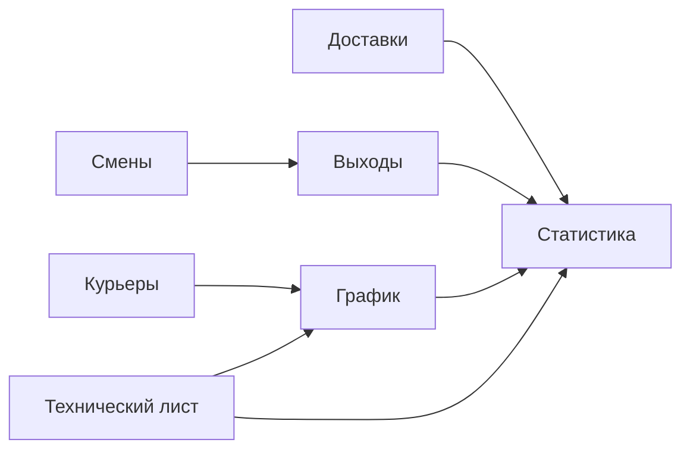

# Схема листов книги `График курьеров`

Документ фиксирует схему, восстановленную по read-only XLSX-снимку и локальным агрегаторам. Точные `userEnteredValue`, data validation, named ranges и условное форматирование живой Google Sheets-книги не удалось снять из-за недоступности Google Drive connector на момент разведки.

Статусы колонок:

| Статус | Значение |
| --- | --- |
| `iiko/import` | значение приходит из iiko или из внешнего загрузчика в книгу |
| `manual` | редактируется менеджером/руководителем доставки |
| `formula` | считается формулой Google Sheets |
| `reconstructed` | поле восстановлено по тому, как книга используется в локальных скриптах; точный текст заголовка в ячейке не подтвержден |

## Общая карта зависимостей



## `Курьеры`

Назначение: справочник курьеров, которые участвуют в графике, сменах и статистике.

| Колонка | Заголовок / поле | Тип | Источник | Пример без ПДн | Используется дальше |
| --- | --- | --- | --- | --- | --- |
| A | Курьер / имя в таблице | text | iiko/import или manual | `Курьер <masked>` | `График`, `Выходы`, `Доставки`, `Статистика` |
| B | Статус активности | boolean/text | manual или import | `активен` | фильтр активных курьеров |
| C | Идентификатор / имя в iiko | text | iiko/import | `<masked_iiko_courier>` | сопоставление с iiko |
| D:G | Дополнительные признаки справочника | text/boolean | reconstructed | `-` | не подтверждено |

Пример строки, обезличено:

| Курьер | Статус | iiko-name/id |
| --- | --- | --- |
| `Курьер <masked>` | `активен` | `<masked>` |

Формулы: в пользовательском справочнике формулы не подтверждены.  
Валидации/условное форматирование: не удалось снять через connector.  
Ручной ввод: добавление/исключение курьера и возможные статусы активности.

## `Выходы`

Назначение: факт выхода курьера на работу. Этот лист используется в локальном агрегаторе как источник часов смен и количества фактических выходов.

Подтвержденные индексы из [scripts/business_control/build_labor_costs.py](../../../scripts/business_control/build_labor_costs.py):

- `A` (`row[0]`) парсится как дата;
- `D` (`row[3]`) парсится как часы;
- `G` (`row[6]`) сравнивается со значением `Помог`.

| Колонка | Заголовок / поле | Тип | Источник | Пример без ПДн | Используется дальше |
| --- | --- | --- | --- | --- | --- |
| A | Дата | date | iiko/import или manual | `2026-04-21` | KPI часов/выходов, месячные агрегаты |
| B | Курьер | text | iiko/import или manual | `Курьер <masked>` | группировка по курьеру |
| C | Время/интервал смены | time/text | reconstructed | `11:00-22:00` | расчет часов, если есть |
| D | Часы | number | iiko/import или formula/materialized | `10.5` | `shift_hours_sum_sheet`, `completed_shift_rows_sheet` |
| E | Открытие смены / начало | datetime/text | reconstructed | `2026-04-21 11:00` | сверка смен |
| F | Закрытие смены / конец | datetime/text | reconstructed | `2026-04-21 22:00` | сверка смен |
| G | Признак / комментарий | text | manual/import | `Помог` | `help_shift_rows_sheet` |

Пример строки, обезличено:

| Дата | Курьер | Интервал | Часы | Признак |
| --- | --- | --- | ---: | --- |
| `2026-04-21` | `Курьер <masked>` | `11:00-22:00` | `11` | `Помог` |

Формулы: в XLSX-снимке лист выглядит как значения; точные формулы не найдены.  
Логика агрегатов: `COUNT` строк с часами больше нуля, `SUM` часов, `COUNT` строк с признаком `Помог`.

## `Смены`

Назначение: журнал открытия/закрытия смен курьеров. Предположительно это более сырой слой, из которого формируется `Выходы`, или отдельная выгрузка из iiko.

| Поле | Тип | Источник | Пример без ПДн | Используется дальше |
| --- | --- | --- | --- | --- |
| Дата смены | date | iiko/import | `2026-04-21` | `Выходы`, контроль открытых смен |
| Курьер | text | iiko/import | `Курьер <masked>` | сопоставление с `Курьеры` |
| Открытие смены | datetime | iiko/import | `2026-04-21 11:02` | длительность смены |
| Закрытие смены | datetime/null | iiko/import | `2026-04-21 22:14` | длительность и открытые смены |
| Статус | text | iiko/import/manual | `закрыта` | контроль незакрытых смен |

Формулы: не подтверждены.  
Ручной ввод: возможны корректировки менеджером, если смена не закрылась или пришла с ошибкой.  
Риск: без Apps Script/живой книги невозможно подтвердить, является ли `Смены` прямым iiko-импортом, ручным журналом или промежуточным листом.

## `Технический лист`

Назначение: служебные даты, списки и вспомогательные диапазоны для графика и статистики. В XLSX-снимке лист скрыт.

| Диапазон | Содержимое | Тип | Источник | Используется дальше |
| --- | --- | --- | --- | --- |
| A:A | Последовательность дат / календарь | date | formula | `График`, `Статистика` |
| B:G | Вспомогательные списки: месяцы, курьеры, статусы | text/date | formula/manual | валидации и агрегаты |

Формулы: точный текст формул в текущей сессии не восстановлен. По прошлому снимку формулы есть именно здесь, но Google formulas не были сохранены в локальных processed-файлах.  
Миграция: заменить календарной таблицей/генератором периодов и справочниками в БД.

## `График`

Назначение: основной визуальный график курьеров. В локальном агрегаторе читается так:

- строка 2 содержит даты по колонкам, начиная с `B`;
- строки ниже содержат курьеров;
- пересечение `курьер x дата` содержит статус выхода.

| Область | Поле | Тип | Источник | Пример без ПДн | Используется дальше |
| --- | --- | --- | --- | --- | --- |
| A3:A | Курьер | text | `Курьеры` / manual | `Курьер <masked>` | строки графика |
| B2:... | Даты | date | formula/manual из `Технический лист` | `2026-02-01` | календарь графика |
| B3:... | Статус дня | text | manual | `Вышел`, `Не вышел`, пусто | `schedule_went_out_count_sheet`, `schedule_no_show_count_sheet` |

Формулы: точные формулы дат не восстановлены; пользовательские ячейки статусов считаются ручным вводом.  
Валидации: вероятно список статусов, но через connector не подтверждено.  
Условное форматирование: вероятно подсветка статусов, но правила не сняты.  
Использование: dashboard/операционный контроль, не источник сумм выплат.

## `Доставки`

Назначение: реестр доставок/заказов. Локальный агрегатор использует его для количества строк доставки, уникальных заказов и длительности.

Подтвержденные индексы:

- `A` (`row[0]`) парсится как дата доставки;
- `E`/`F` (`row[4]` или `row[5]`) используются как идентификатор заказа;
- `G` (`row[6]`) парсится как длительность доставки в часах.

| Колонка | Заголовок / поле | Тип | Источник | Пример без ПДн | Используется дальше |
| --- | --- | --- | --- | --- | --- |
| A | Дата | date | iiko/import | `2026-04-21` | месячные агрегаты доставок |
| B | Курьер | text | iiko/import | `Курьер <masked>` | группировка по курьеру |
| C | Статус / сервисный тип | text | reconstructed | `COURIER` | фильтрация |
| D | Время / период заказа | datetime/text | reconstructed | `18:35` | длительность |
| E | Номер заказа / order id | text | iiko/import | `<order_id_masked>` | уникальные доставки |
| F | Доп. идентификатор заказа | text | iiko/import | `<order_uuid_masked>` | fallback для уникальных доставок |
| G | Длительность доставки, часы | number | iiko/import или formula/materialized | `0.62` | `completed_delivery_rows_sheet`, `delivery_duration_hours_sum_sheet` |

Пример строки, обезличено:

| Дата | Курьер | Заказ | Длительность, ч |
| --- | --- | --- | ---: |
| `2026-04-21` | `Курьер <masked>` | `<order_id_masked>` | `0.58` |

Формулы: в XLSX-снимке лист выглядит как значения.  
Логика агрегатов: количество строк, количество уникальных order id, сумма положительных длительностей.

## `Статистика`

Назначение: агрегатная статистика по курьерам/месяцам/датам.

| Блок | Содержимое | Тип | Источник | Используется дальше |
| --- | --- | --- | --- | --- |
| Курьеры x период | количество доставок, смены, часы, средние длительности | formula | `Доставки`, `Выходы`, `График` | KPI-dashboard |
| Сравнение с целями | факт vs target/норма | formula | iiko metrics / ручные цели | светофор |
| Итоги периода | суммарные доставки, часы, выходы/невыходы | formula | все операционные листы | отчеты владельцу |

Точные Google Sheets-формулы не восстановлены. Математическая логика подтверждается локальными агрегатами:

```text
unique_delivery_orders = count_distinct(Доставки.order_id)
completed_delivery_rows = count(Доставки.duration_hours > 0)
delivery_duration_hours_sum = sum(Доставки.duration_hours)
completed_shift_rows = count(Выходы.hours > 0)
shift_hours_sum = sum(Выходы.hours)
help_shift_rows = count(Выходы.comment = "Помог")
```

## Named ranges, validations, filters, conditional formatting

Через текущие доступные инструменты снять не удалось. По смыслу нужны:

- validation списка курьеров в `График`, `Выходы`, `Доставки`;
- validation статусов графика (`Вышел`, `Не вышел`, возможно отпуск/больничный/помог);
- conditional formatting статусов графика и KPI в `Статистика`;
- фильтры по дате/курьеру на `Доставки` и `Выходы`.

При переносе в приложение это не надо копировать как spreadsheet-механику: validation становится справочниками и enum-ами, conditional formatting - правилами UI, фильтры - параметрами страниц.
