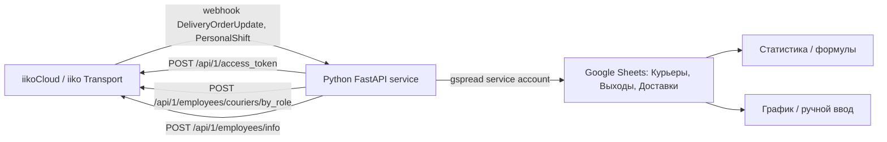

# Интеграция с iiko Transport / iikoCloud

Обновлено после разведки Python-сервиса в `data/raw/courier_service/`: загрузка книги подтвержденно идет не через Apps Script внутри Google Sheets, а через внешний FastAPI-сервис `TestAppScript.py`.

## Главное резюме

Для книги `График курьеров и показатели курьеров` найден отдельный Python-сервис, который:

- принимает webhook `POST /aiko-webhook`;
- ходит в iikoCloud на `https://api-ru.iiko.services/api/1`;
- авторизуется через `POST /api/1/access_token` с `apiLogin`;
- пишет в Google Sheets через `gspread` и service account;
- обновляет только листы `Курьеры`, `Выходы`, `Доставки`.

Это не тот же контур, что iikoServer Resto в основном проекте (`/resto/api`, `IIKO_SERVER_*`). iikoServer-экспорты в репозитории остаются полезны для сверки и P&L/операционных выгрузок, но не являются подтвержденным механизмом записи этой Google Sheets-книги.

## Что подтверждено

| Вопрос | Ответ | Статус |
| --- | --- | --- |
| Есть ли Apps Script как loader книги? | Для найденного контура нет: запись делает внешний Python-сервис через Sheets API. Apps Script snapshot не нужен для этого потока. | подтверждено snapshot |
| Какой iiko API используется? | iikoCloud / iiko Transport, host `api-ru.iiko.services`, API version `/api/1`. | подтверждено кодом |
| Как сервис получает доставки и смены? | Не poll/backfill, а inbound webhook `POST /aiko-webhook` с событиями `DeliveryOrderUpdate` и `PersonalShift`. | подтверждено кодом |
| Какие исходящие iiko endpoint'ы есть? | `POST /api/1/access_token`, `POST /api/1/employees/couriers/by_role`, `POST /api/1/employees/info`. | подтверждено кодом |
| Какие листы пишет сервис? | `Курьеры`, `Выходы`, `Доставки`. | подтверждено кодом |
| Какие листы не пишет? | `Смены`, `Технический лист`, `График`, `Статистика`. | подтверждено кодом |
| Где Google credentials? | `service_account.json` рядом со скриптом; содержит private key, значения не документировать. | подтверждено snapshot |
| Где iikoCloud credential? | `IIKO_API_LOGIN` hard-coded в скрипте; значение не документировать. | подтверждено кодом |

## Архитектура найденного потока

## Авторизация iikoCloud

| Шаг | Метод / path | Параметры | Результат |
| --- | --- | --- | --- |
| 1 | `POST /api/1/access_token` | JSON `apiLogin` из `IIKO_API_LOGIN` | ответ содержит `token` |
| 2 | последующие запросы | header `Authorization: Bearer <token>` | доступ к employee/courier endpoint'ам |

Token хранится только в памяти процесса как global `API_TOKEN`. Сервис обновляет его на startup и каждые 600 секунд. Refresh при `401` и persist token отсутствуют.

## Endpoint'ы iikoCloud из сервиса

| Назначение | Метод / path | Body | Частота |
| --- | --- | --- | --- |
| Получить bearer token | `POST /api/1/access_token` | `{"apiLogin": "<from config>"}` | startup + каждые 600 секунд |
| Получить курьеров по роли | `POST /api/1/employees/couriers/by_role` | `{"organizationIds": ["<ORGANIZATION_ID>"], "rolesToCheck": ["courier"]}` | startup + каждые 600 секунд |
| Получить карточку сотрудника | `POST /api/1/employees/info` | `{"organizationId": "<event.organizationId>", "id": "<employee_id>"}` | на каждое событие `PersonalShift` |

В snapshot не найдены вызовы `/api/1/organizations`, `/api/1/deliveries/by_delivery_date_and_status`, `/api/1/employees/couriers/active_locations` или других delivery polling endpoint'ов.

## Webhook-события

### `DeliveryOrderUpdate`

Используемые поля:

| Payload field | Куда идет |
| --- | --- |
| `eventTime` | дата/время строки `Доставки` в timezone `Europe/Moscow` |
| `eventInfo.id` | `order_id`, ключ поиска в `Доставки.F` |
| `eventInfo.order.number` | номер заказа в `Доставки.E` |
| `eventInfo.order.status` | branch logic: `OnWay`, `Delivered`, `Cancelled` |
| `eventInfo.order.courierInfo.courier.id` | courier id в `Доставки.D` |

Поведение по статусам:

| Status | Действие |
| --- | --- |
| `OnWay` | вставить новую строку в `Доставки` на позицию 2 |
| `Delivered` | найти `order_id`, записать delivered time и длительность |
| `Cancelled` | найти `order_id`, удалить строку |
| другое | залогировать как unhandled |

### `PersonalShift`

Используемые поля:

| Payload field | Куда идет |
| --- | --- |
| `organizationId` | запрос `/employees/info` |
| `eventInfo.id` | employee id, ключ в `Выходы.F` и `Курьеры.A` |
| `eventInfo.opened` | true = открыть смену, false = закрыть |
| `eventTime` | дата/время открытия или закрытия |

Если сотрудника нет в `Курьеры.A`, сервис добавляет `[employee_id, full_name]`.

## Маппинг iikoCloud -> Google Sheets

### `Курьеры`

| Колонка | Значение | Источник |
| --- | --- | --- |
| A | ID | `items[].id` из `/employees/couriers/by_role` или `PersonalShift.eventInfo.id` |
| B | Имя и Фамилия | `firstName + lastName` из iikoCloud |

### `Доставки`

| Колонка | Значение |
| --- | --- |
| A | дата события |
| B | время `OnWay` |
| C | время `Delivered` |
| D | courier id |
| E | номер заказа |
| F | order id |
| G | длительность в часах |

### `Выходы`

| Колонка | Значение |
| --- | --- |
| A | дата события |
| B | время открытия |
| C | время закрытия |
| D | длительность смены в часах |
| E | ФИО сотрудника |
| F | employee id |

## Частота и reliability

| Поток | Частота / триггер | Надежность |
| --- | --- | --- |
| Token refresh | каждые 600 секунд | без retry/backoff и без refresh-on-401 |
| Courier catalog | каждые 600 секунд | при ошибке возвращает пустой список |
| Delivery updates | webhook on event | нет idempotency, повторный `OnWay` даст дубль |
| Shift updates | webhook on event | закрытие без открытия теряется |
| Backfill | отсутствует | пропущенные webhook-события не восстанавливаются |

## Связь с iikoServer Resto в проекте

В репозитории также есть iikoServer Resto-контур (`scripts/iiko/*`, `apps/api/app/services/iiko_sync.py`), который использует `IIKO_SERVER_*` и `/resto/api`. Он нужен для других задач проекта: сотрудники, attendance, delivery/P&L exports, сверки.

Для переноса курьерской книги нельзя смешивать эти API:

| Контур | Host/path | Для чего |
| --- | --- | --- |
| iikoCloud / Transport | `https://api-ru.iiko.services/api/1` | webhook и courier/employee lookup старого сервиса книги |
| iikoServer Resto | `.../resto/api` | существующие выгрузки проекта и read-only sync |

Рекомендуемое размещение нового слоя: `apps/api/app/services/iiko_cloud/`, отдельно от `apps/api/app/services/iiko_sync.py`.

## Оставшиеся неизвестные

- Где на сервере владельца описан запуск сервиса: systemd/supervisor/container не попали в snapshot.
- Как в iikoCloud настроен webhook target и есть ли там секрет/подпись.
- Есть ли доступные endpoint'ы для исторического backfill доставок/смен; в snapshot они не используются.
- Как live book сейчас соотносит id-based строки сервиса с формулами/статистикой старой книги.
