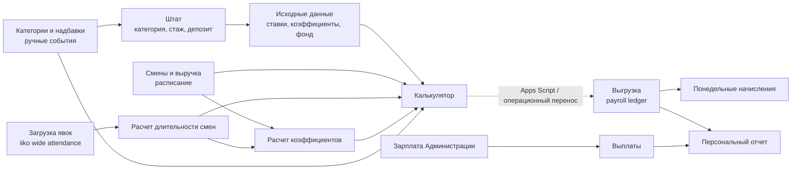

# Рабочий калькулятор зарплат по явкам iiko

Дата фиксации: 2026-05-24.  
Источник: Google Sheets `Расчет зарплат NEW`, документ `1ribsb9A64-9OvkMxJisyMZtjLQT_gLCET40G8cYzD4Q`, read-only.  
Назначение: зафиксировать фактическую производственную методологию шаблона, который считает зарплату на основе журнала явок iiko.

Документ не содержит ФИО, телефонов, паспортов, банковских реквизитов и персональных историй сотрудников. CSV-снимки в `research/processed/payroll_calculator/` обезличены: сотрудники и source employee id заменены стабильными hash-метками, свободные комментарии и контактные/document-like значения закрыты.

## 1. Назначение и место в проекте

Этот документ дополняет, но не заменяет [payroll engine spec](/app-spec/modules/staff/payroll/00-engine.md). Документ 19 фиксирует целевую модель будущего модуля `Зарплата и кадры`: `payroll_run`, immutable `payroll_ledger_line`, отдельные счета депозитов и накопительного фонда, персональный отчет, payroll payments и связь с DDS. Текущий документ фиксирует, как реально работает Google Sheets-калькулятор на снимке 2026-05-24.

Связанные документы:

- [payroll engine spec](/app-spec/modules/staff/payroll/00-engine.md) - управленческая и целевая модель payroll-модуля.
- [22-iiko-employees-api.md](/app-spec/integrations/iiko/employees-api.md) - проверенная карта iiko employees API и схема `AttendanceJournal`.
- [database decisions](/app-spec/architecture/decisions/database-decisions.md) - архитектурные решения по единой БД, особенно §11.1, §11.5, §11.7 и §15.

Главный вывод: калькулятор уже использует факт явок из iiko, но не как прямой API-import `employeeId/dateFrom/dateTo`. Вкладка `Загрузка явок` содержит широкий ручной/экспортный отчет: `employee_source_id`, `Имя сотрудника`, `Подразделение`, `Должность`, затем даты недели с текстовыми интервалами `9:26-21:59`. Формулы парсят эти интервалы и считают часы. Для приложения это нужно превратить в нормализованные `attendance_entry` + `shift_duration_result`.

## 2. Текущее устройство Google Sheets

Файл содержит 14 вкладок. HTML страницы документа дал gid'ы вкладок; XLSX-снимок использован только для read-only просмотра формул и hidden-state.

| № | Вкладка | gid | Тип | Назначение |
| ---: | --- | ---: | --- | --- |
| 0 | `Исходные данные` | `0` | справочник | Сотрудники/роли/категории, коэффициенты, ставки смен, пороги процента от выручки, надбавки, правила накопительного фонда, стартовые депозиты. |
| 1 | `Категории и надбавки` | `1505174086` | ручной журнал событий | История категорий, депозитные override, решения по депозиту, старший/зам, премии, штрафы, НДФЛ, больничные/отпуска/пособия. |
| 2 | `Штат` | `1176727298` | кадрово-расчетный справочник | Текущие роли/категории, стаж, старшинство, депозитные показатели и решение `Выдать`/`Не выдавать`. |
| 3 | `Калькулятор` | `1019409828` | основной расчетный лист | Недельный расчет одного выбранного сотрудника по датам недели: оклад, процент, фонд, удержания, депозиты. |
| 4 | `Зарплата Администрации` | `410754589` | отдельный контур | Фиксированные начисления/выплаты администрации, не производство. |
| 5 | `Выплаты` | `258902766` | реестр выплат | Ведомость/обязательство к выплате: `Выплата ЗП`, `Выплата аванса`, `Выплата накоплений`; денежный факт закрывается через DDS. |
| 6 | `Персональный отчет` | `345435248` | выходной отчет | Персональная детализация начислений, удержаний, выплат, долга и накоплений за выбранный период. |
| 7 | `Выгрузка` | `1578260979` | accrual ledger | Накопленный журнал начислений/удержаний. Строки создаются из калькулятора через Apps Script/операционное действие, а не формулой. |
| 8 | `Смены и выручка` | `1577032092` | вход + импорт | Расписание через `IMPORTRANGE`; рядом ручная/экспортная загрузка дневной выручки. |
| 9 | `Загрузка явок` | `1562584021` | входной журнал iiko | Широкая выгрузка явок iiko за неделю: сотрудник, подразделение, iiko-должность, интервалы по датам. |
| 10 | `Технический лист` | `1995335248` | hidden служебный | Календарь, год, списки сотрудников и вспомогательные диапазоны для отчетов. |
| 11 | `Расчет коэффициентов` | `1796414532` | hidden расчетный | Нормирует коэффициенты смен по фактическим часам из явок. |
| 12 | `Расчет длительности смен` | `1468378961` | hidden расчетный | Парсит текстовые интервалы явок и округляет длительность. |
| 13 | `Понедельные начисления` | `814874892` | агрегированный отчет | Недельная сводка по `Производство Черникова` из `Выгрузка`. |

Решение 2026-05-27: в Google Sheets `Штат` - вкладка ЗПВ; в приложении `Штат` выносится отдельной страницей/master-реестром `employee`, см. memory `project_staff_list_page`.

Вкладки `Технический лист`, `Расчет коэффициентов`, `Расчет длительности смен` скрыты в XLSX-снимке, но доступны через CSV/export и участвуют в расчетах.

## 3. Информационные потоки между вкладками



Ключевые поля потоков:

| Поток | Поле связи | Что передается |
| --- | --- | --- |
| `Загрузка явок` -> `Расчет длительности смен` | `Имя сотрудника` + дата-колонка | Текстовый интервал работы за дату. |
| `Расчет длительности смен` -> `Расчет коэффициентов` | сотрудник + позиция даты | Округленные часы по дням `Y:AE`. |
| `Смены и выручка` -> `Расчет коэффициентов` | сотрудник + роль в расписании | Плановый payroll-коэффициент роли/категории. |
| `Расчет коэффициентов` -> `Калькулятор` | день недели | Сумма фактических коэффициентов смены, знаменатель процента. |
| `Исходные данные` -> `Калькулятор` | сотрудник + роль / роль + категория | Категория, коэффициент, ставка смены, пороги процента, надбавки, фонд. |
| `Категории и надбавки` -> `Калькулятор` | дата + сотрудник + тип | Премии, штрафы, НДФЛ, больничные/отпуска/пособия, комментарии. |
| `Калькулятор` -> `Выгрузка` | дата + сотрудник + тип строки | Строки начислений/удержаний; перенос не формульный. |
| `Выгрузка` + `Выплаты` -> `Персональный отчет` | дата + сотрудник + тип | Начисления, удержания, выплаты и баланс сотрудника. |

## 4. Расчетные формулы по вкладкам

### 4.1 `Смены и выручка`

Входы:

- `A:H` - расписание из внешней таблицы через `IMPORTRANGE(...; "Смены!B4:I")`;
- `J:K` - дневная выручка: дата + сумма.

Owner decision 2026-05-24: источник смен/станций для payroll-ролей - шаблон `Учет смен`, где администраторы-кассиры указывают, на каких станциях стоят сотрудники. Это важно, потому что один и тот же сотрудник может работать на разных станциях: пиццерист может быть сушистом, шаурмист - заготовщиком и т.п. В целевом приложении по умолчанию станция/роль указывается вручную ответственным администратором; допустимый будущий UX - Telegram-бот, который знает состав смены и пошагово спрашивает администратора, на какой должности сегодня каждый сотрудник.

Формулы:

- `A1` импортирует расписание.
- `Калькулятор!C5:I5` берет выручку по датам через `SUMIF('Смены и выручка'!J:K)`.

Связь с iiko: расписание в этой вкладке не является `GET /employees/schedule` из 22. Owner decision 2026-05-24: дневная выручка для payroll всегда берётся из iiko OLAP отчёта `Выручка по направлениям` как `daily_revenue`.

Выход: расписание дает payroll-роль по дням; выручка дает дневной пул процента.

### 4.2 `Загрузка явок`

Входы:

- широкий отчет iiko за неделю;
- поля снимка: `employee_source_id_hash`, `Имя сотрудника`, `Подразделение`, `Должность`, даты недели, интервалы вида `9:26-21:59`.

Формул нет. Это входной журнал.

Связь с iiko:

- `employee_source_id_hash` соответствует защищенному `employeeId`/табельному id; в processed хранится только hash;
- `Имя сотрудника` соответствует display-name из закрытого employee lookup, а не безопасному ключу;
- `Подразделение` соответствует `departmentName`;
- `Должность` соответствует iiko role label из `roleId -> /employees/roles`, но в текущих формулах не определяет payroll-роль;
- интервалы по датам являются свернутым представлением `dateFrom/dateTo` или `OpenTime/CloseTime`.

Не используются явно: `attendanceType`, `attendanceTypeId`, `comment`, `created`, `modified`, `userModified`, `personalDateFrom`, `personalDateTo`. Поэтому больничные/отпуска/пособия в калькуляторе идут из ручных событий, а не из iiko attendance types.

Выход: сырье для `Расчет длительности смен`.

### 4.3 `Расчет длительности смен`

Входы:

- сотрудник из `Загрузка явок!B`;
- интервалы по датам из `Загрузка явок!E:L`.

Формулы:

- `A3` подтягивает сотрудника из `Загрузка явок!B2:B1502`;
- `B3:H3` парсят текстовый интервал: берут правую часть как конец, левую часть как начало, различая длину строки `9:26-21:59` и `16:00-22:00`;
- `J:W` выделяют часы и минуты из рассчитанной длительности;
- `Y:AE` в текущем Google Sheets округляют длительность: если минут меньше 40, берется часовая часть; если минут `>= 40`, добавляется 1 час.

Методология:

```text
raw_interval = "open-close"
duration = close_time - open_time
duration_minutes = exact_minutes_between(open_time, close_time)
duration_hours = duration_minutes / 60
```

Owner decision 2026-05-24: округление `>=40 минут` вверх было техническим/legacy-упрощением Google Sheets и не переносится как бизнес-правило. В приложении payroll должен считать точные минуты. Если смена проходит через полночь, это считается ошибкой/quality review: таких смен в производстве быть не должно.

Owner decision 2026-05-25: если у одного сотрудника в один день есть несколько закрытых интервалов явки, приложение суммирует их точные минуты. Если явка не закрыта и `dateTo` пустой, система расчетно закрывает смену в 22:00, как если бы она была закрыта в 22:00. При этом максимальная длительность смены = 12 часов: если сотрудник открыл смену раньше, оплата всё равно ограничивается 12 часами; если пришёл позже, например в 11:00, считается интервал 11:00-22:00. Исключение - увольнение во время активной смены: тогда `dateTo` = время увольнения.

Ограничения: текущая формула завязана на текстовый формат интервала и не содержит явной обработки смен через полночь, незакрытых явок без `dateTo`, cap 12 часов и нескольких интервалов одного сотрудника в одну дату.

Выход legacy-шаблона: округленные часы по дням в `Расчет коэффициентов` и `Калькулятор`. Целевой выход приложения: точные минуты/часы с quality flag для спорных интервалов.

### 4.4 `Расчет коэффициентов`

Входы:

- расписание `Смены и выручка!A:H`;
- коэффициенты из `Исходные данные`;
- часы из `Расчет длительности смен!Y:AE`;
- сотрудники из `Загрузка явок`.

Формулы:

- `A:H` подтягивают сотрудников/роли расписания и ищут плановый премиальный коэффициент по ключу `сотрудник + payroll-роль`;
- `J:Q` корректируют коэффициент по фактическим часам:

```text
если hours_final >= 12:
  adjusted_coeff = full_scheduled_coeff
иначе:
  adjusted_coeff = hours_final / 12 * full_scheduled_coeff
```

Выход:

- `Калькулятор!C8:I8` суммирует adjusted coefficients по дню и получает знаменатель распределения процента.

### 4.5 `Штат`

Входы:

- базовый список сотрудников, ролей и дат приема;
- события `Категории и надбавки`;
- депозитные движения из `Выгрузка`;
- стартовые депозиты из `Исходные данные`.

Формулы:

- текущая категория берется как последнее событие категории с датой `<= TODAY()`;
- старшинство `Старший`/`Зам` берется из датированных событий;
- стаж = `YEARFRAC(дата приема, TODAY())`;
- собранный депозит = стартовый депозит + `Депозит удержание` - `Депозит возврат`;
- требуемый депозит и сумма удержания берутся из персонального override или из правил категории;
- решение по депозиту берется из `Категории и надбавки`: `Выдать` / `Не выдавать` и коэффициент выдачи.

Выход: `Калькулятор` использует категорию, стаж, старшинство и депозитные поля.

### 4.6 `Калькулятор`

Входы:

- выбранный сотрудник в `A7`;
- даты недели в `C:I`;
- выручка, расписание, явки, коэффициенты, ручные события, штат и справочники.

Ключевые строки:

| Строка | Формула / правило | Выход |
| --- | --- | --- |
| `C5:I5` | `SUMIF` по `Смены и выручка!J:K` | дневная выручка |
| `C8:I8` | сумма `Расчет коэффициентов!K:Q` | знаменатель процента |
| `C9:I9` | часы из `Расчет длительности смен`; в legacy `>=12` показывается как `Смена`; в приложении считать точные минуты | длительность сотрудника |
| `C10:I10` | роль из расписания `Смены и выручка` | payroll-роль |
| `C11:I11` | категория из `Исходные данные` по сотруднику и роли | категория |
| `C12:I12` | `Старший`/`Зам` из `Штат` | надбавка |
| `C13:I13` | коэффициент сотрудника, пропорционально часам при неполной смене | индивидуальный adjusted coeff |
| `C14:I14` | ставка роли/категории + надбавка, пропорционально часам | оклад транзит |
| `C15:I15` | оклад; legacy-ссылка на внеурочный коэффициент является рудиментом и не переносится в приложение | `Оклад` |
| `C16:I16` | `FLOOR((rate * revenue) / total_coeff * employee_coeff)` | `Процент` |
| `C17:I23` | фильтры из `Категории и надбавки` по дата + сотрудник + тип | премии, пособия, штрафы, НДФЛ |
| `C20:I20` | `Оклад * % фонда` по стажу | `Накопительный фонд` |
| `C24:I24` | штраф по ревизии: ставка для поваров или админов, если не исключен | `Штраф по ревизии` |
| `C25:I27` | депозит возврат / удержание / списание по полям `Штат` | депозитные строки |

Процент от выручки:

```text
rate = процент из tier-таблицы выручки
shift_pool = daily_revenue * rate
employee_percent = floor(shift_pool / daily_total_coeff * employee_adjusted_coeff)
```

Пороговая таблица в снимке:

| Дневная выручка от | Процент |
| ---: | ---: |
| 50 000 | 3,5% |
| 140 000 | 4,5% |
| 190 000 | 5,5% |
| 550 000 | 6,5% |

Owner decision 2026-05-24: внеурочный коэффициент в строке `Оклад` - рудимент, больше не применяется. В приложении `Оклад` не должен смотреть на `C25` или иной депозитный блок для внеурочного коэффициента.

Выход: расчетные строки уходят в `Выгрузка` через Apps Script/кнопку или операционное действие, а не через формулу. Это подтверждает решение владельца 2026-05-20 в 19.

### 4.7 `Выгрузка`

Назначение: накопительный accrual ledger.

Структура строк по снимку:

```text
дата | сумма | сотрудник | роль | подразделение | тип строки | комментарий | год
```

Найденные типы строк:

- `Оклад`;
- `Процент`;
- `Премия`;
- `Накопительный фонд`;
- `Штрафы по ревизиям`;
- `Штрафы и удержания`;
- `Штрафы и удержания` с NBSP;
- `Депозит удержание`;
- `Депозит возврат`;
- `Депозит списание`;
- `НДФЛ Начислено`;
- `Больничные и отпуска и пособия`;
- `Списание накоплений`.

Удержания в `Выгрузка` записаны положительными суммами; знак влияния задается типом строки, а не знаком числа.

### 4.8 `Выплаты`

Назначение: реестр фактических/заявленных выплат.

Найденные типы:

- `Выплата ЗП`;
- `Выплата аванса`;
- `Выплата накоплений`.

Вкладка не содержит явного банковского счета, кассы, платежного поручения или `cashflow_transaction_id`. По решению [§11.7 database decision](/app-spec/architecture/decisions/database-decisions.md#117-payroll-payments-vs-dds-cashflowtransaction) в приложении это должно стать `payroll_payment` как обязательство payroll-модуля, а cash-fact должен жить в DDS.

### 4.9 `Персональный отчет`

Входы:

- `A2` начало периода;
- `B2` конец периода;
- `E2` выбранный сотрудник;
- `Выгрузка`, `Выплаты`, `Технический лист`.

Формулы:

- `F3` - задолженность на начало периода;
- `F4` - задолженность на конец периода;
- `B7` - `К выплате`;
- `H7` - накопления за текущий год: `Накопительный фонд - Списание накоплений`;
- `I7:J7` - подсказка `Выплата 15 января` в январском окне;
- дневная таблица агрегирует строки по ключу `дата + сотрудник + тип`.

Owner decision 2026-05-24: с 1 января в персональном отчёте должен появляться отдельный информационный блок о сумме накоплений за прошлый календарный год, подлежащей выплате 15 января. Накопления нового календарного года, начавшиеся с 1 января, не участвуют в выплате 15 января за прошлый год.

Итог по сотруднику:

```text
начисления = Оклад + Процент + Премия + Больничные/отпуска/пособия + Депозит возврат
удержания = Депозит удержание + Штрафы и удержания + Штрафы по ревизиям + НДФЛ Начислено
выплаты = Выплата ЗП + Выплата аванса
к выплате = накопительный баланс начислений - удержаний - выплат - начальный долг/технические корректировки
```

`Накопительный фонд` показывается отдельно и не является обычной суммой к немедленной выплате.

### 4.10 `Понедельные начисления`

Назначение: недельная сводка по `Производство Черникова`.

Формулы:

- неделя строится от фиксированной даты `2026-03-03`;
- строки `Оклад`, `Процент`, `Премия`, `НДФЛ Начислено`, `Штрафы и удержания`, `Штрафы по ревизиям` агрегируются из `Выгрузка`;
- итог = `Оклад + Процент + Премия - НДФЛ - Штрафы и удержания - Штрафы по ревизиям`.

Не входят в текущий недельный итог: `Накопительный фонд`, депозиты, больничные/отпуска/пособия, списание накоплений.

## 5. Связь с iiko employees API

С точки зрения [22 §Схема журнала явки](/app-spec/integrations/iiko/employees-api.md#схема-журнала-явки), текущая таблица использует только часть информации из iiko attendance и делает это в свернутом виде.

| Поле 22 / iiko | Как видно в калькуляторе | Использование |
| --- | --- | --- |
| `employeeId` | `employee_source_id_hash` в `Загрузка явок` | В снимке не используется формулами; должен стать защищенным ключом сотрудника в приложении. |
| display name / `Employee` | `Имя сотрудника` | Сейчас главный ключ связи явок с расчетом; PII-риск. |
| `departmentName` | `Подразделение`, например `Foodmarket Тепло Черникова` | Используется как контекст точки, но payroll-фильтр в других листах живет как `Производство Черникова`. |
| `roleId` -> `/employees/roles` | `Должность`, например `Кассир`/`Повар` | Не определяет payroll-роль; payroll-роль берется из `Смены и выручка`. |
| `dateFrom` / `OpenTime` | левая часть интервала в date-колонке | Парсится текстом в `Расчет длительности смен`. |
| `dateTo` / `CloseTime` | правая часть интервала в date-колонке | Парсится текстом; незакрытый `dateTo` явно не поддержан. |
| `WorkingHours` | расчетный результат `Расчет длительности смен!Y:AE` | Считается в Google Sheets, не берется готовым полем из iiko. |
| `attendanceType` | в `Загрузка явок` отсутствует | В payroll-расчёте используются только рабочие явки; больничные/отпуска/пособия остаются ручными событиями. |
| `comment`, `created`, `modified`, `userModified` | отсутствуют | Нет audit trail изменения явки. |

Периодичность в текущем снимке: недельная загрузка явок, пример периода `12.05.2026-18.05.2026`. Owner decision 2026-05-24: ЗП считается каждый вторник за payroll-период вторник-понедельник. Перед каждой выплатой менеджер по кнопке загружает данные за прошедшую неделю.

Payroll-неделя вторник-понедельник - управленческий календарь payroll, а не временный hardcode. Старт `2026-03-03` подтверждает текущую недельную ось и должен быть параметризован в приложении как начало payroll-календаря.

Owner decisions 2026-05-25 по edge cases:

- если в iiko-явке есть сотрудник, которого приложение не знает, payroll-run блокируется до внесения всех обязательных данных сотрудника в HR/payroll-справочник; без этого расчёт зарплаты не производится;
- при увольнении в системе нужна интеграция с iiko: карточка сотрудника удаляется/деактивируется в iiko, но в приложении сотрудник остаётся в архиве для истории и audit;
- если увольнение внесено во время активной смены, система закрывает смену временем увольнения и считает оплату до этого времени; пример: увольнение в 15:50 закрывает смену в 15:50 и включает этот отработанный интервал в финальную выплату;
- явка после даты увольнения, если она не является закрываемой активной сменой на момент увольнения, считается рассинхроном и уходит в quality review;
- если сотрудник в iiko-явке и сотрудник в расписании `Смены и выручка` / `Учет смен` не совпадают, это рассинхрон, вероятная ошибка администратора или iiko; строка не должна молча рассчитываться, её нужно подсветить и исправить;
- если iiko-явка не закрыта и `dateTo` пустой, для расчёта она закрывается в 22:00, но длительность смены не может превышать 12 часов; пятница/суббота и надбавка 200 ₽ за дополнительный час пока не включаются в это правило;
- iiko-должности `Кассир` / `Повар` не маппятся автоматически в payroll-роли; `Смены и выручка` / `Учет смен` остаётся единственным источником payroll-роли/станции смены.

Что автоматизировано:

- расписание `Смены и выручка!A:H` через `IMPORTRANGE`;
- расчет длительности, коэффициентов, оклада, процента, фонда и персонального отчета формулами;
- перенос из `Калькулятор` в `Выгрузка` вероятно через Apps Script/кнопку, согласно решению владельца в 19.

Что ручное или полу-ручное:

- загрузка iiko-явок в широкий лист `Загрузка явок`;
- загрузка дневной выручки в `Смены и выручка!J:K`;
- указание станции/payroll-роли сотрудника через `Учет смен`; в целевом приложении ручной ввод администратором может быть реализован через Telegram-бота или другой пошаговый интерфейс;
- ручные payroll-события в `Категории и надбавки`;
- реестр выплат `Выплаты`;
- решения по депозиту и списанию накоплений.

## 6. Выходы калькулятора

### 6.1 Payroll ledger

Главный выход начислений - `Выгрузка`. Это accrual ledger, а не факт денег. Он отвечает на вопрос: что начислено, удержано, перенесено в фонд/депозит или списано.

Для P&L текущая логика соответствует решению 2026-05-19 в worklog: ФОТ считается по начислениям, а не по выплатам.

Owner decision 2026-05-25 для P&L MVP: наружу в ОПиУ нужен итог ФОТ **по ролям**, без обязательной детализации `роль x тип начисления`. Целевой additive export можно забирать из Google Sheets `Расчет зарплат NEW`, лист `Свод`, диапазон `C7:C13` и соседние месячные колонки. Разрез по типам начислений остается внутри payroll ledger как drill-down; его нельзя смешивать с role-cut при сборке P&L, чтобы не получить двойной счет.

### 6.2 Выплаты

Owner decision 2026-05-25: вкладка `Выплаты` - это ведомость/обязательство к выплате, а не первичный денежный факт. Факт выдачи денег потом ищется и закрывается в DDS.

Owner decision 2026-05-25 по кошелькам выплат: информация о счетах/кошельках, с которых фактически были произведены выплаты, относится только к DDS. В зарплатной ведомости указывать счёт или wallet выплаты не нужно и бессмысленно; payroll хранит только кому, за какой период и сколько нужно выплатить.

Вкладка `Выплаты` хранит платежные события по сотрудникам, но не содержит банковского/кассового источника денег. В приложении:

- `Выгрузка` -> `payroll_ledger_line`;
- `Выплаты` -> `payroll_payment`;
- факт денег -> `cashflow_transaction` в DDS или агрегированный `payroll_payment_batch`.

Это напрямую соответствует [§11.7 database decision](/app-spec/architecture/decisions/database-decisions.md#117-payroll-payments-vs-dds-cashflowtransaction).

### 6.3 Депозит и накопительный фонд

Депозитные строки есть в `Выгрузка`:

- `Депозит удержание` уменьшает обычную сумму к выплате и увеличивает собранный депозит;
- `Депозит возврат` увеличивает сумму к выплате;
- `Депозит списание` списывает депозит, но не должен показываться сотруднику как обычная выплата.

Owner decision 2026-05-24: `Депозит списание` сейчас отражается как прочий доход, но в приложении нужна отдельная управленческая статья `Списание депозитов`. Основной источник списания депозитов - зарплатная ведомость / payroll ledger, а не DDS/iiko корсчёт.

Накопительный фонд:

- начисляется как процент от `Оклад`;
- отображается отдельно в `Персональный отчет!H7`;
- `Выплата накоплений` есть в `Выплаты`;
- `Списание накоплений` уменьшает фонд.

Owner decision 2026-05-24 по накопительному фонду:

- фонд считается по календарному году: начисления с 1 января по 31 декабря;
- выплата накоплений происходит строго 15 января за предыдущий календарный год, ни раньше и ни позже;
- выплата 15 января обнуляет накопительный счёт сотрудника за предыдущий год;
- начисления текущего года, начавшиеся с 1 января, не участвуют в выплате 15 января за прошлый год;
- если сотрудник увольняется до 15 января, накопительный фонд списывается в пользу прибыли, даже если увольнение произошло 14 января;
- `Списание накоплений` в 99% случаев означает увольнение до даты права на выплату; в редких гипотетических случаях может быть мерой наказания и должно иметь ручную причину.

Корсчёт iiko/DDS `Депозиты сотрудников` на текущий момент не является источником информации для payroll-депозитов и накопительного фонда. На него не нужно ориентироваться при расчёте. Payroll ledger / зарплатная ведомость является основным источником депозитных списаний; DDS может использоваться только как cash-fact/reconciliation по выплатам, если появится подтверждённый match.

Уточнение владельца 2026-05-25 по opening balances: остатки дебиторской и кредиторской задолженности перед сотрудниками на `2026-02-01` хранятся в зарплатной ведомости; долги сотрудников перед компанией на эту дату есть. Операционный контроль депозитов курьеров через корсчет iiko `Депозиты курьеров` / `Депозиты сотрудников` и кошелёк `ГарантФонд` может использоваться только как reconciliation/control после отдельного сопоставления. Он не создаёт payroll-депозиты, депозитные списания или движения накопительного фонда: источником payroll-subledger остаётся зарплатная ведомость.

## 7. Дельта vs управленческая спецификация 19

### 7.1 Что совпадает

- Роли, категории, ставки, коэффициенты и дефолтные депозиты совпадают с [19 §3](/app-spec/modules/staff/payroll/production/spec.md#1-роли-категории-и-коэффициенты).
- Оклад считается как ставка роли/категории, пропорционально часам при неполной смене, см. [19 §4.1](/app-spec/modules/staff/payroll/production/spec.md#3-оклад-production).
- Процент от выручки распределяется через общий дневной пул и adjusted coefficients, см. [19 §4.2](/app-spec/modules/staff/payroll/production/spec.md#4-процент-от-выручки) и [19 §5](/app-spec/modules/staff/payroll/production/spec.md#5-распределение-процента-по-точным-минутам).
- Премии, штрафы, НДФЛ, больничные/отпуска/пособия идут как ручные события из `Категории и надбавки`, см. [19 §4.3](/app-spec/modules/staff/payroll/00-engine.md#3-общие-payroll-events), [19 §4.5](/app-spec/modules/staff/payroll/00-engine.md#3-общие-payroll-events), [19 §4.6](/app-spec/modules/staff/payroll/00-engine.md#3-общие-payroll-events), [19 §4.8](/business-docs/staff/payroll-policy.md#3-ндфл-и-pl).
- Накопительный фонд и депозитные операции совпадают по базовой логике с [19 §4.4](/app-spec/modules/staff/payroll/00-engine.md#4-накопительный-фонд) и [19 §4.9](/app-spec/modules/staff/payroll/00-engine.md#5-депозитный-счет).
- `Персональный отчет` сводит `Выгрузка` и `Выплаты`, см. [19 §6](/app-spec/modules/staff/payroll/00-engine.md#6-персональный-отчет-сотрудника).
- Разделение начислений и выплат совпадает с [payroll engine §7](/app-spec/modules/staff/payroll/00-engine.md#7-разделение-pl-начислений-и-cash-flow-выплат).

### 7.2 Что расходится или уточняет 19

| Расхождение | Что найдено в калькуляторе | Ссылка на 19 | Вывод |
| --- | --- | --- | --- |
| Источник явок | Реальный лист `Загрузка явок` - широкий iiko-отчет с именами и текстовыми интервалами, а не нормализованный `attendance_entry`. | [19 §9](/app-spec/entities/payroll-entities.md) | Для приложения нужно делать importer `employeeId/dateFrom/dateTo`, а не повторять широкий лист. |
| Ключ сотрудника | Формулы связывают явки по имени сотрудника, не по `employeeId`. | [19 §8](/app-spec/modules/staff/payroll/00-engine.md#8-жизненный-цикл-сотрудника), [19 §9](/app-spec/entities/payroll-entities.md) | Нужен защищенный lookup `employeeId -> employee`, а display name не должен быть ключом. |
| iiko role | `Должность` iiko (`Кассир`/`Повар`) не задает payroll-роль; payroll-роль приходит из расписания. | [19 §3](/app-spec/modules/staff/payroll/production/spec.md#1-роли-категории-и-коэффициенты) | Owner decision 2026-05-25: `Смены и выручка` / `Учет смен` остаётся единственным источником payroll-роли; iiko-должность не маппится автоматически. |
| Период | Рабочий расчет недельный; snapshot - `12.05.2026-18.05.2026`, недельная сводка стартует от `2026-03-03`. | [19 §10](/app-spec/modules/staff/payroll/00-engine.md#открытые-вопросы), вопрос 11 | Owner decision 2026-05-24: целевой `payroll_period` фиксируется как вторник-понедельник, расчёт и выплата ЗП - каждый вторник; в приложении это параметризованный payroll-календарь, а не перенос legacy-hardcode. |
| Перенос в ledger | `Калькулятор -> Выгрузка` не формульный, через Apps Script/операционное действие. | [19 §Решения Владельца 2026-05-20](/app-spec/architecture/decisions/payroll-decisions.md#1-owner-decisions-2026-05-20), [19 §9](/app-spec/entities/payroll-entities.md) | Совпадает с фактом, но расходится с целевой архитектурой: нужен immutable `payroll_run`. |
| Attendance types | `attendanceType` из iiko не попадает в текущую таблицу. | [19 §4.5](/app-spec/modules/staff/payroll/00-engine.md#3-общие-payroll-events) | Owner decision 2026-05-24: в payroll-расчёте используются только рабочие явки; больничные/отпуска/пособия остаются ручными событиями. |
| Output payments | `Выплаты` не содержит bank/cash source и не матчится с DDS. | [payroll engine §7](/app-spec/modules/staff/payroll/00-engine.md#7-разделение-pl-начислений-и-cash-flow-выплат) | Owner decision 2026-05-25: это ведомость/обязательство к выплате; в приложении нужен bridge по [§11.7 database decision](/app-spec/architecture/decisions/database-decisions.md#117-payroll-payments-vs-dds-cashflowtransaction). |

### 7.3 Что нового относительно 19

- Подтвержден фактический формат действующей iiko-выгрузки явок: широкий недельный отчет, где даты являются колонками, а интервалы лежат текстом.
- Подтверждено, что iiko source employee id присутствует в выгрузке, но формулы его не используют.
- Подтверждено, что текущий активный расчет опирается на неделю `12.05.2026-18.05.2026`.
- В processed зафиксирован полный manifest gid -> sheet -> CSV, включая hidden sheets.

### 7.4 Что отсутствует в калькуляторе по сравнению с целевой моделью 19

- Нет сущности `payroll_run` и статуса закрытия периода.
- Нет immutable `payroll_ledger_line` с audit до исходной явки.
- Нет `employee_status_event` и полноценного lifecycle найм/увольнение/архив; целевое увольнение должно закрывать активную смену временем увольнения, блокировать дальнейшие начисления и синхронно деактивировать сотрудника в iiko.
- Нет отдельного защищенного `employeeId` lookup как основного ключа расчета.
- Нет прямого API-sync из `GET /employees/attendance`.
- `attendanceType` не используется для автоматического начисления больничных/отпусков/пособий по owner decision 2026-05-24; незакрытые явки и audit поля `created/modified/userModified` остаются зоной quality/audit модели.
- Нет cash matching с DDS.
- Нет отдельной модели `deposit_account` и `accumulation_fund_account`; они смешаны с листами и типами строк.

## 8. PII-аспекты

В исходной книге встречаются персональные или payroll-sensitive данные:

- имена сотрудников;
- внутренние/source id сотрудников из iiko-выгрузки;
- индивидуальные роли, категории и даты приема;
- индивидуальные суммы начислений, удержаний, выплат, депозитов и накоплений;
- свободные комментарии к штрафам/премиям;
- display-name в формуле/импортном fallback.

В скачанном снимке не обнаружены отдельные поля телефонов, паспортов или банковских карт. Но шаблон не защищает от появления таких данных в свободных комментариях, поэтому комментарии в processed закрыты там, где они являются свободным текстом.

Архитектурный вывод: публичный processed-слой может хранить только hash/id и агрегаты. Приложение должно хранить ПДн в закрытом HR/payroll-контуре, а DDS и P&L должны видеть только агрегаты или приватные ссылки.

## 9. Связь с архитектурой 30

- [§11.1 database decision](/app-spec/architecture/decisions/database-decisions.md#111-counterparty-dds-vs-supplier_counterparty-удкз): сотрудник должен быть `counterparty` с ролью `employee` только в том объеме, который нужен для выплат и связей с DDS. Payroll-карточка и ПДн остаются в закрытом HR-слое.
- [§11.5 database decision](/app-spec/architecture/decisions/database-decisions.md#115-prepaid_expenses-vs-баланс-выданные-авансы-поставщикам-vs-supplier_document-с-типом-аванса): префиксные авансы поставщикам не смешивать с payroll-депозитами и накопительным фондом. Депозит сотрудника - отдельное payroll-обязательство/счет, а не `supplier_document.prepayment_kind`.
- [§11.7 database decision](/app-spec/architecture/decisions/database-decisions.md#117-payroll-payments-vs-dds-cashflowtransaction): `Выплаты` должны стать `payroll_payment` как обязательства/ведомости. Денежный факт закрывается через DDS `cashflow_transaction` или `payroll_payment_batch`, индивидуальные суммы доступны только payroll-роли.
- [§15 database decisions](/app-spec/architecture/decisions/database-decisions.md#15-принятые-архитектурные-решения-2026-05-242527): для миграции этого калькулятора первыми нужны `employee`, `attendance_entry`, `shift_duration_result`, `daily_revenue`, `shift_coefficient`, `payroll_run`, `payroll_ledger_line`, `payroll_payment`, `deposit_account`, `accumulation_fund_account`, `source_reference`.

## 10. Открытые вопросы владельцу

### Формулы расчета

1. ✅ закрыто 2026-05-24: внеурочный коэффициент для строки `Оклад` - рудимент, больше не применяется; связь с `C25`/депозитным блоком не переносится в приложение.
2. ✅ закрыто 2026-05-24: округление минут `>=40` вверх не является финальным бизнес-правилом; в приложении считаем точные минуты.
3. ✅ закрыто 2026-05-24: смен через полночь в производстве быть не должно; если такая явка есть, это ошибка / quality review.
4. ✅ закрыто 2026-05-24: в payroll-расчёте используются только рабочие явки; больничные/отпуска/пособия остаются ручными событиями.

### Периодичность и синхронизация

5. ✅ закрыто 2026-05-24: загрузка `Загрузка явок` делается перед каждой выплатой; менеджер по кнопке загружает прошедшую неделю, ЗП считается каждый вторник.
6. ✅ закрыто 2026-05-24: payroll-неделя вторник-понедельник - управленческий календарь payroll; старт `2026-03-03` закрепляется как начало текущей недельной оси.
7. ✅ закрыто 2026-05-24: источник станций/payroll-ролей - шаблон `Учет смен`, ручное указание администратором, в будущем возможен Telegram-бот; дневная выручка `Смены и выручка!J:K` всегда берётся из iiko OLAP отчёта `Выручка по направлениям`.

### Связь с фактом выплат

8. ✅ закрыто 2026-05-25: `Выплаты` - это ведомость/обязательство к выплате; факт выдачи денег потом ищется и закрывается в DDS.
9. ✅ закрыто 2026-05-25: счета/кошельки, с которых произведены выплаты, относятся только к DDS; в зарплатной ведомости wallet выплаты не указывать.
10. ✅ закрыто 2026-05-24: `Выплата накоплений` происходит строго 15 января за предыдущий календарный год и обнуляет накопительный счёт сотрудника за этот год; cash-fact матчится через DDS/payroll payment по [§11.7 database decisions](/app-spec/architecture/decisions/database-decisions.md#117-payroll-payments-vs-dds-cashflowtransaction).

### Edge cases

11. ✅ закрыто 2026-05-25: если сотрудник есть в iiko-явке, но не заведен в приложении/`Штат`/`Исходные данные`, payroll-run блокируется; нужно принудительно внести все обязательные данные сотрудника, без этого расчет ЗП не производится.
12. ✅ закрыто 2026-05-25: при увольнении система должна деактивировать/удалить сотрудника в iiko; если увольнение происходит во время активной смены, смена закрывается временем увольнения и оплачивается до этого времени; явки после увольнения считаются рассинхроном/quality review.
13. ✅ закрыто 2026-05-25: если в iiko-явке один сотрудник, а в `Смены и выручка` / `Учет смен` другой, это рассинхрон и вероятная ошибка администратора или iiko; строку нужно подсветить и исправить, не считать молча.
14. ✅ закрыто 2026-05-25: несколько закрытых интервалов одного сотрудника в один день суммируются; незакрытая явка без `dateTo` расчетно закрывается в 22:00, но смена не может быть больше 12 часов; при увольнении во время активной смены `dateTo` = время увольнения.
15. ✅ закрыто 2026-05-25: iiko-должности `Кассир`/`Повар` не маппятся в payroll-роли автоматически; `Смены и выручка` / `Учет смен` - единственный источник payroll-роли/станции.

### Депозит и накопительный фонд

16. ✅ закрыто 2026-05-24: `Депозит списание` сейчас отражается как прочий доход; в приложении нужна отдельная управленческая статья `Списание депозитов`, источник - payroll ledger / зарплатная ведомость.
17. ✅ закрыто 2026-05-24: `Списание накоплений` в 99% случаев означает увольнение до 15 января / до даты права на выплату; редкие дисциплинарные списания возможны только как ручное решение с причиной.
18. ✅ закрыто 2026-05-24 / уточнено 2026-05-25: iiko/DDS корсчёт `Депозиты сотрудников` не является самостоятельным источником payroll-subledger, но используется как DDS/control source депозитов курьеров и сверяется с зарплатной ведомостью.

### P&L export и opening balances

19. ✅ закрыто 2026-05-25: для P&L MVP нужен итог ФОТ по ролям, без mandatory cross-tab `роль x тип начисления`; additive export можно получать из `Свод!C7:C13`.
20. ✅ закрыто 2026-05-25: opening balances по сотрудникам на `2026-02-01` берутся из зарплатной ведомости; долги сотрудников перед компанией есть, поэтому старый баланс с нулевой задолженностью сотрудников не является источником правды.

## 11. Артефакты

CSV-снимки сохранены в `research/processed/payroll_calculator/`:

| Файл | Содержимое |
| --- | --- |
| [tabs_manifest.csv](../../research/processed/payroll_calculator/tabs_manifest.csv) | Маппинг sheet name -> gid -> processed CSV. |
| [00_source_data.csv](../../research/processed/payroll_calculator/00_source_data.csv) | `Исходные данные`. |
| [01_categories_allowances.csv](../../research/processed/payroll_calculator/01_categories_allowances.csv) | `Категории и надбавки`. |
| [02_staff.csv](../../research/processed/payroll_calculator/02_staff.csv) | `Штат`. |
| [03_calculator.csv](../../research/processed/payroll_calculator/03_calculator.csv) | `Калькулятор`. |
| [04_admin_payroll.csv](../../research/processed/payroll_calculator/04_admin_payroll.csv) | `Зарплата Администрации`. |
| [05_payments.csv](../../research/processed/payroll_calculator/05_payments.csv) | `Выплаты`. |
| [06_personal_report.csv](../../research/processed/payroll_calculator/06_personal_report.csv) | `Персональный отчет`. |
| [07_export_ledger.csv](../../research/processed/payroll_calculator/07_export_ledger.csv) | `Выгрузка`. |
| [08_shifts_revenue.csv](../../research/processed/payroll_calculator/08_shifts_revenue.csv) | `Смены и выручка`. |
| [09_attendance_upload.csv](../../research/processed/payroll_calculator/09_attendance_upload.csv) | `Загрузка явок`. |
| [10_technical_sheet.csv](../../research/processed/payroll_calculator/10_technical_sheet.csv) | `Технический лист`. |
| [11_coefficient_calc.csv](../../research/processed/payroll_calculator/11_coefficient_calc.csv) | `Расчет коэффициентов`. |
| [12_duration_calc.csv](../../research/processed/payroll_calculator/12_duration_calc.csv) | `Расчет длительности смен`. |
| [13_weekly_accruals.csv](../../research/processed/payroll_calculator/13_weekly_accruals.csv) | `Понедельные начисления`. |
| [formula_inventory.csv](../../research/processed/payroll_calculator/formula_inventory.csv) | Read-only инвентарь формул из XLSX-снимка, sanitized. |
| [formula_summary.csv](../../research/processed/payroll_calculator/formula_summary.csv) | Количество формул по вкладкам. |
| [pii_filtering_report.csv](../../research/processed/payroll_calculator/pii_filtering_report.csv) | Технический отчет по числу обезличенных ячеек, без исходных персональных значений. |
