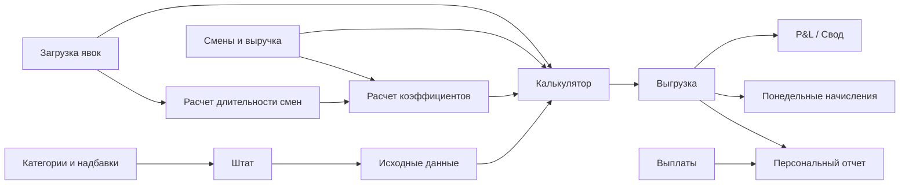

# Текущее состояние payroll в Google Sheets

Дата исходного среза: 2026-05-20.
Статус: read-only archive текущего Google Sheets-контура. Целевая логика приложения вынесена в `/app-spec/modules/staff/payroll/`.

## Источники discovery

- `research/processed/payroll_discovery/agent_a_handoff.md`;
- `research/processed/payroll_discovery/agent_b_handoff.md`;
- `research/processed/payroll_discovery/agent_c_handoff.md`;
- `research/processed/payroll_discovery/workbook_architecture.md`;
- `research/processed/payroll_discovery/payroll_calculation_flow.md`;
- `research/processed/payroll_discovery/staff_structure.md`;
- `research/processed/payroll_discovery/personal_report_structure.md`;
- `research/processed/payroll_discovery/payments_vs_accruals.md`;
- `research/processed/payroll_discovery/accumulation_and_deposit_rules.md`;
- `/app-spec/architecture/vision.md`;
- `business-docs/finance/pnl-methodology.md`;
- `research/processed/economic_block/labor_report.md`.

## 1. Текущее устройство расчета зарплаты в Google Sheets

Текущий payroll-контур устроен как связка справочников, ручных журналов, технических расчетов и итоговых регистров.

Справочники и ручные события живут в `Исходные данные`, `Штат`, `Категории и надбавки`, `Смены и выручка`, `Загрузка явок`. Скрытые/технические листы `Расчет длительности смен` и `Расчет коэффициентов` превращают явки, расписание и категории в нормированные коэффициенты смены. `Калькулятор` считает одного выбранного сотрудника за неделю. `Выгрузка` хранит накопленные расчетные строки начислений и удержаний. Owner decision 2026-05-25: `Выплаты` - это ведомость/обязательство к выплате, а не первичный денежный факт; факт выдачи денег закрывается через DDS. `Персональный отчет` сводит payroll ledger и payment obligations в персональный баланс.

Ключевой вывод для веб-приложения: таблицу нельзя переносить как один большой экран-калькулятор. Нужны отдельные сущности `payroll_run`, `payroll_ledger_line`, `payroll_payment`, `deposit_account`, `accumulation_fund_account`, `employee_event` и audit trail до исходных событий. `payroll_payment` фиксирует обязательство/ведомость; cash-fact закрывается через DDS.

## 2. Карта листов и назначение

| Лист | Назначение сейчас | Что становится в веб-приложении | Статус |
| --- | --- | --- | --- |
| `Исходные данные` | справочники ставок, коэффициентов, депозитов, порогов процента, фонда и надбавок | справочники payroll-правил с versioning | подтверждено формулами |
| `Штат` | текущие сотрудники, роли, дата приема, расчет стажа, депозитные показатели | `employees`, `employee_role_assignments`, `deposit_accounts` | подтверждено формулами |
| `Категории и надбавки` | ручной журнал категорий, депозитных условий, надбавок, премий, штрафов, НДФЛ, пособий | кадровые и payroll-события с датой действия | подтверждено формулами |
| `Смены и выручка` | расписание через `IMPORTRANGE`, дневная выручка | `shift_schedule`, `daily_revenue` | подтверждено формулами |
| `Загрузка явок` | фактические интервалы работы по сотрудникам и дням | `attendance_entries` | подтверждено формулами |
| `Расчет длительности смен` | парсинг интервалов, расчет часов и округление | расчетный сервис длительности | подтверждено формулами |
| `Расчет коэффициентов` | расчет плановых и фактических коэффициентов смены | сервис распределения revenue-share | подтверждено формулами |
| `Калькулятор` | недельный расчет выбранного сотрудника | payroll run preview / расчетный движок | подтверждено формулами |
| `Выгрузка` | накопительный расчетный ledger начислений и удержаний | `payroll_ledger_lines` | подтверждено формулами / наблюдается в реестре |
| `Выплаты` | legacy-реестр выплат; по решению владельца 2026-05-25 это ведомость/обязательство, а не первичный cash-fact | `payroll_payments` + 1:1 `cashflow_transaction` или `payroll_payment_batch` | подтверждено формулами; решение владельца 2026-05-25 |
| `Персональный отчет` | баланс сотрудника, детализация начислений и выплат | экран персонального payroll-отчета | подтверждено формулами |
| `Понедельные начисления` | недельная сводка по производству Черникова | ведомость/агрегация по периоду и подразделению | подтверждено формулами, требует параметризации |
| `Зарплата Администрации` | отдельный контур фиксированной административной зарплаты | admin payroll profile/events | подтверждено формулами |
| `Технический лист` | календарь и списки для отчетов | системные справочники/временные измерения | подтверждено формулами |

## Ограничения archive

- Этот файл фиксирует структуру Google Sheets, но не является спецификацией целевого payroll-движка.
- Технический перенос Apps Script не нужен: целевой контур создаёт immutable `payroll_ledger_line` внутри `payroll_run`.
- Курьерских payroll-формул в этом источнике нет; будущая спека курьерского payroll оставлена placeholder'ом в `/app-spec/modules/staff/payroll/couriers/spec.md`.
