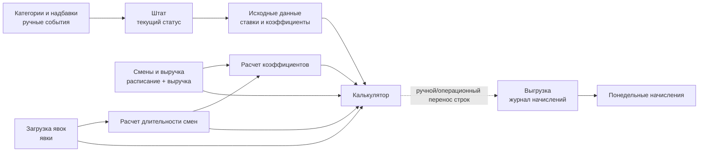

# Архитектура книги `Расчет зарплат NEW`

Источник: Google Sheets `Расчет зарплат NEW` (`1ribsb9A64-9OvkMxJisyMZtjLQT_gLCET40G8cYzD4Q`).  
Режим анализа: read-only, снимок XLSX + точечное чтение формул Google Sheets API. Персональные ФИО и персональные суммы в этот документ не вынесены.

## Роли листов

| Лист | Роль | Тип данных | Комментарий |
|---|---|---|---|
| `Исходные данные` | справочник и настройки расчета | смешанный: формулы + ручные настройки | Хранит матрицы коэффициентов, ставок смен, порогов процента, надбавок, накопительного фонда и стартовых депозитов. Блок сотрудников частично подтягивается из `Штат`. |
| `Категории и надбавки` | журнал ручных событий | ручной ввод | Категории, особые депозитные условия, выдача депозитов, вступление/снятие старших, премии, штрафы, НДФЛ, больничные/отпуска/пособия. Формул не найдено. |
| `Калькулятор` | основной расчет по выбранному сотруднику и неделе | расчетный лист | Собирает дату, роль, длительность, коэффициенты, оклад, процент, премии, удержания, депозиты. Похоже на рабочий калькулятор перед переносом строк в `Выгрузка`. |
| `Смены и выручка` | расписание и выручка | внешний импорт + ручная загрузка | `A1:H` импортирует расписание через `IMPORTRANGE`; `J:K` содержит даты и суммы выручки. |
| `Загрузка явок` | источник фактических явок | ручной/импортный ввод | Хранит сотрудника и интервалы работы по датам недели. Формул не найдено. |
| `Технический лист` | вспомогательный сервисный лист | технический, скрытый | Даты, текущий год, список сотрудников для персонального отчета. Не является центральным расчетом зарплаты. |
| `Расчет коэффициентов` | нормировка коэффициентов смен | технический расчетный, скрытый | Преобразует роли в плановые коэффициенты, затем корректирует их по фактически отработанным часам. |
| `Расчет длительности смен` | расчет длительности явок | технический расчетный, скрытый | Парсит текстовые интервалы из `Загрузка явок`, выделяет часы/минуты, округляет минуты в финальную длительность. |
| `Понедельные начисления` | недельная сводка | итоговый расчетный | Агрегирует `Выгрузка` по неделям и типам начислений для одного подразделения. |
| `Выгрузка` | журнал начислений | итоговый/фактический журнал | Почти все строки являются значениями. Формулы найдены только для года и проверки дублей по накопительному фонду. |

## Смежные листы, влияющие на расчет

| Лист | Зачем важен |
|---|---|
| `Штат` | Формирует текущую категорию, старшинство, депозитные условия и часть справочника сотрудников. На него ссылаются `Исходные данные` и `Калькулятор`. |
| `Выплаты`, `Персональный отчет`, `Зарплата Администрации` | Используют `Выгрузка` и технические списки для отчетов/выплат, но не являются ядром расчета производственной сменной зарплаты. |

## Главные зависимости

## Вывод по архитектуре

Книга устроена как связка ручных справочников, скрытых технических расчетов и рабочего недельного калькулятора. `Калькулятор` рассчитывает начисления по выбранному сотруднику (`A7`) и датам недели (`C:I`), а `Выгрузка` хранит уже накопленные строки начислений. Прямой формульной сборки `Калькулятор -> Выгрузка` в листе не обнаружено: для веб-приложения это означает, что нужен отдельный объект `payroll_run`/`payroll_line`, а не попытка повторить `Выгрузка` как живую формулу.

## Наблюдения по качеству

- Пустая ячейка в формулах часто означает `""`, а не ноль; это надо сохранить в бизнес-логике.
- Тип `Штрафы и удержания` встречается в двух вариантах: с обычным и неразрывным пробелом. В веб-приложении нужен нормализованный справочник типов.
- `Понедельные начисления` жестко фильтрует подразделение `Производство Черникова` и стартует от фиксированной даты `2026-03-03`.
- В `Калькулятор!C15:I15` оклад умножается на внеурочный коэффициент при `C25:I25=TRUE`, но текущие строки `25:27` используются под депозитные операции. Это место требует проверки владельцем.
- В экспортированном XLSX виден потенциальный `#REF!` в одном из расчетов листа `Штат`; надо проверить в нативном Google Sheets, относится ли он к активным строкам.
